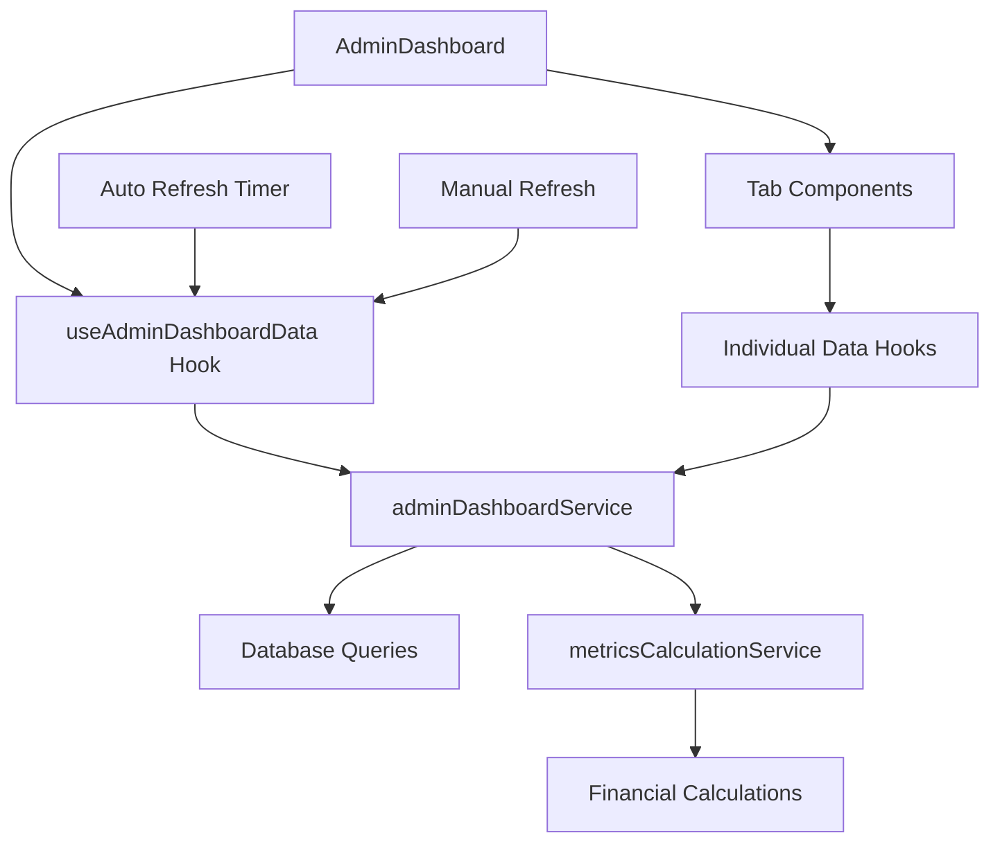

# Admin Dashboard Refactor - Design Document

## Overview

This design document outlines the refactoring of the AdminDashboard component into a modular, theme-aware, data-driven dashboard system. The new architecture will follow the Analytics page pattern with tabbed components, implement real database calculations, and ensure full theme compliance.

## Architecture

### Component Structure (Building on Existing Infrastructure)

```
src/pages/admin/AdminDashboard.tsx (Main container - ~100 lines)
├── src/components/admin/dashboard/
│   ├── DashboardHeader.tsx (Header with refresh button - ~50 lines)
│   ├── FinancialOverview.tsx (Financial metrics cards - ~150 lines)
│   ├── BusinessMetrics.tsx (Business KPI cards - ~100 lines)
│   └── tabs/
│       ├── FinancialTab.tsx (Financial analysis - ~200 lines)
│       ├── ClientsTab.tsx (Client analytics - ~200 lines)
│       ├── UsersTab.tsx (User analytics - ~200 lines)
│       ├── SystemTab.tsx (System health - ~200 lines)
│       └── OperationsTab.tsx (Operational metrics - ~200 lines)
├── src/services/ (EXTEND EXISTING)
│   ├── adminService.ts (EXISTING - already has comprehensive admin functions)
│   ├── dashboardService.ts (EXISTING - extend with admin-specific metrics)
│   └── metricsCalculationService.ts (NEW - financial calculations only)
├── src/hooks/ (EXTEND EXISTING)
│   ├── useDashboardMetrics.ts (EXISTING - extend for admin dashboard)
│   └── useAdminDashboardData.ts (NEW - admin-specific data hook)
└── src/types/ (EXTEND EXISTING)
    ├── admin.ts (EXISTING - comprehensive admin types)
    ├── dashboard.ts (EXISTING - basic dashboard types)
    └── adminDashboard.ts (NEW - admin dashboard specific types)
```

### Existing Infrastructure Analysis

**✅ EXISTING SERVICES TO REUSE:**
- `AdminService` - Comprehensive client/user management with real DB queries
- `DashboardService` - Real dashboard metrics with call/lead calculations  
- `useDashboardMetrics` - Hook for dashboard data with auth integration

**✅ EXISTING TYPES TO EXTEND:**
- `Client`, `User`, `SystemMessage`, `AgentStatus` from admin.ts
- `DashboardMetrics`, `SystemMessage`, `AgentStatus` from dashboard.ts

**🆕 NEW COMPONENTS NEEDED:**
- Admin-specific financial calculations (profit, costs, growth trends)
- Client profitability analysis
- User analytics beyond basic metrics
- Theme-aware tabbed interface

### Data Flow Architecture



## Components and Interfaces

### Main Dashboard Container

```typescript
// AdminDashboard.tsx
interface AdminDashboardProps {
  // No props needed - uses auth context for permissions
}

interface DashboardState {
  isLoading: boolean;
  lastUpdated: Date;
  error: string | null;
}
```

### Admin Dashboard Data Hook (Extending Existing)

```typescript
// useAdminDashboardData.ts - Extends existing useDashboardMetrics
interface AdminDashboardData extends DashboardMetrics {
  // Financial data (NEW)
  financial: FinancialMetrics;
  clientProfitability: ClientProfitability[];
  costBreakdown: CostBreakdown;
  growthTrends: GrowthTrends;
  
  // Client/User data (EXTEND EXISTING AdminService)
  clients: Client[]; // From existing AdminService.getClients()
  users: User[]; // From existing AdminService.getUsers()
  
  // System data (EXTEND EXISTING)
  systemHealth: SystemHealth; // From existing AdminService.getSystemHealth()
  
  // Operations data (EXTEND EXISTING DashboardService)
  callMetrics: CallMetrics; // Enhanced from existing DashboardService
}

interface FinancialMetrics {
  totalRevenue: number;
  totalCosts: number;
  netProfit: number;
  profitMargin: number;
  monthlyRecurringRevenue: number;
}
```

### Financial Metrics Service (NEW - Extends Existing Services)

```typescript
// metricsCalculationService.ts - Uses existing AdminService + DashboardService
interface FinancialCalculations {
  // Uses existing AdminService.getClients() for client data
  calculateTotalRevenue(clients: Client[]): number;
  
  // Uses existing call data from DashboardService queries
  calculateTotalCosts(calls: any[]): Promise<CostBreakdown>;
  
  // Combines client data with call cost data
  calculateClientProfitability(clients: Client[], calls: any[]): Promise<ClientProfitability[]>;
  
  // Uses historical data queries (extend existing services)
  calculateGrowthTrends(currentPeriod: Date, previousPeriod: Date): Promise<GrowthTrends>;
}

interface CostBreakdown {
  // Real database fields from calls table
  aiCosts: number; // SUM(openai_api_cost_usd * 1.35) - Convert to CAD
  vapiCosts: number; // SUM(vapi_call_cost_usd * 1.35) 
  vapiLlmCosts: number; // SUM(vapi_llm_cost_usd * 1.35)
  twilioCosts: number; // SUM(twillio_call_cost_usd * 1.35)
  smsCosts: number; // SUM(sms_cost_usd * 1.35)
  toolCosts: number; // SUM(tool_cost_usd * 1.35)
  
  // Calculated from client data (existing AdminService)
  partnerSplits: number; // SUM(monthly_billing_amount_cad * partner_split_percentage / 100)
  findersFees: number; // SUM(finders_fee_cad)
  
  totalCosts: number;
}
```

### Theme-Aware Component Patterns

```typescript
// Theme-compliant component structure
const ThemeAwareCard = ({ children, className, ...props }) => (
  <Card className={cn("bg-card text-card-foreground border-border", className)} {...props}>
    {children}
  </Card>
);

const ThemeAwareMetricCard = ({ title, value, trend, icon: Icon }) => (
  <ThemeAwareCard className="border-l-4 border-l-primary">
    <CardHeader className="flex flex-row items-center justify-between space-y-0 pb-2">
      <CardTitle className="text-sm font-medium text-muted-foreground">{title}</CardTitle>
      <Icon className="h-4 w-4 text-muted-foreground" />
    </CardHeader>
    <CardContent>
      <div className="text-2xl font-bold text-foreground">{value}</div>
      <p className="text-xs text-muted-foreground flex items-center gap-1">
        <TrendingUp className="h-3 w-3" />
        {trend}
      </p>
    </CardContent>
  </ThemeAwareCard>
);
```

## Data Models

### Dashboard Metrics Types

```typescript
interface ClientProfitability {
  id: string;
  name: string;
  revenue: number;
  costs: number;
  profit: number;
  margin: number;
  status: string;
  callVolume: number;
  leadConversion: number;
}

interface UserAnalytics {
  byRole: Record<string, number>;
  activeToday: number;
  activeThisWeek: number;
  newThisMonth: number;
  loginFrequency: {
    daily: number;
    weekly: number;
    monthly: number;
  };
}

interface SystemMetrics {
  health: 'healthy' | 'degraded' | 'down';
  components: SystemComponent[];
  performance: {
    avgResponseTime: number;
    errorRate: number;
    uptime: number;
  };
  resources: {
    apiCallsToday: number;
    apiLimitUtilization: number;
    storageUsed: number;
    bandwidthUsed: number;
  };
}

interface OperationalMetrics {
  callMetrics: {
    totalCalls: number;
    totalLeads: number;
    conversionRate: number;
    avgCallDuration: number;
    callsToday: number;
    leadsToday: number;
  };
  agentStatuses: AgentStatus[];
  systemMessages: SystemMessage[];
  recentActivity: ActivityEvent[];
}
```

### Real Data Calculation Strategies

#### Financial Calculations (Using Existing AdminService Pattern)

```typescript
// Extend existing AdminService pattern for financial calculations
const calculateFinancialMetrics = async (): Promise<FinancialMetrics> => {
  // Use existing AdminService.getClients() - already has real DB integration
  const clients = await AdminService.getClients();
  
  // Use existing pattern from DashboardService for call data
  const { data: calls } = await supabase
    .from('calls')
    .select(`
      client_id,
      openai_api_cost_usd,
      vapi_call_cost_usd,
      vapi_llm_cost_usd,
      twillio_call_cost_usd,
      sms_cost_usd,
      tool_cost_usd,
      total_cost_cad,
      created_at
    `)
    .gte('created_at', startOfMonth);

  // Calculate using existing client data structure
  const totalRevenue = clients
    .filter(c => c.status === 'active')
    .reduce((sum, client) => sum + client.monthly_billing_amount_cad, 0);

  // Calculate costs from real call data (convert USD to CAD)
  const costBreakdown = calls.reduce((acc, call) => ({
    aiCosts: acc.aiCosts + (call.openai_api_cost_usd * 1.35),
    vapiCosts: acc.vapiCosts + (call.vapi_call_cost_usd * 1.35),
    vapiLlmCosts: acc.vapiLlmCosts + (call.vapi_llm_cost_usd * 1.35),
    twilioCosts: acc.twilioCosts + (call.twillio_call_cost_usd * 1.35),
    smsCosts: acc.smsCosts + (call.sms_cost_usd * 1.35),
    toolCosts: acc.toolCosts + (call.tool_cost_usd * 1.35),
  }), { aiCosts: 0, vapiCosts: 0, vapiLlmCosts: 0, twilioCosts: 0, smsCosts: 0, toolCosts: 0 });

  // Calculate partner splits and finder's fees from existing client data
  const partnerSplits = clients.reduce((sum, client) => 
    sum + (client.monthly_billing_amount_cad * client.partner_split_percentage / 100), 0);
  const findersFees = clients.reduce((sum, client) => sum + client.finders_fee_cad, 0);

  return {
    totalRevenue,
    totalCosts: Object.values(costBreakdown).reduce((a, b) => a + b, 0) + partnerSplits + findersFees,
    costBreakdown: { ...costBreakdown, partnerSplits, findersFees },
    // ... other metrics
  };
};
```

#### Growth Trends Calculation

```typescript
const calculateGrowthTrends = async (currentPeriod: Date, previousPeriod: Date) => {
  const currentMetrics = await getMetricsForPeriod(currentPeriod);
  const previousMetrics = await getMetricsForPeriod(previousPeriod);
  
  return {
    revenueGrowth: calculatePercentageChange(currentMetrics.revenue, previousMetrics.revenue),
    costGrowth: calculatePercentageChange(currentMetrics.costs, previousMetrics.costs),
    profitGrowth: calculatePercentageChange(currentMetrics.profit, previousMetrics.profit),
    clientGrowth: calculatePercentageChange(currentMetrics.activeClients, previousMetrics.activeClients),
  };
};
```

## Error Handling

### Error Boundary Strategy

```typescript
interface DashboardErrorBoundary {
  fallback: ComponentType<{ error: Error; resetError: () => void }>;
  onError: (error: Error, errorInfo: ErrorInfo) => void;
}

// Individual component error boundaries
const TabErrorBoundary = ({ children, tabName }) => (
  <ErrorBoundary
    fallback={({ error, resetError }) => (
      <Card className="bg-card text-card-foreground border-border">
        <CardContent className="pt-6 flex items-center justify-center min-h-[400px]">
          <div className="text-center">
            <AlertTriangle className="h-12 w-12 text-destructive mx-auto mb-4" />
            <h3 className="text-lg font-semibold mb-2">Failed to Load {tabName}</h3>
            <p className="text-muted-foreground mb-4">There was an error loading this section.</p>
            <Button onClick={resetError}>Try Again</Button>
          </div>
        </CardContent>
      </Card>
    )}
    onError={(error) => console.error(`${tabName} tab error:`, error)}
  >
    {children}
  </ErrorBoundary>
);
```

### Data Fetching Error Handling

```typescript
// useAdminDashboardData.ts - Extends existing useDashboardMetrics
const useAdminDashboardData = () => {
  // Reuse existing dashboard metrics hook
  const { metrics: basicMetrics, isLoading: basicLoading, error: basicError } = useDashboardMetrics();
  
  const [adminData, setAdminData] = useState<AdminDashboardData | null>(null);
  const [loading, setLoading] = useState(true);
  const [errors, setErrors] = useState<Record<string, string>>({});

  const fetchAdminData = async () => {
    const results = await Promise.allSettled([
      // Use existing AdminService functions
      AdminService.getClients(),
      AdminService.getUsers(), 
      AdminService.getSystemHealth(),
      
      // New financial calculations
      metricsCalculationService.getFinancialMetrics(),
      metricsCalculationService.getClientProfitability(),
      metricsCalculationService.getGrowthTrends(),
    ]);

    // Combine with existing basic metrics
    const [clients, users, systemHealth, financial, profitability, growth] = results;
    
    setAdminData({
      // Extend existing metrics
      ...basicMetrics,
      
      // Add admin-specific data
      clients: clients.status === 'fulfilled' ? clients.value : [],
      users: users.status === 'fulfilled' ? users.value : [],
      systemHealth: systemHealth.status === 'fulfilled' ? systemHealth.value : null,
      financial: financial.status === 'fulfilled' ? financial.value : null,
      clientProfitability: profitability.status === 'fulfilled' ? profitability.value : [],
      growthTrends: growth.status === 'fulfilled' ? growth.value : null,
    });

    // Track errors for individual sections
    const newErrors: Record<string, string> = {};
    results.forEach((result, index) => {
      if (result.status === 'rejected') {
        const sectionNames = ['clients', 'users', 'system', 'financial', 'profitability', 'growth'];
        newErrors[sectionNames[index]] = result.reason.message;
      }
    });
    setErrors(newErrors);
  };

  return { 
    data: adminData, 
    loading: loading || basicLoading, 
    errors: { ...errors, basic: basicError?.message }, 
    refetch: fetchAdminData 
  };
};
```

## Testing Strategy

### Component Testing

```typescript
// Financial tab component test
describe('FinancialTab', () => {
  it('should display real financial metrics', async () => {
    const mockData = {
      totalRevenue: 50000,
      totalCosts: 30000,
      netProfit: 20000,
      profitMargin: 40,
    };
    
    jest.spyOn(adminDashboardService, 'getFinancialMetrics')
      .mockResolvedValue(mockData);
    
    render(<FinancialTab />);
    
    await waitFor(() => {
      expect(screen.getByText('$50,000')).toBeInTheDocument();
      expect(screen.getByText('40%')).toBeInTheDocument();
    });
  });

  it('should handle theme changes correctly', () => {
    const { container } = render(<FinancialTab />);
    
    // Test light theme classes
    expect(container.querySelector('.bg-card')).toBeInTheDocument();
    expect(container.querySelector('.text-card-foreground')).toBeInTheDocument();
  });
});
```

### Service Testing

```typescript
describe('metricsCalculationService', () => {
  it('should calculate client profitability correctly', async () => {
    const mockClients = [
      { id: '1', monthly_billing_amount_cad: 5000, partner_split_percentage: 20, finders_fee_cad: 500 }
    ];
    const mockCalls = [
      { client_id: '1', total_cost_cad: 1000 }
    ];
    
    const result = await metricsCalculationService.calculateClientProfitability(mockClients, mockCalls);
    
    expect(result[0].profit).toBe(2500); // 5000 - (1000 + 1000 + 500)
    expect(result[0].margin).toBe(50); // 2500/5000 * 100
  });
});
```

## Performance Considerations

### Lazy Loading Strategy

```typescript
// Lazy load tab components
const FinancialTab = lazy(() => import('./tabs/FinancialTab'));
const ClientsTab = lazy(() => import('./tabs/ClientsTab'));
const UsersTab = lazy(() => import('./tabs/UsersTab'));
const SystemTab = lazy(() => import('./tabs/SystemTab'));
const OperationsTab = lazy(() => import('./tabs/OperationsTab'));

// Use Suspense for loading states
<Suspense fallback={<TabLoadingSkeleton />}>
  <TabsContent value="financial">
    <FinancialTab />
  </TabsContent>
</Suspense>
```

### Data Caching Strategy

```typescript
const useCachedDashboardData = () => {
  const queryClient = useQueryClient();
  
  return useQuery({
    queryKey: ['admin-dashboard'],
    queryFn: adminDashboardService.getAllMetrics,
    staleTime: 5 * 60 * 1000, // 5 minutes
    cacheTime: 10 * 60 * 1000, // 10 minutes
    refetchInterval: 5 * 60 * 1000, // Auto-refresh every 5 minutes
  });
};
```

## Migration Strategy

### Phase 1: Component Structure
1. Create new component files and folder structure
2. Move existing logic into appropriate components
3. Implement theme-aware styling

### Phase 2: Data Integration
1. Create dashboard service functions
2. Replace mock data with real database queries
3. Implement proper error handling

### Phase 3: Performance Optimization
1. Add lazy loading for tab components
2. Implement data caching
3. Add loading states and error boundaries

### Phase 4: Testing and Validation
1. Add comprehensive component tests
2. Test theme switching functionality
3. Validate financial calculations against known data

## Accessibility Considerations

- All metric cards will have proper ARIA labels
- Color-coded information will include text alternatives
- Keyboard navigation will be supported for all interactive elements
- Screen reader compatibility will be maintained
- High contrast mode support through theme system