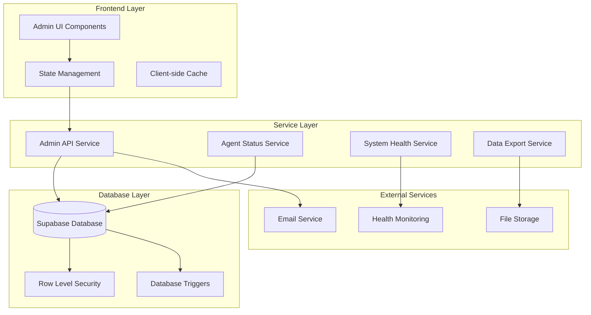
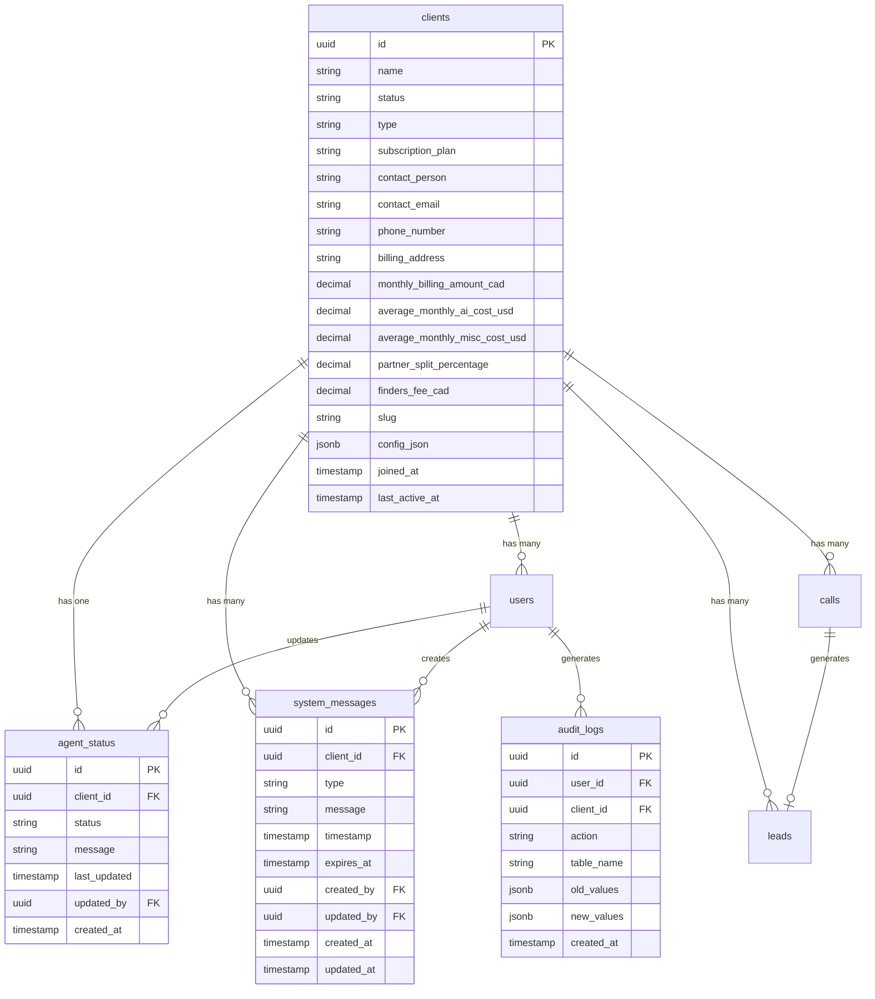

# Design Document: Admin Panel Production

## Overview

The Admin Panel Production feature transforms the existing admin panel from a mock-data prototype into a fully functional, production-ready system. This involves implementing real database connectivity, comprehensive CRUD operations, advanced filtering and search capabilities, real-time agent status management, system health monitoring, and responsive UI/UX enhancements.

The system builds upon the existing admin panel architecture while adding production-grade features including error handling, performance optimization, audit logging, data import/export capabilities, and real-time updates. The design focuses on scalability, maintainability, and user experience while ensuring data integrity and security.

## Architecture

### High-Level Architecture

The production admin panel follows a layered architecture with clear separation of concerns:



### Database Architecture

The system leverages the existing Supabase database with enhanced query optimization and real-time subscriptions:



## Components and Interfaces

### Enhanced Admin Service Layer

```typescript
interface AdminService {
  // Client Management
  getClients(filters: ClientFilters, pagination: PaginationOptions): Promise<PaginatedResponse<Client>>;
  getClientById(id: string): Promise<Client>;
  createClient(data: CreateClientData): Promise<Client>;
  updateClient(id: string, data: UpdateClientData): Promise<Client>;
  deleteClient(id: string): Promise<void>;
  bulkUpdateClients(ids: string[], updates: Partial<Client>): Promise<Client[]>;
  exportClients(filters: ClientFilters, format: ExportFormat): Promise<ExportResult>;
  
  // User Management
  getUsers(filters: UserFilters, pagination: PaginationOptions): Promise<PaginatedResponse<User>>;
  createUser(data: CreateUserData): Promise<User>;
  updateUser(id: string, data: UpdateUserData): Promise<User>;
  deleteUser(id: string): Promise<void>;
  bulkInviteUsers(invitations: UserInvitation[]): Promise<InvitationResult[]>;
  
  // Agent Status Management
  getAgentStatus(clientId?: string): Promise<AgentStatus[]>;
  updateAgentStatus(clientId: string, status: AgentStatusUpdate): Promise<AgentStatus>;
  getAgentStatusHistory(clientId: string, timeframe: TimeFrame): Promise<AgentStatusHistory[]>;
  
  // System Messages
  getSystemMessages(filters: MessageFilters): Promise<SystemMessage[]>;
  createSystemMessage(data: CreateMessageData): Promise<SystemMessage>;
  updateSystemMessage(id: string, data: UpdateMessageData): Promise<SystemMessage>;
  deleteSystemMessage(id: string): Promise<void>;
  
  // System Health & Monitoring
  getSystemHealth(clientId?: string): Promise<SystemHealth>;
  runHealthCheck(clientId?: string): Promise<HealthCheckResult>;
  getSystemMetrics(timeframe: TimeFrame, clientId?: string): Promise<SystemMetrics>;
  
  // Audit & Compliance
  getAuditLogs(filters: AuditFilters): Promise<PaginatedResponse<AuditLog>>;
  exportAuditLogs(filters: AuditFilters, format: ExportFormat): Promise<ExportResult>;
}
```

### Real-time Data Management

```typescript
interface RealtimeService {
  // Agent Status Subscriptions
  subscribeToAgentStatus(clientId: string, callback: (status: AgentStatus) => void): Subscription;
  
  // System Messages Subscriptions
  subscribeToSystemMessages(clientId: string, callback: (messages: SystemMessage[]) => void): Subscription;
  
  // Client Data Subscriptions
  subscribeToClientUpdates(callback: (client: Client) => void): Subscription;
  
  // System Health Subscriptions
  subscribeToSystemHealth(callback: (health: SystemHealth) => void): Subscription;
}
```

### Enhanced UI Components

#### Client Management Components

```typescript
// Enhanced ClientsTable with advanced features
interface ClientsTableProps {
  clients: Client[];
  isLoading: boolean;
  selectedClients: string[];
  onSelectionChange: (selected: string[]) => void;
  onBulkAction: (action: BulkAction, clientIds: string[]) => void;
  onSort: (column: string, direction: SortDirection) => void;
  sortConfig: SortConfig;
  onExport: (format: ExportFormat) => void;
}

// Advanced filtering component
interface ClientFiltersProps {
  filters: ClientFilters;
  onFilterChange: (filters: ClientFilters) => void;
  onSavedFilterLoad: (filterId: string) => void;
  onSaveFilter: (name: string, filters: ClientFilters) => void;
  savedFilters: SavedFilter[];
}

// Client metrics dashboard
interface ClientMetricsDashboardProps {
  clientId: string;
  timeframe: TimeFrame;
  onTimeframeChange: (timeframe: TimeFrame) => void;
  realTimeUpdates: boolean;
}
```

#### Agent Status Management Components

```typescript
// Agent status control panel
interface AgentStatusControlProps {
  clientId: string;
  currentStatus: AgentStatus;
  onStatusUpdate: (status: AgentStatusUpdate) => void;
  isUpdating: boolean;
  statusHistory: AgentStatusHistory[];
}

// System messages manager
interface SystemMessageManagerProps {
  clientId?: string; // null for global messages
  messages: SystemMessage[];
  onCreateMessage: (data: CreateMessageData) => void;
  onUpdateMessage: (id: string, data: UpdateMessageData) => void;
  onDeleteMessage: (id: string) => void;
  isLoading: boolean;
}
```

#### Data Export Components

```typescript
// Export dialog with advanced options
interface DataExportDialogProps {
  isOpen: boolean;
  onClose: () => void;
  dataType: 'clients' | 'users' | 'audit_logs';
  totalRecords: number;
  filters: any;
  onExport: (options: ExportOptions) => void;
}

interface ExportOptions {
  format: 'csv' | 'xlsx' | 'json';
  fields: string[];
  includeRelatedData: boolean;
  dateRange?: DateRange;
  maxRecords?: number;
}
```

## Data Models

### Enhanced Client Model

```typescript
interface Client {
  id: string;
  name: string;
  status: 'active' | 'inactive' | 'pending';
  type: string;
  subscription_plan: string;
  contact_person: string | null;
  contact_email: string | null;
  phone_number: string | null;
  billing_address: string | null;
  monthly_billing_amount_cad: number;
  average_monthly_ai_cost_usd: number;
  average_monthly_misc_cost_usd: number;
  partner_split_percentage: number;
  finders_fee_cad: number;
  slug: string;
  config_json: ClientConfig;
  joined_at: Date;
  last_active_at: Date | null;
  
  // Computed fields
  metrics?: ClientMetrics;
  agentStatus?: AgentStatus;
  recentActivity?: ActivitySummary;
  billingStatus?: BillingStatus;
}

interface ClientConfig {
  theme?: 'light' | 'dark' | 'system';
  features?: string[];
  customization?: {
    branding?: BrandingConfig;
    notifications?: NotificationConfig;
  };
  agent?: AgentConfig;
}

interface ClientMetrics {
  totalCalls: number;
  totalLeads: number;
  avgCallDuration: number;
  callsToday: number;
  leadsToday: number;
  conversionRate: number;
  monthlyGrowth: number;
  lastCallAt: Date | null;
}
```

### Agent Status Model

```typescript
interface AgentStatus {
  id: string;
  client_id: string;
  status: 'active' | 'inactive' | 'maintenance';
  message: string | null;
  last_updated: Date;
  updated_by: string;
  created_at: Date;
  
  // Computed fields
  updatedByUser?: User;
  duration?: number; // Time in current status (minutes)
  nextScheduledChange?: ScheduledStatusChange;
}

interface AgentStatusUpdate {
  status: 'active' | 'inactive' | 'maintenance';
  message?: string;
  scheduledChange?: ScheduledStatusChange;
}

interface ScheduledStatusChange {
  scheduledAt: Date;
  newStatus: 'active' | 'inactive' | 'maintenance';
  message?: string;
  autoRevert?: boolean;
  revertAt?: Date;
}

interface AgentStatusHistory {
  id: string;
  client_id: string;
  status: 'active' | 'inactive' | 'maintenance';
  message: string | null;
  changed_at: Date;
  changed_by: string;
  duration_minutes: number;
  changedByUser?: User;
}
```

### System Message Model

```typescript
interface SystemMessage {
  id: string;
  client_id: string | null; // null for global messages
  type: 'info' | 'warning' | 'error' | 'success';
  message: string;
  timestamp: Date;
  expires_at: Date | null;
  created_by: string;
  updated_by: string | null;
  created_at: Date;
  updated_at: Date;
  
  // Computed fields
  isExpired?: boolean;
  isGlobal?: boolean;
  createdByUser?: User;
  affectedClients?: Client[];
}

interface CreateMessageData {
  client_id?: string | null;
  type: 'info' | 'warning' | 'error' | 'success';
  message: string;
  expires_at?: Date | null;
  targetAllClients?: boolean;
}
```

### Audit Log Model

```typescript
interface AuditLog {
  id: string;
  user_id: string;
  client_id: string | null;
  action: AuditAction;
  table_name: string;
  record_id: string | null;
  old_values: Record<string, any> | null;
  new_values: Record<string, any> | null;
  ip_address: string | null;
  user_agent: string | null;
  created_at: Date;
  
  // Computed fields
  user?: User;
  client?: Client;
  summary?: string;
}

type AuditAction = 
  | 'create' | 'update' | 'delete'
  | 'login' | 'logout' | 'password_change'
  | 'role_change' | 'permission_change'
  | 'agent_status_change' | 'system_message_create'
  | 'bulk_operation' | 'data_export' | 'data_import';
```

## API Interfaces

### Enhanced Database Service

```typescript
interface DatabaseService {
  // Advanced querying with filters and pagination
  query<T>(
    table: string,
    options: QueryOptions
  ): Promise<PaginatedResponse<T>>;
  
  // Bulk operations
  bulkInsert<T>(table: string, records: Partial<T>[]): Promise<T[]>;
  bulkUpdate<T>(table: string, updates: BulkUpdateOperation[]): Promise<T[]>;
  bulkDelete(table: string, ids: string[]): Promise<void>;
  
  // Real-time subscriptions
  subscribe<T>(
    table: string,
    filters: SubscriptionFilters,
    callback: (payload: RealtimePayload<T>) => void
  ): Subscription;
  
  // Transaction support
  transaction<T>(operations: DatabaseOperation[]): Promise<T>;
}

interface QueryOptions {
  select?: string[];
  filters?: FilterCondition[];
  joins?: JoinCondition[];
  orderBy?: OrderByCondition[];
  pagination?: PaginationOptions;
  groupBy?: string[];
  having?: FilterCondition[];
}

interface BulkUpdateOperation {
  id: string;
  updates: Record<string, any>;
}
```

### Export Service Interface

```typescript
interface ExportService {
  exportData(options: ExportOptions): Promise<ExportResult>;
  getExportStatus(exportId: string): Promise<ExportStatus>;
  downloadExport(exportId: string): Promise<Blob>;
  scheduleRecurringExport(schedule: ExportSchedule): Promise<ScheduledExport>;
  cancelScheduledExport(scheduleId: string): Promise<void>;
}

interface ExportResult {
  exportId: string;
  status: 'pending' | 'processing' | 'completed' | 'failed';
  downloadUrl?: string;
  recordCount?: number;
  fileSize?: number;
  createdAt: Date;
  completedAt?: Date;
  error?: string;
}

interface ExportSchedule {
  name: string;
  exportOptions: ExportOptions;
  schedule: CronExpression;
  emailRecipients: string[];
  isActive: boolean;
}
```

## Error Handling

### Comprehensive Error Management

```typescript
// Error types and handling
enum ErrorType {
  VALIDATION_ERROR = 'validation_error',
  DATABASE_ERROR = 'database_error',
  PERMISSION_ERROR = 'permission_error',
  NETWORK_ERROR = 'network_error',
  RATE_LIMIT_ERROR = 'rate_limit_error',
  EXPORT_ERROR = 'export_error',
  IMPORT_ERROR = 'import_error',
  SYSTEM_ERROR = 'system_error'
}

interface AppError {
  type: ErrorType;
  message: string;
  code: string;
  details?: Record<string, any>;
  timestamp: Date;
  userId?: string;
  clientId?: string;
  requestId?: string;
}

// Error handling strategies
interface ErrorHandler {
  handleValidationError(error: ValidationError): UserFeedback;
  handleDatabaseError(error: DatabaseError): UserFeedback;
  handleNetworkError(error: NetworkError): RetryStrategy;
  handlePermissionError(error: PermissionError): UserFeedback;
  logError(error: AppError): void;
  notifyAdmins(error: CriticalError): void;
}

interface RetryStrategy {
  shouldRetry: boolean;
  maxRetries: number;
  backoffStrategy: 'linear' | 'exponential';
  retryDelay: number;
}
```

### Form Validation and Error Display

```typescript
// Enhanced form validation
interface FormValidator {
  validateClient(data: CreateClientData | UpdateClientData): ValidationResult;
  validateUser(data: CreateUserData | UpdateUserData): ValidationResult;
  validateBulkOperation(operation: BulkOperation): ValidationResult;
  validateExportOptions(options: ExportOptions): ValidationResult;
}

interface ValidationResult {
  isValid: boolean;
  errors: FieldError[];
  warnings: FieldWarning[];
}

interface FieldError {
  field: string;
  message: string;
  code: string;
  value?: any;
}
```

## Performance Optimization

### Caching Strategy

```typescript
interface CacheService {
  // Client data caching
  getCachedClients(filters: ClientFilters): Promise<Client[] | null>;
  setCachedClients(filters: ClientFilters, clients: Client[]): Promise<void>;
  invalidateClientCache(clientId?: string): Promise<void>;
  
  // Metrics caching
  getCachedMetrics(clientId: string, timeframe: TimeFrame): Promise<ClientMetrics | null>;
  setCachedMetrics(clientId: string, timeframe: TimeFrame, metrics: ClientMetrics): Promise<void>;
  
  // Search result caching
  getCachedSearchResults(query: string, filters: any): Promise<SearchResult[] | null>;
  setCachedSearchResults(query: string, filters: any, results: SearchResult[]): Promise<void>;
}

// Cache invalidation strategies
interface CacheInvalidationStrategy {
  onClientUpdate(clientId: string): void;
  onUserUpdate(userId: string): void;
  onAgentStatusChange(clientId: string): void;
  onSystemMessageChange(): void;
  onBulkOperation(affectedIds: string[]): void;
}
```

### Database Query Optimization

```typescript
// Optimized query patterns
interface OptimizedQueries {
  // Paginated client list with metrics
  getClientsWithMetrics(
    filters: ClientFilters,
    pagination: PaginationOptions
  ): Promise<PaginatedResponse<ClientWithMetrics>>;
  
  // Efficient user search with client associations
  searchUsersWithClients(
    query: string,
    filters: UserFilters
  ): Promise<UserWithClient[]>;
  
  // Aggregated system metrics
  getSystemMetricsAggregated(
    timeframe: TimeFrame,
    clientIds?: string[]
  ): Promise<AggregatedMetrics>;
  
  // Bulk status updates with history tracking
  bulkUpdateAgentStatus(
    updates: AgentStatusBulkUpdate[]
  ): Promise<AgentStatusUpdateResult[]>;
}
```

## Security Considerations

### Enhanced Security Measures

```typescript
// Role-based access control
interface SecurityService {
  validatePermission(
    userId: string,
    action: string,
    resource: string,
    resourceId?: string
  ): Promise<boolean>;
  
  auditAction(
    userId: string,
    action: AuditAction,
    details: AuditDetails
  ): Promise<void>;
  
  detectSuspiciousActivity(
    userId: string,
    actions: UserAction[]
  ): Promise<SecurityAlert[]>;
  
  enforceRateLimit(
    userId: string,
    action: string
  ): Promise<RateLimitResult>;
}

// Data sanitization and validation
interface DataSanitizer {
  sanitizeClientData(data: any): SanitizedClientData;
  sanitizeUserData(data: any): SanitizedUserData;
  validateFileUpload(file: File): FileValidationResult;
  sanitizeExportData(data: any[]): SanitizedExportData;
}
```

### Row Level Security (RLS) Policies

```sql
-- Enhanced RLS policies for production
CREATE POLICY "Admin users can manage all clients" ON clients
  FOR ALL USING (
    EXISTS (
      SELECT 1 FROM users 
      WHERE users.id = auth.uid() 
      AND users.role IN ('admin', 'owner')
    )
  );

CREATE POLICY "Client admins can manage their client" ON clients
  FOR ALL USING (
    EXISTS (
      SELECT 1 FROM users 
      WHERE users.id = auth.uid() 
      AND users.client_id = clients.id
      AND users.role = 'client_admin'
    )
  );

CREATE POLICY "Agent status updates require admin role" ON agent_status
  FOR ALL USING (
    EXISTS (
      SELECT 1 FROM users 
      WHERE users.id = auth.uid() 
      AND users.role IN ('admin', 'owner')
    )
  );
```

## Real-time Features

### WebSocket Integration

```typescript
interface RealtimeManager {
  // Connection management
  connect(): Promise<void>;
  disconnect(): void;
  reconnect(): Promise<void>;
  
  // Channel subscriptions
  subscribeToChannel(
    channel: string,
    callback: (event: RealtimeEvent) => void
  ): Subscription;
  
  // Broadcast updates
  broadcastUpdate(
    channel: string,
    event: string,
    payload: any
  ): Promise<void>;
  
  // Connection status
  getConnectionStatus(): ConnectionStatus;
  onConnectionChange(callback: (status: ConnectionStatus) => void): void;
}

// Real-time event types
interface RealtimeEvent {
  type: 'INSERT' | 'UPDATE' | 'DELETE';
  table: string;
  record: any;
  old_record?: any;
  timestamp: Date;
}
```

### Live Data Updates

```typescript
// Live dashboard updates
interface LiveDashboard {
  startLiveUpdates(clientId?: string): void;
  stopLiveUpdates(): void;
  updateMetrics(metrics: Partial<SystemMetrics>): void;
  updateAgentStatus(status: AgentStatus): void;
  updateSystemMessages(messages: SystemMessage[]): void;
}

// Real-time notifications
interface NotificationService {
  showNotification(notification: Notification): void;
  showToast(message: string, type: ToastType): void;
  showAlert(alert: Alert): void;
  clearNotifications(): void;
}
```

## Mobile Responsiveness

### Responsive Design Strategy

```typescript
// Responsive breakpoints
const breakpoints = {
  mobile: '320px',
  tablet: '768px',
  desktop: '1024px',
  wide: '1440px'
} as const;

// Responsive component patterns
interface ResponsiveTableProps {
  data: any[];
  columns: ColumnDefinition[];
  mobileLayout: 'cards' | 'accordion' | 'horizontal-scroll';
  tabletLayout: 'condensed' | 'full';
}

interface ResponsiveFormProps {
  fields: FormField[];
  layout: 'single-column' | 'two-column' | 'adaptive';
  mobileOptimizations: MobileFormOptimizations;
}

interface MobileFormOptimizations {
  groupRelatedFields: boolean;
  useNativeInputTypes: boolean;
  optimizeKeyboards: boolean;
  enableSwipeGestures: boolean;
}
```

### Touch-Friendly Interactions

```typescript
// Touch gesture support
interface TouchGestureHandler {
  onSwipeLeft(callback: () => void): void;
  onSwipeRight(callback: () => void): void;
  onPinchZoom(callback: (scale: number) => void): void;
  onLongPress(callback: () => void): void;
}

// Mobile-optimized components
interface MobileOptimizedTable {
  enableHorizontalScroll: boolean;
  stickyColumns: string[];
  touchScrolling: boolean;
  pullToRefresh: boolean;
}
```

## Testing Strategy

### Comprehensive Testing Approach

```typescript
// Test categories
interface TestSuite {
  unitTests: UnitTestSuite;
  integrationTests: IntegrationTestSuite;
  e2eTests: E2ETestSuite;
  performanceTests: PerformanceTestSuite;
  securityTests: SecurityTestSuite;
}

// Database testing
interface DatabaseTestSuite {
  testCRUDOperations(): void;
  testBulkOperations(): void;
  testTransactions(): void;
  testRLSPolicies(): void;
  testDataIntegrity(): void;
  testPerformance(): void;
}

// Real-time testing
interface RealtimeTestSuite {
  testWebSocketConnections(): void;
  testSubscriptions(): void;
  testBroadcasts(): void;
  testReconnection(): void;
  testConcurrentUpdates(): void;
}
```

## Deployment Considerations

### Production Deployment Strategy

```typescript
// Environment configuration
interface ProductionConfig {
  database: DatabaseConfig;
  cache: CacheConfig;
  monitoring: MonitoringConfig;
  security: SecurityConfig;
  performance: PerformanceConfig;
}

// Health checks and monitoring
interface HealthCheckService {
  checkDatabaseHealth(): Promise<HealthStatus>;
  checkCacheHealth(): Promise<HealthStatus>;
  checkExternalServices(): Promise<HealthStatus>;
  checkSystemResources(): Promise<ResourceStatus>;
  generateHealthReport(): Promise<HealthReport>;
}

// Backup and recovery
interface BackupService {
  createBackup(type: 'full' | 'incremental'): Promise<BackupResult>;
  restoreBackup(backupId: string): Promise<RestoreResult>;
  scheduleBackups(schedule: BackupSchedule): Promise<void>;
  verifyBackupIntegrity(backupId: string): Promise<IntegrityResult>;
}
```

This design provides a comprehensive foundation for transforming the admin panel into a production-ready system with all the necessary features for managing clients, users, agent status, and system health in a scalable and maintainable way.