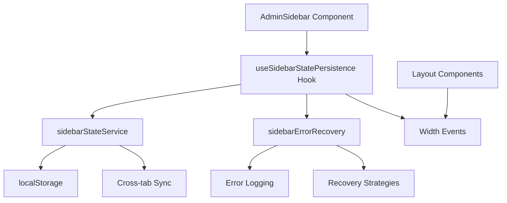

# Sidebar State Persistence - Developer Guide

## Table of Contents
1. [Quick Start](#quick-start)
2. [Architecture Overview](#architecture-overview)
3. [Implementation Details](#implementation-details)
4. [Best Practices](#best-practices)
5. [Testing Strategy](#testing-strategy)
6. [Performance Optimization](#performance-optimization)
7. [Debugging Guide](#debugging-guide)
8. [Common Patterns](#common-patterns)
9. [Troubleshooting](#troubleshooting)
10. [Advanced Usage](#advanced-usage)

## Quick Start

### For New Developers

Get up and running with sidebar state persistence in 5 minutes:

```typescript
// 1. Import the hook
import { useSidebarStatePersistence } from '@/hooks/useSidebarStatePersistence';

// 2. Use in your component
const MySidebarComponent = () => {
  const {
    sidebarState,
    changeSidebarMode,
    displayProperties
  } = useSidebarStatePersistence();

  // 3. Render based on display properties
  return (
    <div 
      className={`sidebar ${displayProperties.isExpanded ? 'expanded' : 'collapsed'}`}
      style={{ width: displayProperties.currentWidth }}
    >
      {displayProperties.showText && <span>Menu Text</span>}
    </div>
  );
};
```

### Integration Checklist

- [ ] Import the hook in your sidebar component
- [ ] Use `displayProperties` for rendering logic
- [ ] Handle mode changes with `changeSidebarMode`
- [ ] Set up hover handling with `setHoverState` (for expand-on-hover)
- [ ] Add width change event dispatching for layout updates
- [ ] Test persistence across page reloads

## Architecture Overview

### System Components



### Data Flow

1. **Component Mount**: Hook initializes with default or persisted state
2. **User Interaction**: Mode change triggers state update
3. **State Persistence**: Service saves to localStorage
4. **Cross-tab Sync**: Other tabs receive storage events
5. **Layout Update**: Width change events notify layout components

### Key Abstractions

#### 1. State Management Layer
- **Hook**: React integration and state management
- **Service**: Pure JavaScript persistence logic
- **Recovery**: Error handling and fallback strategies

#### 2. Configuration Layer
- **Default Config**: Sensible defaults for all options
- **User Preferences**: Customizable behavior settings
- **Runtime Config**: Dynamic configuration based on environment

#### 3. Event Layer
- **Storage Events**: Cross-tab synchronization
- **Custom Events**: Layout width notifications
- **Error Events**: Recovery and logging

## Implementation Details

### Hook Implementation

```typescript
export const useSidebarStatePersistence = (config: Partial<SidebarConfig> = {}) => {
  // 1. Merge configuration with defaults
  const finalConfig = { ...DEFAULT_CONFIG, ...config };
  
  // 2. Initialize state with persistence recovery
  const [sidebarState, setSidebarState] = useState<SidebarState>(() => {
    // Initial state logic with fallbacks
  });
  
  // 3. Load persisted state after mount
  useEffect(() => {
    // Async loading from localStorage
  }, []);
  
  // 4. Save state changes
  useEffect(() => {
    // Debounced saving to localStorage
  }, [sidebarState.mode]);
  
  // 5. Return API with memoized callbacks
  return {
    sidebarState,
    changeSidebarMode: useCallback(/* ... */),
    setHoverState: useCallback(/* ... */),
    // ... other methods
  };
};
```

### Service Implementation

```typescript
class SidebarStateService {
  // 1. Storage availability check
  private checkStorageAvailability(): boolean {
    // Safe localStorage detection
  }
  
  // 2. Data validation
  private validateStateData(data: any): boolean {
    // Type checking and validation
  }
  
  // 3. Cross-tab synchronization
  private initializeCrossTabSync(): void {
    // Storage event listeners
  }
  
  // 4. Error handling
  private handleStorageError(error: Error): void {
    // Error recovery and logging
  }
}
```

### Error Recovery Implementation

```typescript
class SidebarErrorRecovery {
  // 1. Error classification
  private determineErrorType(error: Error): SidebarErrorType {
    // Pattern matching for error types
  }
  
  // 2. Recovery strategies
  async recoverFromError(error: Error, operation: string): Promise<RecoveryResult> {
    // Strategy selection and execution
  }
  
  // 3. Retry logic
  private async handleSyncFailure(retryKey: string, currentRetries: number): Promise<RecoveryResult> {
    // Exponential backoff retry
  }
}
```

## Best Practices

### 1. Component Integration

#### ✅ Do
```typescript
const MySidebar = () => {
  const { displayProperties, changeSidebarMode } = useSidebarStatePersistence();
  
  // Use display properties for rendering
  const sidebarClass = cn(
    'sidebar',
    displayProperties.isExpanded && 'expanded',
    displayProperties.isOverlay && 'overlay'
  );
  
  return <div className={sidebarClass}>...</div>;
};
```

#### ❌ Don't
```typescript
const MySidebar = () => {
  const { sidebarState } = useSidebarStatePersistence();
  
  // Don't compute display logic in component
  const isExpanded = sidebarState.mode === 'expanded' || 
    (sidebarState.mode === 'expand-on-hover' && sidebarState.isHovered);
  
  return <div className={isExpanded ? 'expanded' : 'collapsed'}>...</div>;
};
```

### 2. Error Handling

#### ✅ Do
```typescript
const MySidebar = () => {
  const { storageAvailable, clearStoredState } = useSidebarStatePersistence();
  
  // Provide fallback UI for storage issues
  if (!storageAvailable) {
    return <div className="sidebar-fallback">...</div>;
  }
  
  // Provide reset option for users
  const handleReset = () => {
    if (clearStoredState()) {
      window.location.reload();
    }
  };
};
```

#### ❌ Don't
```typescript
const MySidebar = () => {
  const { sidebarState } = useSidebarStatePersistence();
  
  // Don't ignore storage availability
  // Don't assume persistence always works
  return <div>...</div>;
};
```

### 3. Performance Optimization

#### ✅ Do
```typescript
const MySidebar = () => {
  const { displayProperties } = useSidebarStatePersistence();
  
  // Memoize expensive calculations
  const sidebarStyles = useMemo(() => ({
    width: displayProperties.currentWidth,
    transform: displayProperties.isOverlay ? 'translateX(0)' : 'none'
  }), [displayProperties.currentWidth, displayProperties.isOverlay]);
  
  return <div style={sidebarStyles}>...</div>;
};
```

#### ❌ Don't
```typescript
const MySidebar = () => {
  const { sidebarState } = useSidebarStatePersistence();
  
  // Don't recalculate on every render
  const width = sidebarState.mode === 'expanded' ? 256 : 64;
  
  return <div style={{ width }}>...</div>;
};
```

### 4. Testing Integration

#### ✅ Do
```typescript
// Mock the hook for testing
vi.mock('@/hooks/useSidebarStatePersistence', () => ({
  useSidebarStatePersistence: vi.fn(() => ({
    sidebarState: { mode: 'collapsed', isHovered: false, width: 64, isTransitioning: false },
    displayProperties: { isExpanded: false, showText: false, currentWidth: 64, layoutWidth: 64, isOverlay: false },
    changeSidebarMode: vi.fn(),
    setHoverState: vi.fn(),
    storageAvailable: true
  }))
}));
```

#### ❌ Don't
```typescript
// Don't test with real localStorage in unit tests
// Don't assume specific implementation details
```

## Testing Strategy

### Unit Tests

```typescript
describe('useSidebarStatePersistence', () => {
  beforeEach(() => {
    // Clean localStorage
    localStorage.clear();
    // Reset mocks
    vi.clearAllMocks();
  });

  it('should persist state changes', async () => {
    const { result } = renderHook(() => useSidebarStatePersistence());
    
    await act(async () => {
      result.current.changeSidebarMode('expanded');
    });
    
    // Verify localStorage was updated
    expect(localStorage.getItem('admin-sidebar-state')).toBeTruthy();
  });
});
```

### Integration Tests

```typescript
describe('AdminSidebar Integration', () => {
  it('should maintain state across remounts', () => {
    // First render
    const { unmount } = render(<AdminSidebar />);
    
    // Change state
    fireEvent.click(screen.getByRole('button', { name: /expand/i }));
    
    // Unmount and remount
    unmount();
    render(<AdminSidebar />);
    
    // Verify state persisted
    expect(screen.getByText(/expanded/i)).toBeInTheDocument();
  });
});
```

### Error Scenario Tests

```typescript
describe('Error Handling', () => {
  it('should handle localStorage unavailable', () => {
    // Mock localStorage as unavailable
    Object.defineProperty(window, 'localStorage', { value: undefined });
    
    const { result } = renderHook(() => useSidebarStatePersistence());
    
    expect(result.current.storageAvailable).toBe(false);
    expect(result.current.sidebarState.mode).toBe('collapsed');
  });
});
```

## Performance Optimization

### 1. Memoization Strategy

```typescript
// Hook implementation with proper memoization
export const useSidebarStatePersistence = (config: Partial<SidebarConfig> = {}) => {
  // Memoize configuration
  const finalConfig = useMemo(() => ({ ...DEFAULT_CONFIG, ...config }), [config]);
  
  // Memoize callbacks
  const changeSidebarMode = useCallback((mode: SidebarMode) => {
    // Implementation
  }, []);
  
  // Memoize display properties
  const displayProperties = useMemo(() => ({
    isExpanded: sidebarState.mode === 'expanded' || 
                (sidebarState.mode === 'expand-on-hover' && sidebarState.isHovered),
    // ... other properties
  }), [sidebarState.mode, sidebarState.isHovered]);
  
  return { displayProperties, changeSidebarMode, /* ... */ };
};
```

### 2. Debounced Operations

```typescript
// Debounced localStorage saves
const debouncedSave = useMemo(
  () => debounce((state: SidebarState) => {
    sidebarStateService.saveState(state);
  }, 300),
  []
);

useEffect(() => {
  debouncedSave(sidebarState);
}, [sidebarState, debouncedSave]);
```

### 3. Event Listener Optimization

```typescript
// Efficient event listener management
useEffect(() => {
  const handleStorageChange = (event: StorageEvent) => {
    if (event.key === 'admin-sidebar-state' && event.newValue) {
      // Handle cross-tab sync
    }
  };

  window.addEventListener('storage', handleStorageChange);
  
  return () => {
    window.removeEventListener('storage', handleStorageChange);
  };
}, []);
```

## Debugging Guide

### 1. Debug Information

```typescript
// Get comprehensive debug info
const debugInfo = {
  hook: useSidebarStatePersistence(),
  service: sidebarStateService.getDiagnostics(),
  errors: sidebarErrorRecovery.getErrorHistory(),
  storage: {
    available: typeof Storage !== 'undefined',
    quota: navigator.storage?.estimate?.(),
    data: Object.keys(localStorage).filter(key => key.includes('sidebar'))
  }
};

console.log('Sidebar Debug Info:', debugInfo);
```

### 2. Common Debug Scenarios

#### State Not Persisting
```typescript
// Check storage availability
console.log('Storage available:', typeof Storage !== 'undefined');

// Check for errors
console.log('Error history:', sidebarErrorRecovery.getErrorHistory());

// Check stored data
console.log('Stored state:', localStorage.getItem('admin-sidebar-state'));
```

#### Cross-tab Sync Issues
```typescript
// Test storage events
window.addEventListener('storage', (e) => {
  console.log('Storage event:', e.key, e.newValue);
});

// Manually trigger sync
localStorage.setItem('admin-sidebar-state', JSON.stringify({ mode: 'expanded' }));
```

#### Performance Issues
```typescript
// Monitor render frequency
const renderCount = useRef(0);
renderCount.current++;
console.log('Render count:', renderCount.current);

// Monitor state changes
useEffect(() => {
  console.log('State changed:', sidebarState);
}, [sidebarState]);
```

### 3. Debug Tools

#### Browser DevTools
- **Application Tab**: Check localStorage data
- **Console**: Monitor error messages and debug logs
- **Performance Tab**: Profile render performance
- **Network Tab**: Check for any unexpected requests

#### Custom Debug Panel
```typescript
const SidebarDebugPanel = () => {
  const hookData = useSidebarStatePersistence();
  const diagnostics = sidebarStateService.getDiagnostics();
  
  return (
    <div className="debug-panel">
      <h3>Sidebar Debug Info</h3>
      <pre>{JSON.stringify({ hookData, diagnostics }, null, 2)}</pre>
    </div>
  );
};
```

## Common Patterns

### 1. Layout Integration

```typescript
const AdminLayout = () => {
  const [sidebarWidth, setSidebarWidth] = useState(64);
  
  useEffect(() => {
    const handleSidebarResize = (event: CustomEvent<{ width: number }>) => {
      setSidebarWidth(event.detail.width);
    };

    window.addEventListener('admin-sidebar-resize', handleSidebarResize as EventListener);
    
    return () => {
      window.removeEventListener('admin-sidebar-resize', handleSidebarResize as EventListener);
    };
  }, []);
  
  return (
    <div className="admin-layout">
      <AdminSidebar />
      <main style={{ marginLeft: sidebarWidth }}>
        <Outlet />
      </main>
    </div>
  );
};
```

### 2. Responsive Behavior

```typescript
const ResponsiveSidebar = () => {
  const { displayProperties, changeSidebarMode } = useSidebarStatePersistence();
  const isMobile = useIsMobile();
  
  // Auto-collapse on mobile
  useEffect(() => {
    if (isMobile && displayProperties.isExpanded) {
      changeSidebarMode('collapsed');
    }
  }, [isMobile, displayProperties.isExpanded, changeSidebarMode]);
  
  return <div>...</div>;
};
```

### 3. Animation Integration

```typescript
const AnimatedSidebar = () => {
  const { sidebarState, displayProperties } = useSidebarStatePersistence();
  
  const sidebarVariants = {
    expanded: { width: 256, opacity: 1 },
    collapsed: { width: 64, opacity: 0.8 },
    hover: { width: 256, opacity: 1, zIndex: 50 }
  };
  
  return (
    <motion.div
      variants={sidebarVariants}
      animate={
        displayProperties.isOverlay ? 'hover' :
        displayProperties.isExpanded ? 'expanded' : 'collapsed'
      }
      transition={{ duration: 0.3, ease: 'easeInOut' }}
    >
      {/* Sidebar content */}
    </motion.div>
  );
};
```

## Troubleshooting

### Issue: State Not Persisting

**Symptoms**: Sidebar resets to default on page reload

**Diagnosis**:
```typescript
// Check storage availability
console.log('localStorage available:', typeof Storage !== 'undefined');

// Check for quota issues
navigator.storage?.estimate().then(estimate => {
  console.log('Storage quota:', estimate);
});

// Check error history
console.log('Errors:', sidebarErrorRecovery.getErrorHistory());
```

**Solutions**:
1. Check browser privacy settings
2. Clear browser data if quota exceeded
3. Verify domain consistency
4. Check for ad blockers

### Issue: Cross-tab Sync Not Working

**Symptoms**: Changes in one tab don't reflect in others

**Diagnosis**:
```typescript
// Test storage events
window.addEventListener('storage', (e) => {
  console.log('Storage event received:', e);
});

// Manually trigger event
localStorage.setItem('test-key', 'test-value');
```

**Solutions**:
1. Ensure same origin policy compliance
2. Check browser storage event support
3. Verify no conflicting event listeners
4. Test in incognito mode

### Issue: Performance Problems

**Symptoms**: Slow rendering or excessive re-renders

**Diagnosis**:
```typescript
// Monitor render frequency
const MyComponent = () => {
  const renderCount = useRef(0);
  renderCount.current++;
  
  useEffect(() => {
    console.log('Component rendered:', renderCount.current);
  });
  
  return <div>...</div>;
};
```

**Solutions**:
1. Add proper memoization
2. Reduce state change frequency
3. Optimize event listeners
4. Use React DevTools Profiler

## Advanced Usage

### 1. Custom Error Recovery

```typescript
// Custom error recovery strategy
const customErrorRecovery = {
  async handleCustomError(error: Error): Promise<boolean> {
    // Custom recovery logic
    if (error.message.includes('custom-error')) {
      // Handle specific error type
      return true;
    }
    return false;
  }
};

// Register custom recovery
sidebarErrorRecovery.addCustomRecovery(customErrorRecovery);
```

### 2. Analytics Integration

```typescript
// Track sidebar usage
const useSidebarAnalytics = () => {
  const { sidebarState } = useSidebarStatePersistence();
  
  useEffect(() => {
    // Track mode changes
    analytics.track('sidebar_mode_changed', {
      mode: sidebarState.mode,
      timestamp: Date.now()
    });
  }, [sidebarState.mode]);
};
```

### 3. A/B Testing Integration

```typescript
// A/B test different default modes
const useExperimentalSidebar = () => {
  const experiment = useExperiment('sidebar-default-mode');
  
  const config = useMemo(() => ({
    defaultMode: experiment.variant === 'expanded' ? 'expanded' : 'collapsed'
  }), [experiment.variant]);
  
  return useSidebarStatePersistence(config);
};
```

### 4. Server-Side Preferences

```typescript
// Sync with server preferences
const useServerSyncedSidebar = () => {
  const { user } = useAuth();
  const [serverPrefs, setServerPrefs] = useState(null);
  
  // Load server preferences
  useEffect(() => {
    if (user) {
      loadUserPreferences(user.id).then(setServerPrefs);
    }
  }, [user]);
  
  // Use server preferences as default
  const config = useMemo(() => ({
    defaultMode: serverPrefs?.sidebarMode || 'collapsed'
  }), [serverPrefs]);
  
  return useSidebarStatePersistence(config);
};
```

## Migration and Upgrades

### From Legacy Implementation

1. **Identify current state management**
2. **Map existing state to new structure**
3. **Update component integration**
4. **Test persistence functionality**
5. **Migrate user preferences**

### Version Compatibility

The system handles version compatibility automatically:
- **Data validation** for different versions
- **Migration scripts** for breaking changes
- **Fallback behavior** for unsupported versions

### Breaking Changes

When making breaking changes:
1. **Update version number** in stored data
2. **Add migration logic** for old data
3. **Test with existing user data**
4. **Provide fallback behavior**

## Contributing Guidelines

### Code Standards

1. **TypeScript strict mode** compliance
2. **Comprehensive error handling**
3. **Performance considerations**
4. **Test coverage > 90%**
5. **Documentation updates**

### Testing Requirements

1. **Unit tests** for all functions
2. **Integration tests** for component usage
3. **Error scenario tests**
4. **Performance benchmarks**
5. **Cross-browser testing**

### Review Checklist

- [ ] Backward compatibility maintained
- [ ] Error handling comprehensive
- [ ] Performance impact assessed
- [ ] Documentation updated
- [ ] Tests added/updated
- [ ] Cross-browser tested