# Sidebar State Persistence - Troubleshooting Flow

## Visual Problem-Solving Guide

### 🔍 Initial Diagnosis Flow


### 🚨 Emergency Triage

```mermaid
flowchart LR
    A[Critical Issue] --> B{User can access admin?}
    B -->|No| C[🔴 CRITICAL]
    B -->|Yes| D{Functionality broken?}
    D -->|Yes| E[🟡 HIGH]
    D -->|No| F{Performance impact?}
    F -->|Yes| G[🟢 MEDIUM]
    F -->|No| H[🔵 LOW]
    
    C --> C1[Reset all data immediately]
    E --> E1[Isolate and fix specific feature]
    G --> G1[Optimize performance]
    H --> H1[Schedule for next sprint]
```



## Issue Categories & Solutions

### 📱 Category 1: State Persistence Issues

#### Problem: Sidebar resets on page reload


**Quick Fix Commands:**
```javascript
// 1. Check storage availability
console.log('Storage test:', (() => {
  try {
    localStorage.setItem('test', 'test');
    localStorage.removeItem('test');
    return 'Available';
  } catch (e) {
    return 'Blocked: ' + e.message;
  }
})());

// 2. Reset if corrupted
if (localStorage.getItem('admin-sidebar-state')?.includes('undefined')) {
  sidebarStateService.resetAllData();
  location.reload();
}

// 3. Force save test
sidebarStateService.saveState({ 
  mode: 'expanded', 
  isHovered: false, 
  width: 256, 
  isTransitioning: false 
});
```

#### Problem: Data corruption


**Recovery Script:**
```javascript
// Automated corruption recovery
const recoverFromCorruption = () => {
  console.log('🔧 Starting corruption recovery...');
  
  // 1. Backup current data
  const backup = localStorage.getItem('admin-sidebar-state');
  console.log('Backup created:', backup);
  
  // 2. Clear corrupted data
  sidebarStateService.resetAllData();
  
  // 3. Verify clean state
  const cleanState = sidebarStateService.loadState();
  console.log('Clean state:', cleanState);
  
  // 4. Test save/load cycle
  sidebarStateService.saveState({ 
    mode: 'collapsed', 
    isHovered: false, 
    width: 64, 
    isTransitioning: false 
  });
  
  const testLoad = sidebarStateService.loadState();
  console.log('✅ Recovery complete:', testLoad?.mode === 'collapsed');
  
  return testLoad?.mode === 'collapsed';
};
```

### 🔄 Category 2: Cross-Tab Synchronization Issues

#### Problem: Changes don't sync between tabs


**Sync Test Suite:**
```javascript
// Comprehensive sync testing
const testCrossTabSync = () => {
  console.log('🔄 Testing cross-tab synchronization...');
  
  // 1. Test storage event detection
  let eventReceived = false;
  const testListener = (e) => {
    if (e.key === 'sync-test') {
      eventReceived = true;
      console.log('✅ Storage event received');
    }
  };
  
  window.addEventListener('storage', testListener);
  
  // 2. Trigger event from same tab (should not fire)
  localStorage.setItem('sync-test', Date.now().toString());
  
  setTimeout(() => {
    console.log('Same-tab event (should be false):', eventReceived);
    
    // 3. Instructions for manual test
    console.log('📋 Manual test: Open another tab and run:');
    console.log('localStorage.setItem("sync-test", "' + Date.now() + '")');
    
    // 4. Cleanup
    setTimeout(() => {
      window.removeEventListener('storage', testListener);
      localStorage.removeItem('sync-test');
    }, 10000);
  }, 1000);
};

// Run test
testCrossTabSync();
```

#### Problem: Sync conflicts


### ⚡ Category 3: Performance Issues

#### Problem: Excessive re-renders


**Performance Profiler:**
```javascript
// Performance monitoring setup
const performanceProfiler = {
  renderCount: 0,
  storageOps: 0,
  startTime: Date.now(),
  
  start() {
    console.log('📊 Starting performance profiling...');
    
    // Monitor renders
    const originalUseState = React.useState;
    React.useState = function(initial) {
      const result = originalUseState(initial);
      performanceProfiler.renderCount++;
      return result;
    };
    
    // Monitor storage operations
    const originalSetItem = localStorage.setItem;
    localStorage.setItem = function(key, value) {
      if (key.includes('sidebar')) {
        performanceProfiler.storageOps++;
      }
      return originalSetItem.call(this, key, value);
    };
    
    // Report every 5 seconds
    this.interval = setInterval(() => {
      const elapsed = (Date.now() - this.startTime) / 1000;
      console.log(`📈 Performance Report (${elapsed}s):`, {
        renders: this.renderCount,
        storageOps: this.storageOps,
        rendersPerSecond: (this.renderCount / elapsed).toFixed(2),
        storageOpsPerSecond: (this.storageOps / elapsed).toFixed(2)
      });
    }, 5000);
  },
  
  stop() {
    clearInterval(this.interval);
    console.log('📊 Performance profiling stopped');
  }
};

// Usage
performanceProfiler.start();
// ... test your app ...
// performanceProfiler.stop();
```

### 🎯 Category 4: Mobile-Specific Issues

#### Problem: Touch events not working


**Mobile Debug Suite:**
```javascript
// Mobile-specific debugging
const mobileDebugger = {
  testTouchSupport() {
    console.log('📱 Touch Support Test:');
    console.log('- Touch events:', 'ontouchstart' in window);
    console.log('- Pointer events:', 'onpointerdown' in window);
    console.log('- MSPointer events:', 'onmspointerdown' in window);
    console.log('- User agent:', navigator.userAgent);
  },
  
  monitorTouchEvents() {
    console.log('👆 Monitoring touch events...');
    
    ['touchstart', 'touchmove', 'touchend', 'touchcancel'].forEach(event => {
      document.addEventListener(event, (e) => {
        console.log(`[${event}]`, {
          touches: e.touches.length,
          changedTouches: e.changedTouches.length,
          target: e.target.tagName,
          clientX: e.touches[0]?.clientX,
          clientY: e.touches[0]?.clientY
        });
      }, { passive: true });
    });
  },
  
  testSwipeGesture() {
    console.log('👈 Testing swipe gesture...');
    
    let startX = 0;
    let startTime = 0;
    
    document.addEventListener('touchstart', (e) => {
      startX = e.touches[0].clientX;
      startTime = Date.now();
    });
    
    document.addEventListener('touchend', (e) => {
      const endX = e.changedTouches[0].clientX;
      const endTime = Date.now();
      const distance = endX - startX;
      const duration = endTime - startTime;
      
      console.log('Swipe detected:', {
        distance,
        duration,
        velocity: distance / duration,
        direction: distance > 0 ? 'right' : 'left'
      });
    });
  }
};

// Run mobile tests
mobileDebugger.testTouchSupport();
mobileDebugger.monitorTouchEvents();
mobileDebugger.testSwipeGesture();
```

## Decision Trees

### 🌳 Main Troubleshooting Decision Tree


### 🔧 Quick Fix Decision Tree

```mermaid
flowchart TD
    A[Need Quick Fix?] --> B{How urgent?}
    
    B -->|Critical| C[Emergency Reset]
    B -->|High| D[Targeted Fix]
    B -->|Medium| E[Standard Debug]
    B -->|Low| F[Schedule Investigation]
    
    C --> C1[sidebarStateService.resetAllData()]
    C1 --> C2[window.location.reload()]
    
    D --> D1[Identify specific issue]
    D1 --> D2[Apply targeted solution]
    
    E --> E1[Follow standard flow]
    E1 --> E2[Document findings]
    
    F --> F1[Add to backlog]
    F1 --> F2[Monitor for escalation]
```

## Escalation Procedures

### 🚨 When to Escalate


### 📋 Escalation Checklist

**Before Escalating:**
- [ ] Attempted basic troubleshooting steps
- [ ] Checked error logs and console
- [ ] Verified issue reproducibility
- [ ] Gathered debug information
- [ ] Documented steps to reproduce

**Information to Include:**
- [ ] Browser and version
- [ ] Operating system
- [ ] User role and permissions
- [ ] Steps to reproduce
- [ ] Expected vs actual behavior
- [ ] Console errors/warnings
- [ ] Debug report output

**Escalation Template:**
```
Subject: [SEVERITY] Sidebar State Persistence Issue

Environment:
- Browser: [Chrome 91.0.4472.124]
- OS: [Windows 10]
- User Role: [system_admin]

Issue Description:
[Clear description of the problem]

Steps to Reproduce:
1. [Step 1]
2. [Step 2]
3. [Step 3]

Expected Behavior:
[What should happen]

Actual Behavior:
[What actually happens]

Debug Information:
[Paste debug report output]

Troubleshooting Attempted:
- [ ] Cleared localStorage
- [ ] Tested in incognito mode
- [ ] Checked console for errors
- [ ] Verified component imports

Impact:
[How this affects users/business]

Workaround:
[Any temporary solutions found]
```

## Recovery Procedures

### 🔄 Automated Recovery

```javascript
// Automated recovery system
const autoRecovery = {
  async runDiagnostics() {
    console.log('🔍 Running automated diagnostics...');
    
    const results = {
      storageAvailable: this.testStorage(),
      dataIntegrity: this.testDataIntegrity(),
      syncFunctional: await this.testSync(),
      performanceOk: this.testPerformance()
    };
    
    console.log('📊 Diagnostic Results:', results);
    return results;
  },
  
  testStorage() {
    try {
      const testKey = '__recovery_test__';
      localStorage.setItem(testKey, 'test');
      const retrieved = localStorage.getItem(testKey);
      localStorage.removeItem(testKey);
      return retrieved === 'test';
    } catch (e) {
      return false;
    }
  },
  
  testDataIntegrity() {
    try {
      const data = localStorage.getItem('admin-sidebar-state');
      if (!data) return true; // No data is fine
      
      const parsed = JSON.parse(data);
      return parsed && typeof parsed.mode === 'string';
    } catch (e) {
      return false;
    }
  },
  
  async testSync() {
    return new Promise((resolve) => {
      let eventReceived = false;
      
      const listener = (e) => {
        if (e.key === '__sync_test__') {
          eventReceived = true;
          window.removeEventListener('storage', listener);
          resolve(true);
        }
      };
      
      window.addEventListener('storage', listener);
      
      // Simulate cross-tab change
      setTimeout(() => {
        if (!eventReceived) {
          window.removeEventListener('storage', listener);
          resolve(false);
        }
      }, 2000);
      
      // This won't trigger in same tab, but tests the listener setup
      localStorage.setItem('__sync_test__', Date.now().toString());
      localStorage.removeItem('__sync_test__');
    });
  },
  
  testPerformance() {
    const start = performance.now();
    
    // Simulate typical operations
    for (let i = 0; i < 100; i++) {
      sidebarStateService.loadState();
    }
    
    const duration = performance.now() - start;
    return duration < 100; // Should complete in under 100ms
  },
  
  async attemptRecovery(diagnostics) {
    console.log('🔧 Attempting automated recovery...');
    
    if (!diagnostics.storageAvailable) {
      console.log('❌ Storage unavailable - cannot recover');
      return false;
    }
    
    if (!diagnostics.dataIntegrity) {
      console.log('🧹 Clearing corrupted data...');
      sidebarStateService.resetAllData();
    }
    
    if (!diagnostics.syncFunctional) {
      console.log('🔄 Re-initializing sync listeners...');
      // Re-initialize would happen on next component mount
    }
    
    if (!diagnostics.performanceOk) {
      console.log('⚡ Clearing performance-impacting data...');
      // Clear analytics data that might be slowing things down
      localStorage.removeItem('admin-sidebar-analytics');
    }
    
    console.log('✅ Recovery attempt complete');
    return true;
  },
  
  async fullRecovery() {
    const diagnostics = await this.runDiagnostics();
    const recovered = await this.attemptRecovery(diagnostics);
    
    if (recovered) {
      console.log('🎉 Automated recovery successful');
      return true;
    } else {
      console.log('❌ Automated recovery failed - manual intervention required');
      return false;
    }
  }
};

// Usage: autoRecovery.fullRecovery()
```

### 🆘 Manual Recovery Steps

**Step 1: Assessment**
```javascript
// Quick health check
const healthCheck = () => {
  console.log('🏥 Health Check Results:');
  console.log('- Storage:', typeof Storage !== 'undefined' ? '✅' : '❌');
  console.log('- Data:', localStorage.getItem('admin-sidebar-state') ? '✅' : '⚠️');
  console.log('- Errors:', sidebarErrorRecovery.getErrorHistory().length);
  console.log('- Performance:', performance.memory ? '✅' : '⚠️');
};
```

**Step 2: Data Backup**
```javascript
// Create backup before recovery
const createBackup = () => {
  const backup = {
    timestamp: new Date().toISOString(),
    sidebarState: localStorage.getItem('admin-sidebar-state'),
    preferences: localStorage.getItem('admin-sidebar-preferences'),
    analytics: localStorage.getItem('admin-sidebar-analytics')
  };
  
  console.log('💾 Backup created:', backup);
  return JSON.stringify(backup);
};
```

**Step 3: Progressive Recovery**
```javascript
// Progressive recovery approach
const progressiveRecovery = {
  step1_clearCorrupted() {
    console.log('🧹 Step 1: Clearing corrupted data...');
    try {
      const data = localStorage.getItem('admin-sidebar-state');
      JSON.parse(data || '{}');
      console.log('✅ Data is valid');
    } catch (e) {
      localStorage.removeItem('admin-sidebar-state');
      console.log('🗑️ Removed corrupted data');
    }
  },
  
  step2_resetToDefaults() {
    console.log('🔄 Step 2: Resetting to defaults...');
    sidebarStateService.saveState({
      mode: 'collapsed',
      isHovered: false,
      width: 64,
      isTransitioning: false
    });
    console.log('✅ Default state restored');
  },
  
  step3_testFunctionality() {
    console.log('🧪 Step 3: Testing functionality...');
    const loaded = sidebarStateService.loadState();
    console.log('Load test:', loaded ? '✅' : '❌');
    
    sidebarStateService.saveState({
      mode: 'expanded',
      isHovered: false,
      width: 256,
      isTransitioning: false
    });
    
    const reloaded = sidebarStateService.loadState();
    console.log('Save/load test:', reloaded?.mode === 'expanded' ? '✅' : '❌');
  },
  
  runAll() {
    this.step1_clearCorrupted();
    this.step2_resetToDefaults();
    this.step3_testFunctionality();
    console.log('🎉 Progressive recovery complete');
  }
};
```

## Monitoring & Prevention

### 📊 Health Monitoring

```javascript
// Continuous health monitoring
const healthMonitor = {
  start() {
    console.log('🔍 Starting health monitoring...');
    
    this.interval = setInterval(() => {
      const health = {
        timestamp: new Date().toISOString(),
        storage: this.checkStorage(),
        errors: this.checkErrors(),
        performance: this.checkPerformance(),
        memory: this.checkMemory()
      };
      
      // Only log if there are issues
      if (!health.storage || health.errors > 0 || !health.performance) {
        console.warn('⚠️ Health issue detected:', health);
      }
    }, 30000); // Check every 30 seconds
  },
  
  stop() {
    clearInterval(this.interval);
    console.log('🔍 Health monitoring stopped');
  },
  
  checkStorage() {
    try {
      const testKey = '__health_check__';
      localStorage.setItem(testKey, 'test');
      localStorage.removeItem(testKey);
      return true;
    } catch (e) {
      return false;
    }
  },
  
  checkErrors() {
    return sidebarErrorRecovery.getErrorHistory().filter(
      error => Date.now() - error.timestamp < 300000 // Last 5 minutes
    ).length;
  },
  
  checkPerformance() {
    const start = performance.now();
    sidebarStateService.loadState();
    const duration = performance.now() - start;
    return duration < 10; // Should be under 10ms
  },
  
  checkMemory() {
    if (!performance.memory) return null;
    
    return {
      used: Math.round(performance.memory.usedJSHeapSize / 1024 / 1024),
      total: Math.round(performance.memory.totalJSHeapSize / 1024 / 1024),
      limit: Math.round(performance.memory.jsHeapSizeLimit / 1024 / 1024)
    };
  }
};

// Start monitoring
healthMonitor.start();
```

This comprehensive troubleshooting flow provides visual guides and systematic approaches to diagnose and resolve sidebar state persistence issues efficiently.