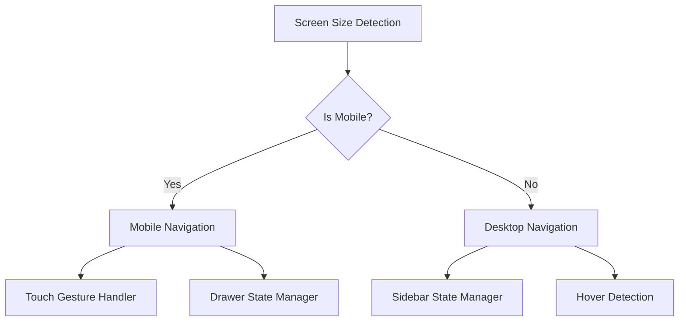

# Mobile Navigation Developer Guide

## Quick Start

### For New Developers
This guide provides everything you need to understand and work with the mobile navigation system in 15 minutes.

### For Experienced Developers
Jump to the [Advanced Topics](#advanced-topics) section for performance optimization and troubleshooting.

## System Architecture

### Component Hierarchy

```
AdminSidebar (Main Component)
├── useIsMobile() → Determines which version to render
├── DesktopAdminSidebar (Desktop/Tablet)
│   ├── 3-state sidebar system
│   ├── Hover detection
│   └── State persistence
└── MobileAdminNavigation (Mobile)
    ├── Touch gesture system
    ├── Drawer overlay
    └── Accessibility features
```

### State Management Flow



## Core Concepts

### 1. Responsive Detection

The system uses the `useIsMobile` hook to determine which navigation to render:

```tsx
const isMobile = useIsMobile(); // Breakpoint: 768px

return (
  <>
    {!isMobile && <DesktopAdminSidebar />}
    {isMobile && <MobileAdminNavigation />}
  </>
);
```

### 2. Touch Gesture System

The mobile navigation implements a sophisticated touch gesture system:

```tsx
// Touch gesture detection
const handleTouchStart = (e: React.TouchEvent) => {
  setTouchStart(e.targetTouches[0].clientX);
};

const handleTouchEnd = () => {
  const distance = touchStart - touchEnd;
  const isRightSwipe = distance < -50 && touchStart < 50; // Edge swipe only
  
  if (isRightSwipe && !isDrawerOpen) {
    setIsDrawerOpen(true);
  }
};
```

### 3. State Synchronization

The system maintains separate state for mobile and desktop but ensures consistency:

```tsx
// Desktop state (persisted)
const [sidebarState, setSidebarState] = useState(() => {
  const saved = localStorage.getItem('admin-sidebar-state');
  return saved ? JSON.parse(saved) : defaultState;
});

// Mobile state (session-only)
const [isDrawerOpen, setIsDrawerOpen] = useState(false);
```

## Implementation Details

### Mobile Navigation Component

```tsx
const MobileAdminNavigation = () => {
  const [isDrawerOpen, setIsDrawerOpen] = useState(false);
  const [touchStart, setTouchStart] = useState<number | null>(null);
  const [isDragging, setIsDragging] = useState(false);

  // Gesture handling
  const handleTouchStart = (e: React.TouchEvent) => {
    setTouchStart(e.targetTouches[0].clientX);
    setIsDragging(false);
  };

  // Body scroll prevention
  useEffect(() => {
    if (isDrawerOpen) {
      document.body.style.overflow = 'hidden';
    } else {
      document.body.style.overflow = 'unset';
    }
    
    return () => {
      document.body.style.overflow = 'unset';
    };
  }, [isDrawerOpen]);

  return (
    <>
      {/* Menu trigger */}
      <div className="fixed top-4 left-4 z-50 md:hidden">
        <Button onClick={() => setIsDrawerOpen(true)}>
          <Menu className="h-6 w-6" />
        </Button>
      </div>

      {/* Drawer overlay */}
      {isDrawerOpen && (
        <div className="fixed inset-0 bg-black/50 z-50">
          {/* Drawer content */}
        </div>
      )}
    </>
  );
};
```

### Desktop Integration

The desktop sidebar communicates layout changes to the main layout:

```tsx
// Dispatch width changes for layout adjustment
useEffect(() => {
  const layoutWidth = sidebarState.mode === 'expanded' ? 256 : 64;
  window.dispatchEvent(new CustomEvent('admin-sidebar-resize', {
    detail: { width: layoutWidth }
  }));
}, [sidebarState.mode]);
```

## Advanced Topics

### Performance Optimization

#### 1. Render Optimization

```tsx
// Only render the needed navigation component
const AdminSidebar = React.memo(() => {
  const isMobile = useIsMobile();
  
  // Conditional rendering prevents both components from mounting
  if (isMobile) {
    return <MobileAdminNavigation />;
  }
  
  return <DesktopAdminSidebar />;
});
```

#### 2. Event Handler Optimization

```tsx
// Debounced touch handling to prevent excessive updates
const debouncedTouchHandler = useMemo(
  () => debounce((e: TouchEvent) => {
    handleTouchMove(e);
  }, 16), // ~60fps
  []
);
```

#### 3. Memory Management

```tsx
useEffect(() => {
  // Cleanup function for event listeners
  return () => {
    if (hoverTimeoutRef.current) {
      clearTimeout(hoverTimeoutRef.current);
    }
    document.removeEventListener('keydown', handleEscape);
  };
}, []);
```

### Accessibility Implementation

#### 1. Keyboard Navigation

```tsx
// Escape key handling
useEffect(() => {
  const handleEscape = (e: KeyboardEvent) => {
    if (e.key === 'Escape' && isDrawerOpen) {
      setIsDrawerOpen(false);
    }
  };
  
  document.addEventListener('keydown', handleEscape);
  return () => document.removeEventListener('keydown', handleEscape);
}, [isDrawerOpen]);
```

#### 2. ARIA Implementation

```tsx
<Button
  aria-label="Open navigation menu"
  aria-expanded={isDrawerOpen}
  onClick={() => setIsDrawerOpen(true)}
>
  <Menu className="h-6 w-6" />
</Button>
```

#### 3. Focus Management

```tsx
// Focus trap for drawer
useEffect(() => {
  if (isDrawerOpen) {
    const focusableElements = drawer.querySelectorAll(
      'button, [href], input, select, textarea, [tabindex]:not([tabindex="-1"])'
    );
    
    const firstElement = focusableElements[0] as HTMLElement;
    const lastElement = focusableElements[focusableElements.length - 1] as HTMLElement;
    
    firstElement?.focus();
  }
}, [isDrawerOpen]);
```

## Testing Strategy

### Unit Testing

```tsx
describe('Mobile Navigation', () => {
  it('should open drawer on menu button click', async () => {
    render(<AdminSidebar />);
    
    const menuButton = screen.getByLabelText('Open navigation menu');
    fireEvent.click(menuButton);
    
    await waitFor(() => {
      expect(screen.getByText('Admin Sections')).toBeInTheDocument();
    });
  });
});
```

### Integration Testing

```tsx
describe('Responsive Behavior', () => {
  it('should switch between mobile and desktop', () => {
    const { rerender } = render(<AdminSidebar />);
    
    // Mock mobile
    mockUseIsMobile.mockReturnValue(true);
    rerender(<AdminSidebar />);
    expect(screen.getByLabelText('Open navigation menu')).toBeInTheDocument();
    
    // Mock desktop
    mockUseIsMobile.mockReturnValue(false);
    rerender(<AdminSidebar />);
    expect(screen.queryByLabelText('Open navigation menu')).not.toBeInTheDocument();
  });
});
```

### Touch Testing

```tsx
describe('Touch Gestures', () => {
  it('should handle swipe gestures', () => {
    render(<AdminSidebar />);
    
    const swipeArea = screen.getByLabelText('Swipe right to open navigation');
    
    fireEvent.touchStart(swipeArea, {
      targetTouches: [{ clientX: 10 }]
    });
    
    fireEvent.touchMove(swipeArea, {
      targetTouches: [{ clientX: 80 }]
    });
    
    fireEvent.touchEnd(swipeArea);
    
    expect(screen.getByText('Admin Sections')).toBeInTheDocument();
  });
});
```

## Debugging Guide

### Common Issues and Solutions

#### 1. Navigation Not Switching Between Mobile/Desktop

**Problem**: Component doesn't switch between mobile and desktop versions.

**Debug Steps**:
```tsx
// Check mobile detection
console.log('Is Mobile:', useIsMobile());
console.log('Window Width:', window.innerWidth);
console.log('Breakpoint:', window.innerWidth < 768);
```

**Solution**: Verify `useIsMobile` hook is working and breakpoint is correct.

#### 2. Touch Gestures Not Working

**Problem**: Swipe gestures don't open/close drawer.

**Debug Steps**:
```tsx
// Check touch support
console.log('Touch Support:', 'ontouchstart' in window);

// Debug touch events
const handleTouchStart = (e) => {
  console.log('Touch Start:', e.targetTouches[0].clientX);
};
```

**Solution**: Ensure touch events are supported and not being prevented by other handlers.

#### 3. Drawer Not Closing

**Problem**: Drawer stays open when it should close.

**Debug Steps**:
```tsx
// Check state updates
useEffect(() => {
  console.log('Drawer State:', isDrawerOpen);
}, [isDrawerOpen]);

// Check event handlers
const handleOverlayClick = (e) => {
  console.log('Overlay Click:', e.target === e.currentTarget);
};
```

**Solution**: Verify event propagation and state update logic.

### Performance Debugging

#### 1. Render Performance

```tsx
// Add render logging
const MobileAdminNavigation = () => {
  console.log('MobileAdminNavigation render');
  
  // Component logic...
};
```

#### 2. Memory Leaks

```tsx
// Check for memory leaks
useEffect(() => {
  const cleanup = () => {
    console.log('Cleanup called');
    // Cleanup logic...
  };
  
  return cleanup;
}, []);
```

#### 3. Animation Performance

```tsx
// Monitor animation performance
const handleTransitionStart = () => {
  console.time('drawer-animation');
};

const handleTransitionEnd = () => {
  console.timeEnd('drawer-animation');
};
```

## Best Practices

### 1. State Management

```tsx
// ✅ Good: Minimal state
const [isDrawerOpen, setIsDrawerOpen] = useState(false);

// ❌ Bad: Excessive state
const [isDrawerOpen, setIsDrawerOpen] = useState(false);
const [isAnimating, setIsAnimating] = useState(false);
const [touchPosition, setTouchPosition] = useState({ x: 0, y: 0 });
```

### 2. Event Handling

```tsx
// ✅ Good: Cleanup event listeners
useEffect(() => {
  const handleResize = () => { /* ... */ };
  window.addEventListener('resize', handleResize);
  return () => window.removeEventListener('resize', handleResize);
}, []);

// ❌ Bad: No cleanup
useEffect(() => {
  window.addEventListener('resize', handleResize);
}, []);
```

### 3. Accessibility

```tsx
// ✅ Good: Proper ARIA labels
<Button aria-label="Open navigation menu">
  <Menu />
</Button>

// ❌ Bad: No accessibility
<Button>
  <Menu />
</Button>
```

### 4. Performance

```tsx
// ✅ Good: Memoized components
const MobileNavigation = React.memo(() => {
  // Component logic...
});

// ❌ Bad: No memoization
const MobileNavigation = () => {
  // Component logic...
};
```

## Troubleshooting Checklist

### Before Debugging

- [ ] Check browser console for errors
- [ ] Verify component is receiving correct props
- [ ] Ensure all dependencies are installed
- [ ] Check if issue is mobile-specific or affects all devices

### Mobile-Specific Issues

- [ ] Test on actual mobile device, not just browser dev tools
- [ ] Check touch event support
- [ ] Verify viewport meta tag is present
- [ ] Test with different screen orientations

### Performance Issues

- [ ] Check for memory leaks in dev tools
- [ ] Monitor render frequency
- [ ] Verify event listeners are cleaned up
- [ ] Check animation performance

### Accessibility Issues

- [ ] Test with screen reader
- [ ] Verify keyboard navigation works
- [ ] Check color contrast ratios
- [ ] Test with high contrast mode

## Emergency Procedures

### Critical Issues

#### 1. Navigation Completely Broken

```tsx
// Emergency fallback component
const EmergencyNavigation = () => (
  <div className="fixed top-0 left-0 w-full bg-red-500 text-white p-4 z-50">
    <p>Navigation Error - Using Fallback</p>
    <a href="/admin/dashboard">Dashboard</a>
    <a href="/admin/management">Management</a>
  </div>
);
```

#### 2. Mobile Navigation Not Responding

```tsx
// Force desktop navigation on mobile as fallback
const AdminSidebar = () => {
  const [forceDesktop, setForceDesktop] = useState(false);
  const isMobile = useIsMobile() && !forceDesktop;
  
  // Emergency button to force desktop mode
  if (isMobile && navigationBroken) {
    return (
      <Button onClick={() => setForceDesktop(true)}>
        Use Desktop Navigation
      </Button>
    );
  }
  
  // Normal logic...
};
```

#### 3. Performance Emergency

```tsx
// Disable animations in emergency
const useReducedMotion = () => {
  return window.matchMedia('(prefers-reduced-motion: reduce)').matches;
};

// Apply in component
const shouldAnimate = !useReducedMotion() && !performanceEmergency;
```

## Support and Resources

### Internal Resources
- **Design System**: `/src/components/ui/`
- **Theme System**: `/src/context/ThemeContext.tsx`
- **Utility Functions**: `/src/lib/utils.ts`

### External Resources
- **React Testing Library**: https://testing-library.com/docs/react-testing-library/intro/
- **Accessibility Guidelines**: https://www.w3.org/WAI/WCAG21/quickref/
- **Touch Events**: https://developer.mozilla.org/en-US/docs/Web/API/Touch_events

### Getting Help

1. **Check Documentation**: Start with this guide and README
2. **Search Issues**: Look for similar problems in project issues
3. **Debug Systematically**: Use the debugging checklist
4. **Ask for Help**: Provide debug information and steps to reproduce

Remember: The mobile navigation system is designed to be robust and self-healing. Most issues can be resolved by following the debugging steps in this guide.