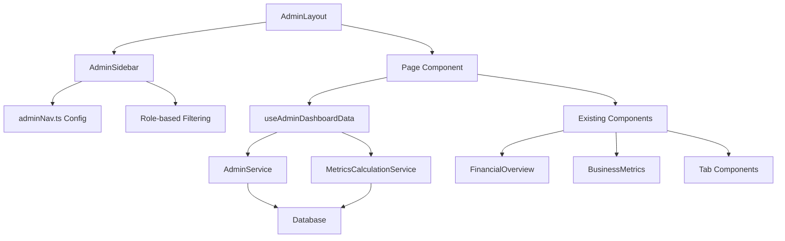

# Admin Sidebar Refactor - Design Document

## Overview

This design document outlines the refactoring of the admin interface from a tab-based system to a dual sidebar navigation system. The new architecture features a Main Sidebar for top-level categories and a Sub-Sidebar for section-specific navigation, eliminating redundant features between AdminDashboard and AdminAnalytics while reusing existing components and services.

## Architecture

### Current State Analysis

**Existing Components to Reuse:**
- `FinancialOverview.tsx` - Financial KPI cards (Real Data)
- `BusinessMetrics.tsx` - Business KPI cards (Mixed Real/Mock Data)
- `FinancialTab.tsx` - Complete financial analysis with real data
- `ClientsTab.tsx` - Client analytics with real data
- `UsersTab.tsx` - User analytics with real data
- `SystemTab.tsx` - System health monitoring (Mixed Data)
- `OperationsTab.tsx` - Operations metrics (Partially Implemented)

**Existing Services to Leverage:**
- `AdminService` - User and client management
- `MetricsCalculationService` - Financial calculations
- `useAdminDashboardData` - Admin-specific data hook
- `DashboardHeader.tsx` - Header with refresh functionality

**Files to Eliminate:**
- `/src/pages/admin/AdminDashboard.tsx` (Tab-based interface)
- `/src/pages/admin/AdminAnalytics.tsx` (Redundant analytics)
- `/src/components/admin/dashboard/tabs/` (All tab components will become pages)

### New Dual Sidebar Architecture Structure

```
src/
├── config/
│   └── adminNav.ts                    (NEW - Dual sidebar navigation configuration)
├── components/admin/
│   ├── MainSidebar.tsx                (NEW - Primary navigation with icons)
│   ├── SubSidebar.tsx                 (NEW - Secondary navigation with page links)
│   └── dashboard/                     (REUSE - Existing components)
│       ├── DashboardHeader.tsx        (REUSE)
│       ├── FinancialOverview.tsx      (REUSE)
│       ├── BusinessMetrics.tsx        (REUSE)
│       └── [other existing components]
├── pages/admin/
│   ├── dashboard.tsx                  (NEW - Main admin dashboard)
│   ├── user-management.tsx            (RENAME from UserManagement.tsx)
│   └── analytics/                     (NEW - Analytics section)
│       ├── financials.tsx             (NEW - From FinancialTab)
│       ├── clients.tsx                (NEW - From ClientsTab)
│       ├── users.tsx                  (NEW - From UsersTab)
│       ├── platform.tsx               (NEW - Platform analytics)
│       └── system-ops.tsx             (NEW - System & Operations combined)
└── layouts/
    └── AdminLayout.tsx                (MODIFY - Integrate dual sidebar system)
```

## Components and Interfaces

### Dual Sidebar Navigation Configuration

```typescript
// src/config/adminNav.ts
import { 
  LayoutDashboard, 
  BarChart3, 
  Users, 
  Building2, 
  Settings,
  Shield,
  Activity
} from 'lucide-react';

export interface MainNavItem {
  id: string;
  title: string;
  icon: React.ComponentType<any>;
  requiredAccess: 'system_admin' | 'client_admin';
  subSidebar: SubSidebarConfig;
}

export interface SubSidebarConfig {
  title: string;
  links: SubNavLink[];
}

export interface SubNavLink {
  title: string;
  href: string;
  requiredAccess: 'system_admin' | 'client_admin';
  description?: string;
}

export const mainNavItems: MainNavItem[] = [
  { 
    id: 'dashboard',
    title: 'Dashboard', 
    icon: LayoutDashboard,
    requiredAccess: 'system_admin',
    subSidebar: {
      title: 'Dashboard',
      links: [
        { title: 'Overview', href: '/admin/dashboard', requiredAccess: 'system_admin', description: 'Main admin dashboard with KPIs' },
        { title: 'Quick Actions', href: '/admin/dashboard/actions', requiredAccess: 'system_admin', description: 'Common admin tasks' }
      ]
    }
  },
  {
    id: 'analytics',
    title: 'Analytics',
    icon: BarChart3,
    requiredAccess: 'system_admin',
    subSidebar: {
      title: 'Analytics',
      links: [
        { title: 'Financials', href: '/admin/analytics/financials', requiredAccess: 'system_admin', description: 'Revenue, costs, and profitability' },
        { title: 'Clients', href: '/admin/analytics/clients', requiredAccess: 'system_admin', description: 'Client performance and metrics' },
        { title: 'Users', href: '/admin/analytics/users', requiredAccess: 'system_admin', description: 'User activity and engagement' },
        { title: 'Platform', href: '/admin/analytics/platform', requiredAccess: 'system_admin', description: 'Platform-wide analytics' },
        { title: 'System & Ops', href: '/admin/analytics/system-ops', requiredAccess: 'system_admin', description: 'System health and operations' }
      ]
    }
  },
  { 
    id: 'users',
    title: 'User Management', 
    icon: Users,
    requiredAccess: 'client_admin',
    subSidebar: {
      title: 'User Management',
      links: [
        { title: 'All Users', href: '/admin/user-management', requiredAccess: 'client_admin', description: 'Manage user accounts' },
        { title: 'Roles & Permissions', href: '/admin/user-management/roles', requiredAccess: 'system_admin', description: 'Configure user roles' }
      ]
    }
  },
  { 
    id: 'clients',
    title: 'Client Management', 
    icon: Building2,
    requiredAccess: 'system_admin',
    subSidebar: {
      title: 'Client Management',
      links: [
        { title: 'All Clients', href: '/admin/clients', requiredAccess: 'system_admin', description: 'Manage client accounts' },
        { title: 'Billing', href: '/admin/clients/billing', requiredAccess: 'system_admin', description: 'Client billing and subscriptions' }
      ]
    }
  },
  
  {
    id: `audit-logs`,
    title: 'Audit Logs',
    icon: Shield,
    requiredAccess: 'system_admin',
    subSidebar: {
      title: 'Audit Logs',
      links: [
        { title: 'All Logs', href: '/admin/audit-logs', requiredAccess: 'system_admin', description: 'View all audit logs' },
        { title: 'User Logs', href: '/admin/audit-logs/user', requiredAccess: 'system_admin', description: 'User activity logs' },
        { title: 'System Logs', href: '/admin/audit-logs/system', requiredAccess: 'system_admin', description: 'System events logs' },
        { title: 'Call Logs', href: '/admin/audit-logs/call', requiredAccess: 'system_admin', description: 'View all call logs' },
        { title: 'Auth Logs', href: '/admin/audit-logs/auth', requiredAccess: 'system_admin', description: 'Authentication events logs' }
      ]
    }
  }
  
  {
    id: 'settings',
    title: 'Settings',
    icon: Settings,
    requiredAccess: 'system_admin',
    subSidebar: {
      title: 'Settings',
      links: [
        { title: 'General', href: '/admin/settings/general', requiredAccess: 'system_admin', description: 'General system settings' },
        { title: 'Security', href: '/admin/settings/security', requiredAccess: 'system_admin', description: 'Security and access settings' },
        { title: 'Status', href: '/admin/system-status', requiredAccess: 'system_admin', description: 'System health monitoring' },
        { title: 'Agents', href: '/admin/agents', requiredAccess: 'system_admin', description: 'Agent Configuration' }
      ]
    }
  }
];
```

### Main Sidebar Component

```typescript
// src/components/admin/MainSidebar.tsx
interface MainSidebarProps {
  activeSection: string;
  onSectionChange: (sectionId: string) => void;
  isCollapsed: boolean;
  onToggleCollapse: () => void;
  isHovered: boolean;
  onHoverChange: (hovered: boolean) => void;
}

const MainSidebar: React.FC<MainSidebarProps> = ({
  activeSection,
  onSectionChange,
  isCollapsed,
  onToggleCollapse,
  isHovered,
  onHoverChange
}) => {
  const { user, logout } = useAuth();
  const isMobile = useIsMobile();

  // Filter navigation items based on user role
  const filteredNavItems = mainNavItems.filter(item => 
    hasRequiredAccess(user, item.requiredAccess)
  );

  // Calculate sidebar width based on state
  const sidebarWidth = isCollapsed ? (isHovered ? 'w-64' : 'w-16') : 'w-64';
  const isExpanded = !isCollapsed || isHovered;

  return (
    <div 
      className={cn(
        "fixed left-0 top-0 h-full bg-card border-r border-border shadow-sm transition-all duration-300 z-50",
        sidebarWidth,
        isCollapsed && isHovered && "shadow-lg" // Extra shadow when hovering over collapsed sidebar
      )}
      onMouseEnter={() => isCollapsed && onHoverChange(true)}
      onMouseLeave={() => isCollapsed && onHoverChange(false)}
    >
      {/* Header */}
      <div className="p-4 border-b border-border">
        <div className="flex items-center justify-between">
          {isExpanded && <Logo />}
          {isExpanded && (
            <div className="flex items-center gap-2">
              <Shield className="h-4 w-4 text-primary" />
              <span className="text-sm font-medium text-primary">Admin</span>
            </div>
          )}
          {!isExpanded && (
            <Shield className="h-6 w-6 text-primary mx-auto" />
          )}
        </div>
      </div>

      {/* Navigation Items */}
      <div className="flex-1 py-4">
        {/* Back to Main App - Hidden when collapsed */}
        {isExpanded && (
          <div className="px-4 mb-4">
            <Button variant="outline" size="sm" asChild className="w-full justify-start">
              <NavLink to="/dashboard">
                <ChevronLeft className="h-4 w-4 mr-2" />
                Back to Main App
              </NavLink>
            </Button>
          </div>
        )}

        {/* Main Navigation */}
        <nav className="space-y-2 px-2">
          {filteredNavItems.map((item) => {
            const isActive = activeSection === item.id;
            return (
              <button
                key={item.id}
                onClick={() => onSectionChange(item.id)}
                className={cn(
                  "w-full flex items-center gap-3 px-3 py-3 rounded-lg transition-all duration-200",
                  isActive 
                    ? "bg-primary/10 text-primary border-l-4 border-primary" 
                    : "text-foreground/70 hover:text-foreground hover:bg-secondary border-l-4 border-transparent",
                  !isExpanded && "justify-center px-3"
                )}
                title={!isExpanded ? item.title : undefined}
              >
                <item.icon className="h-5 w-5 flex-shrink-0" />
                {isExpanded && <span className="font-medium">{item.title}</span>}
              </button>
            );
          })}
        </nav>
      </div>

      {/* Footer */}
      <div className="border-t border-border p-4">
        {/* User Info - Hidden when collapsed */}
        {isExpanded && (
          <div className="mb-4 p-3 bg-muted/50 rounded-lg">
            <div className="text-sm font-medium">{user?.full_name || user?.email}</div>
            <div className="text-xs text-muted-foreground capitalize">{user?.role} Access</div>
          </div>
        )}

        {/* Logout Button */}
        <button
          onClick={logout}
          className={cn(
            "w-full flex items-center gap-3 px-3 py-3 text-foreground/70 hover:text-foreground hover:bg-secondary rounded-lg transition-all duration-200",
            !isExpanded && "justify-center"
          )}
          title={!isExpanded ? "Logout" : undefined}
        >
          <LogOut className="h-5 w-5" />
          {isExpanded && <span>Logout</span>}
        </button>

        {/* Collapse Toggle Button - Below Logout */}
        <div className="mt-4 pt-4 border-t border-border">
          <button
            onClick={onToggleCollapse}
            className={cn(
              "w-full flex items-center gap-2 px-3 py-2 text-muted-foreground hover:text-foreground rounded-lg transition-all duration-200",
              !isExpanded && "justify-center"
            )}
            title={!isExpanded ? (isCollapsed ? "Expand" : "Collapse") : undefined}
          >
            {isCollapsed ? (
              <ChevronRight className="h-4 w-4" />
            ) : (
              <ChevronLeft className="h-4 w-4" />
            )}
            {isExpanded && (
              <span className="text-xs">{isCollapsed ? "Expand" : "Collapse"}</span>
            )}
          </button>
        </div>
      </div>
    </div>
  );
};

// Sub-Sidebar Component
interface SubSidebarProps {
  activeSection: string;
  mainSidebarWidth: number;
}

const SubSidebar: React.FC<SubSidebarProps> = ({ activeSection, mainSidebarWidth }) => {
  const location = useLocation();
  const { user } = useAuth();

  // Find the active main nav item
  const activeNavItem = mainNavItems.find(item => item.id === activeSection);
  
  if (!activeNavItem || !hasRequiredAccess(user, activeNavItem.requiredAccess)) {
    return null;
  }

  // Filter sub-navigation links based on user role
  const filteredLinks = activeNavItem.subSidebar.links.filter(link =>
    hasRequiredAccess(user, link.requiredAccess)
  );

  return (
    <div 
      className="fixed top-0 h-full w-64 bg-muted/30 border-r border-border transition-all duration-300"
      style={{ left: mainSidebarWidth }}
    >
      {/* Sub-sidebar Header */}
      <div className="p-6 border-b border-border">
        <h2 className="text-lg font-semibold text-foreground">
          {activeNavItem.subSidebar.title}
        </h2>
      </div>

      {/* Sub-navigation Links */}
      <nav className="p-4 space-y-2">
        {filteredLinks.map((link) => {
          const isActive = location.pathname === link.href || 
                          location.pathname.startsWith(link.href + '/');
          
          return (
            <NavLink
              key={link.href}
              to={link.href}
              className={cn(
                "block px-4 py-3 rounded-lg transition-all duration-200",
                isActive
                  ? "bg-primary/10 text-primary border-l-4 border-primary"
                  : "text-foreground/70 hover:text-foreground hover:bg-secondary/50 border-l-4 border-transparent"
              )}
            >
              <div className="font-medium">{link.title}</div>
              {link.description && (
                <div className="text-xs text-muted-foreground mt-1">
                  {link.description}
                </div>
              )}
            </NavLink>
          );
        })}
      </nav>
    </div>
  );
};

// Individual Navigation Item Component
const AdminNavItem: React.FC<{
  item: AdminNavItem;
  isCollapsed: boolean;
  isExpanded: boolean;
  onToggleExpand: (title: string) => void;
}> = ({ item, isCollapsed, isExpanded, onToggleExpand }) => {
  const location = useLocation();
  const hasSubItems = item.subItems && item.subItems.length > 0;
  
  // Check if current route matches this item or any of its sub-items
  const isActive = item.href ? location.pathname.startsWith(item.href) : 
    item.subItems?.some(subItem => location.pathname.startsWith(subItem.href));

  if (hasSubItems) {
    return (
      <SidebarMenuItem>
        {/* Main section header */}
        <SidebarMenuButton
          onClick={() => onToggleExpand(item.title)}
          className={cn(
            "flex items-center gap-5 px-6 py-4 font-medium rounded-lg transition-all duration-200",
            isActive ? "bg-primary/10 text-primary" : "text-foreground/70 hover:text-foreground hover:bg-secondary",
            isCollapsed && "justify-center px-3"
          )}
          tooltip={isCollapsed ? item.title : undefined}
        >
          <item.icon className="h-5 w-5" />
          {!isCollapsed && (
            <>
              <span className="flex-1">{item.title}</span>
              <ChevronDown className={cn(
                "h-4 w-4 transition-transform",
                isExpanded && "rotate-180"
              )} />
            </>
          )}
        </SidebarMenuButton>

        {/* Sub-items - Only shown when not collapsed and expanded */}
        {!isCollapsed && isExpanded && (
          <div className="ml-6 mt-2 space-y-1">
            {item.subItems?.map((subItem) => {
              const isSubActive = location.pathname.startsWith(subItem.href);
              return (
                <SidebarMenuButton key={subItem.href} asChild>
                  <NavLink
                    to={subItem.href}
                    className={cn(
                      "flex items-center gap-3 px-4 py-2 text-sm rounded-md transition-all duration-200",
                      isSubActive
                        ? "bg-primary/10 text-primary border-l-2 border-primary"
                        : "text-foreground/60 hover:text-foreground hover:bg-secondary/50"
                    )}
                  >
                    <div className="w-2 h-2 rounded-full bg-current opacity-50" />
                    <span>{subItem.title}</span>
                  </NavLink>
                </SidebarMenuButton>
              );
            })}
          </div>
        )}
      </SidebarMenuItem>
    );
  }

  // Single navigation item (no sub-items)
  return (
    <SidebarMenuItem>
      <SidebarMenuButton asChild tooltip={isCollapsed ? item.title : undefined}>
        <NavLink
          to={item.href!}
          className={cn(
            "flex items-center gap-5 px-6 py-4 font-medium rounded-lg transition-all duration-200",
            isActive
              ? "bg-primary/10 text-primary border-l-4 border-primary"
              : "text-foreground/70 hover:text-foreground hover:bg-secondary active:scale-98 border-l-4 border-transparent",
            isCollapsed && "justify-center px-3"
          )}
        >
          <item.icon className="h-5 w-5" />
          {!isCollapsed && <span>{item.title}</span>}
        </NavLink>
      </SidebarMenuButton>
    </SidebarMenuItem>
  );
};
```

### Page Component Structure

```typescript
// src/pages/admin/analytics/financials.tsx
import React from 'react';
import { AdminLayout } from '@/layouts/AdminLayout';
import { DashboardHeader } from '@/components/admin/dashboard/DashboardHeader';
import { FinancialTab } from '@/components/admin/dashboard/tabs/FinancialTab';
import { useAdminDashboardData } from '@/hooks/useAdminDashboardData';

const AdminFinancialsPage: React.FC = () => {
  const { data, loading, error, refetch } = useAdminDashboardData();

  return (
    <div className="space-y-6">
      <DashboardHeader 
        title="Financial Analytics"
        lastUpdated={data?.lastUpdated}
        isLoading={loading}
        onRefresh={refetch}
      />
      
      <FinancialTab />
    </div>
  );
};

export default AdminFinancialsPage;
```

### Main Dashboard Page

```typescript
// src/pages/admin/dashboard.tsx
import React from 'react';
import { DashboardHeader } from '@/components/admin/dashboard/DashboardHeader';
import { FinancialOverview } from '@/components/admin/dashboard/FinancialOverview';
import { BusinessMetrics } from '@/components/admin/dashboard/BusinessMetrics';
import { useAdminDashboardData } from '@/hooks/useAdminDashboardData';

const AdminDashboardPage: React.FC = () => {
  const { data, loading, error, refetch } = useAdminDashboardData();

  if (loading && !data) {
    return <AdminDashboardSkeleton />;
  }

  if (error && !data) {
    return <AdminDashboardError onRetry={refetch} />;
  }

  return (
    <div className="space-y-6">
      <DashboardHeader 
        title="Admin Dashboard"
        lastUpdated={data?.lastUpdated}
        isLoading={loading}
        onRefresh={refetch}
      />
      
      <FinancialOverview metrics={data?.financial} />
      <BusinessMetrics metrics={data?.business} />
      
      {/* Quick access cards to analytics sections */}
      <QuickAccessGrid />
    </div>
  );
};

export default AdminDashboardPage;
```

## Data Flow Architecture



## Migration Strategy

### Phase 1: Setup and Configuration
1. Create navigation configuration file
2. Create new page directory structure
3. Set up routing for new pages

### Phase 2: Component Migration
1. Move tab components to individual pages
2. Update AdminSidebar with hierarchical navigation
3. Create main dashboard page with KPI overview

### Phase 3: Integration and Testing
1. Update routing in App.tsx
2. Test all navigation paths
3. Verify role-based access control

### Phase 4: Cleanup
1. Remove old AdminDashboard and AdminAnalytics files
2. Remove unused tab components
3. Update any remaining references

## Mobile Responsiveness

### Desktop Sidebar
- Collapsible sidebar with icon-only mode
- Hierarchical navigation with expand/collapse
- Active state highlighting
- Smooth transitions

### Mobile Navigation
- Overlay/drawer navigation
- Touch-friendly navigation items
- Swipe gestures for opening/closing
- Bottom navigation for quick access

## Error Handling

### Page-Level Error Boundaries
```typescript
const AdminPageErrorBoundary: React.FC<{ children: React.ReactNode }> = ({ children }) => (
  <ErrorBoundary
    fallback={({ error, resetError }) => (
      <AdminErrorFallback 
        error={error} 
        onRetry={resetError}
        title="Admin Page Error"
      />
    )}
  >
    {children}
  </ErrorBoundary>
);
```

### Loading States
- Skeleton loading for each page type
- Progressive loading for data-heavy sections
- Graceful degradation for partial data

## Performance Considerations

### Lazy Loading
```typescript
// Lazy load analytics pages
const AdminFinancialsPage = lazy(() => import('./analytics/financials'));
const AdminClientsPage = lazy(() => import('./analytics/clients'));
const AdminUsersPage = lazy(() => import('./analytics/users'));
const AdminPlatformPage = lazy(() => import('./analytics/platform'));
const AdminSystemOpsPage = lazy(() => import('./analytics/system-ops'));
```

### Data Caching
- Reuse existing useAdminDashboardData hook
- Implement page-specific data caching
- Share common data between related pages

## Accessibility

### Keyboard Navigation
- Full keyboard navigation support
- Proper focus management
- ARIA labels for screen readers

### Screen Reader Support
- Semantic HTML structure
- Proper heading hierarchy
- Descriptive link text

## Testing Strategy

### Component Tests
- Test navigation configuration rendering
- Test role-based filtering
- Test active state highlighting

### Integration Tests
- Test complete navigation flows
- Test data loading and error states
- Test mobile responsive behavior

### E2E Tests
- Test admin user workflows
- Test permission-based access
- Test cross-page data consistency

## Backward Compatibility

### Route Redirects
```typescript
// In App.tsx routing
<Route path="/admin" element={<Navigate to="/admin/dashboard" replace />} />
<Route path="/admin/analytics" element={<Navigate to="/admin/analytics/financials" replace />} />
```

### Data Migration
- Ensure all existing data sources continue to work
- Maintain existing API contracts
- Preserve user preferences and settings
## Layout Details: Fixed Sidebar & Content Sizing (2025-07-29 Update)

**Problem Encountered:**
Some admin pages (except dashboard) had a persistent empty space on the right side. This was caused by the main content area not properly filling the available space when both sidebars (MainSidebar, SubSidebar) are `position: fixed`.

**Root Cause:**
- The main content container used `width: 100%` or percentage-based sizing, which referenced its parent container, not the full viewport.
- With fixed sidebars, the main content must explicitly account for sidebar widths to avoid layout gaps.

**Solution Implemented:**
- The main content area now uses:
  ```tsx
  style={{
    marginLeft: isMobile ? 0 : `${totalLeftMargin}px`,
    width: isMobile ? '100%' : `calc(100vw - ${totalLeftMargin}px)`
  }}
  ```
  Where `totalLeftMargin` is the sum of the main and sub sidebar widths when visible.
- This ensures the content always fills the viewport, minus the sidebars, with no right-side gap.

**Best Practice:**
- **Always use `width: calc(100vw - [sidebar widths])` for main content when sidebars are fixed-position.**
- Avoid `width: 100%` or parent-relative sizing for main content in this layout.

**Result:**
- All admin pages now fill the available space correctly.
- The layout is robust to sidebar expand/collapse and works for all routes.

---