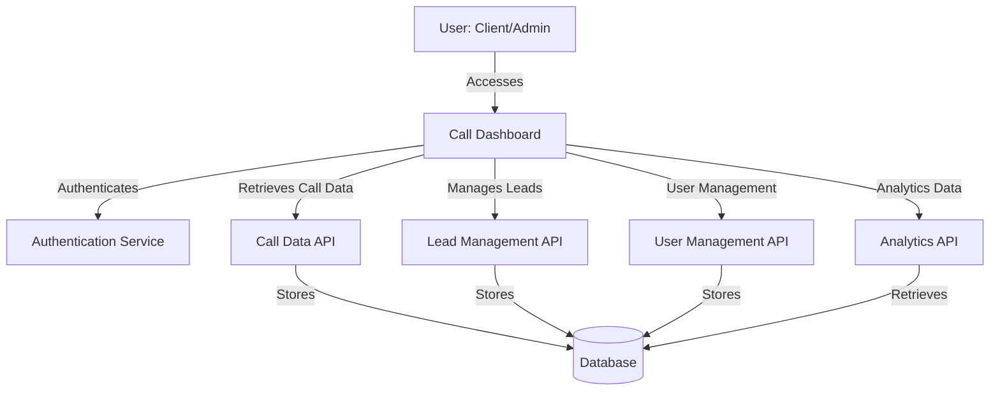
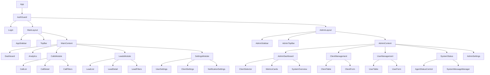

# Design Document: Dealermate

## Overview

The Call Facilitation Dashboard is a comprehensive web application designed for B2B clients to monitor and manage their AI-powered call operations. The system provides analytics, call management, lead tracking, and administrative controls through an intuitive interface. The dashboard is designed to be responsive, secure, and performant, allowing businesses to efficiently track and optimize their call operations.

The application will be built using React with TypeScript for the frontend, leveraging the existing project structure. It will use a component-based architecture with proper state management to ensure a smooth user experience. The backend will integrate with existing APIs for call data and authentication services.

## Architecture

### High-Level Architecture

The application follows a client-server architecture with the following components:

1. **Frontend Application**
   - React/TypeScript SPA (Single Page Application)
   - Component-based UI architecture
   - State management using React Context API and hooks
   - Responsive design using Tailwind CSS

2. **Backend Services** (Integration Points)
   - Authentication Service
   - Call Data API
   - Lead Management API
   - User Management API
   - Analytics API

3. **Data Storage**
   - Supabase for database operations
   - Local storage for user preferences and session management

### System Context Diagram



## Components and Interfaces

### Core Components

1. **Authentication Module**
   - Login component
   - Session management
   - Role-based access control
   - Token handling and refresh

2. **Navigation Component**
   - Sidebar navigation
   - Responsive menu for mobile
   - Active state management
   - User profile section

3. **Dashboard Overview**
   - Summary metrics cards
   - Activity timeline
   - Status indicators
   - System messages display

4. **Analytics Module**
   - Charts and graphs components
   - Date range selector
   - Metric comparison tools
   - Export functionality

5. **Call Management Module**
   - Call list with filtering and sorting
   - Call detail popup
   - Audio player for recordings
   - Search functionality

6. **Lead Management Module**
   - Lead list with filtering and sorting
   - Lead detail view
   - Status update interface
   - Export functionality

7. **Settings Module**
   - User settings form
   - Client settings (admin only)
   - Notification preferences
   - Profile management

8. **Admin Panel**
   - Dedicated admin layout with separate navigation
   - Client management interface with CRUD operations
   - User management interface with role assignment
   - System health monitoring and status control
   - Configuration controls and settings management
   - Multi-client data filtering and overview

### Component Hierarchy



## Data Models

### User Model

```typescript
interface User {
  id: string; // UUID
  email: string;
  full_name: string;
  role: 'owner' | 'admin' | 'user' | 'client_admin' | 'client_user' ; // USER-DEFINED enum
  client_id: string | null; // UUID, Foreign key to clients, if NULL can access all clients (usually for admins)
  last_login_at: Date | null;
  created_at: Date;
  
  // Additional fields for dashboard functionality
  preferences?: {
    notifications: {
      email: boolean;
      leadAlerts: boolean;
      systemAlerts: boolean;
      notificationEmails: string[];
    };
    displaySettings: {
      theme: 'light' | 'dark' | 'system';
      dashboardLayout: 'compact' | 'detailed';
    };
  };
}
```

### Client Model

```typescript
interface Client {
  id: string; // UUID
  name: string;
  status: 'active' | 'inactive' | 'pending'; // USER-DEFINED enum "Client Status"
  type: string;
  subscription_plan: string;
  contact_person: string | null;
  contact_email: string | null;
  phone_number: string | null;
  billing_address: string | null;
  monthly_billing_amount_cad: number;
  average_monthly_ai_cost_usd: number;
  average_monthly_misc_cost_usd: number;
  partner_split_percentage: number;
  finders_fee_cad: number;
  slug: string;
  config_json: any; // JSONB for custom configuration
  joined_at: Date;
  last_active_at: Date | null;
  
  // Dashboard-specific computed metrics (to be calculated on the frontend)
  metrics?: {
    totalCalls: number;
    totalLeads: number;
    avgCallDuration: number;
    callsToday: number;
    leadsToday: number;
  };
}
```

### Call Model

```typescript
interface Call {
  id: string; // UUID
  client_id: string; // UUID, Foreign key to clients
  call_type: string;
  caller_phone_number: string | null;
  to_phone_number: string | null;
  caller_full_name: string | null;
  call_start_time: Date;
  call_end_time: Date;
  call_duration_seconds: number;
  call_duration_mins: number | null;
  transcript: string;
  call_summary: string | null;
  recording_url: string | null;
  assistant_id: string | null;
  hangup_reason: string | null;
  transfer_flag: boolean;
  
  // Cost tracking fields
  vapi_call_cost_usd: number;
  vapi_llm_cost_usd: number;
  openai_api_cost_usd: number;
  openai_api_tokens_input: number;
  openai_api_tokens_output: number;
  twillio_call_cost_usd: number;
  sms_cost_usd: number;
  tool_cost_usd: number;
  total_call_cost_usd: number;
  total_cost_cad: number | null;
  
  created_at: Date;
  
  // Dashboard-specific computed fields
  status?: 'in-progress' | 'completed' | 'failed' | 'transferred'; // Derived from existing fields
  outcome?: 'successful' | 'unsuccessful' | 'lead-generated' | 'transferred' | null; // Derived from existing fields
}
```

### Lead Model

```typescript
interface Lead {
  id: string; // UUID
  client_id: string; // UUID, Foreign key to clients
  call_id: string; // UUID, Foreign key to calls
  full_name: string | null;
  first_name: string | null;
  last_name: string | null;
  phone_number: string | null;
  from_phone_number: string | null;
  email: string | null;
  lead_status: string;
  callback_timing_captured: boolean | null;
  callback_timing_value: string | null;
  appointment_confirmed_at: Date | null;
  sent_to_client_at: Date | null;
  custom_lead_data: any | null; // JSONB for custom lead data
  created_at: Date;
}
```

### Lead Evaluation Model

```typescript
interface LeadEvaluation {
  id: string; // UUID
  client_id: string; // UUID, Foreign key to clients
  call_id: string; // UUID, Foreign key to calls
  
  // Evaluation scores
  clarity_politeness_score: number;
  clarity_politeness_rationale: string | null;
  naturalness_score: number;
  naturalness_rationale: string | null;
  relevance_questions_score: number;
  relevance_questions_rationale: string | null;
  objection_handling_score: number;
  objection_handling_rationale: string | null;
  lead_intent_score: number;
  lead_intent_rationale: string | null;
  lead_completion_score: number;
  failure_risk_score: number;
  failure_risk_rationale: string | null;
  
  // Overall evaluation
  sentiment: 'positive' | 'neutral' | 'negative'; // USER-DEFINED enum
  sentiment_rationale: string | null;
  overall_evaluation_score: number | null;
  negative_call_flag: boolean;
  human_review_required: boolean;
  review_reason: string | null;
  evaluated_at: Date;
}
```

### Cost Event Model

```typescript
interface CostEvent {
  id: string; // UUID
  client_id: string; // UUID, Foreign key to clients
  call_id: string | null; // UUID, Foreign key to calls
  event_type: string;
  cost_usd: number;
  related_data_json: any; // JSONB for additional data
  timestamp: Date;
}
```

### Monthly Billing Summary Model

```typescript
interface MonthlyBillingSummary {
  id: string; // UUID
  month: Date;
  total_calls_processed: number;
  total_leads_captured: number;
  total_appointments_confirmed: number;
  total_gross_revenue_cad: number;
  total_variable_costs_usd: number;
  total_fixed_costs_usd: number;
  total_finders_fees_cad: number;
  total_partner_payout_cad: number;
  net_profit_usd_cad: number;
}
```

## API Interfaces

### Authentication API

```typescript
interface AuthAPI {
  login(email: string, password: string): Promise<{ user: User, token: string }>;
  logout(): Promise<void>;
  refreshToken(token: string): Promise<string>;
  getCurrentUser(): Promise<User>;
  updatePassword(oldPassword: string, newPassword: string): Promise<void>;
}
```

### Call API

```typescript
interface CallAPI {
  getCalls(clientId: string, filters?: CallFilters): Promise<PaginatedResponse<Call>>;
  getCallById(callId: string): Promise<Call>;
  updateCallNotes(callId: string, notes: string): Promise<Call>;
  getCallRecording(callId: string): Promise<Blob>;
  getCallTranscript(callId: string): Promise<string>;
  searchCalls(query: string, filters?: CallFilters): Promise<PaginatedResponse<Call>>;
}

interface CallFilters {
  startDate?: Date;
  endDate?: Date;
  status?: Call['status'][];
  outcome?: Call['outcome'][];
  hasLead?: boolean;
  page?: number;
  pageSize?: number;
  sortBy?: string;
  sortDirection?: 'asc' | 'desc';
}

interface PaginatedResponse<T> {
  data: T[];
  total: number;
  page: number;
  pageSize: number;
  totalPages: number;
}
```

### Lead API

```typescript
interface LeadAPI {
  getLeads(clientId: string, filters?: LeadFilters): Promise<PaginatedResponse<Lead>>;
  getLeadById(leadId: string): Promise<Lead>;
  createLead(lead: Omit<Lead, 'id' | 'createdAt' | 'updatedAt'>): Promise<Lead>;
  updateLead(leadId: string, updates: Partial<Lead>): Promise<Lead>;
  addLeadNote(leadId: string, note: string): Promise<Lead>;
  exportLeads(clientId: string, filters?: LeadFilters, format: 'csv' | 'xlsx'): Promise<Blob>;
}

interface LeadFilters {
  startDate?: Date;
  endDate?: Date;
  status?: Lead['status'][];
  source?: Lead['source'][];
  assignedTo?: string;
  page?: number;
  pageSize?: number;
  sortBy?: string;
  sortDirection?: 'asc' | 'desc';
}
```

### Admin API

```typescript
interface AdminAPI {
  // Client Management
  getClients(filters?: ClientFilters): Promise<PaginatedResponse<Client>>;
  getClientById(clientId: string): Promise<Client>;
  createClient(client: Omit<Client, 'id' | 'createdAt' | 'metrics'>): Promise<Client>;
  updateClient(clientId: string, updates: Partial<Client>): Promise<Client>;
  activateClient(clientId: string): Promise<Client>;
  deactivateClient(clientId: string): Promise<Client>;
  
  // User Management
  getUsers(filters?: UserFilters): Promise<PaginatedResponse<User>>;
  getUserById(userId: string): Promise<User>;
  createUser(user: Omit<User, 'id' | 'lastLogin'>): Promise<User>;
  updateUser(userId: string, updates: Partial<User>): Promise<User>;
  deleteUser(userId: string): Promise<void>;
  
  // System Health
  getSystemHealth(): Promise<SystemHealth>;
  getSystemMetrics(timeframe: 'day' | 'week' | 'month'): Promise<SystemMetrics>;
}

interface SystemHealth {
  status: 'healthy' | 'degraded' | 'down';
  components: Record<string, { status: 'up' | 'down', message?: string }>;
  lastChecked: Date;
}

interface SystemMetrics {
  totalCalls: number;
  totalLeads: number;
  activeClients: number;
  averageResponseTime: number;
  errorRate: number;
  timeframeData: Array<{ timestamp: Date, value: number }>;
}
```

### Analytics API

```typescript
interface AnalyticsAPI {
  getDashboardMetrics(clientId: string): Promise<DashboardMetrics>;
  getCallMetrics(clientId: string, timeframe: 'day' | 'week' | 'month' | 'custom', startDate?: Date, endDate?: Date): Promise<CallMetrics>;
  getLeadMetrics(clientId: string, timeframe: 'day' | 'week' | 'month' | 'custom', startDate?: Date, endDate?: Date): Promise<LeadMetrics>;
  getCallDistribution(clientId: string, timeframe: 'day' | 'week' | 'month'): Promise<CallDistribution>;
}

interface DashboardMetrics {
  totalCalls: number;
  totalLeads: number;
  avgCallDuration: number;
  callsToday: number;
  leadsToday: number;
  conversionRate: number;
  agentStatus: 'active' | 'inactive';
  systemMessages: SystemMessage[];
}

interface CallMetrics {
  totalCalls: number;
  avgDuration: number;
  callsByOutcome: Record<Call['outcome'], number>;
  callsByStatus: Record<Call['status'], number>;
  callsOverTime: Array<{ timestamp: Date, count: number }>;
}

interface LeadMetrics {
  totalLeads: number;
  leadsByStatus: Record<Lead['status'], number>;
  leadsBySource: Record<Lead['source'], number>;
  leadsOverTime: Array<{ timestamp: Date, count: number }>;
  conversionRate: number;
}

interface CallDistribution {
  byHourOfDay: Array<{ hour: number, count: number }>;
  byDayOfWeek: Array<{ day: number, count: number }>;
  byDate: Array<{ date: Date, count: number }>;
}

interface SystemMessage {
  id: string;
  type: 'info' | 'warning' | 'error' | 'success';
  message: string;
  timestamp: Date;
  expiresAt: Date | null;
}
```

## Error Handling

### Error Types

```typescript
enum ErrorType {
  AUTHENTICATION = 'authentication',
  AUTHORIZATION = 'authorization',
  VALIDATION = 'validation',
  NOT_FOUND = 'not_found',
  SERVER_ERROR = 'server_error',
  NETWORK_ERROR = 'network_error',
  TIMEOUT = 'timeout',
}

interface AppError {
  type: ErrorType;
  message: string;
  code?: string;
  details?: Record<string, any>;
}
```

### Error Handling Strategy

1. **Global Error Handling**
   - React error boundaries for component-level errors
   - Global error handler for unhandled exceptions
   - Consistent error logging and reporting

2. **API Error Handling**
   - Standardized error response format
   - Automatic retry for network errors with exponential backoff
   - Authentication error handling with automatic token refresh

3. **User Feedback**
   - Toast notifications for transient errors
   - Inline validation errors for form inputs
   - Error pages for critical failures
   - Friendly error messages with actionable steps

4. **Recovery Strategies**
   - Automatic reconnection for network issues
   - Graceful degradation for unavailable features
   - Data caching for offline functionality
   - Session recovery after authentication errors

## Testing Strategy

### Testing Levels

1. **Unit Testing**
   - Component testing with React Testing Library
   - Service and utility function testing
   - State management testing

2. **Integration Testing**
   - API integration tests
   - Component interaction tests
   - State management integration

3. **End-to-End Testing**
   - Critical user flows
   - Authentication and authorization
   - Data persistence

### Test Coverage Goals

- 80% code coverage for core business logic
- 100% coverage for critical authentication and data handling functions
- All user stories covered by at least one end-to-end test

### Testing Tools

- Jest for unit and integration testing
- React Testing Library for component testing
- Cypress for end-to-end testing
- Mock Service Worker for API mocking

## Security & Privacy Considerations

1. **Authentication and Authorization**
   - JWT-based authentication
   - Role-based access control
   - Session timeout and automatic logout
   - Secure credential storage

2. **Data Protection**
   - HTTPS for all communications
   - Data encryption for sensitive information
   - Input validation and sanitization
   - Protection against common web vulnerabilities (XSS, CSRF)

3. **Client Data Isolation (CRITICAL)**
   - Strict multi-tenant data segregation
   - Database queries filtered by client_id for non-admin users
   - UI components hide sensitive information (client IDs, costs)
   - Client data isolation utilities for consistent implementation
   - Admin-only views for cross-client data

4. **Audit and Compliance**
   - Activity logging for sensitive operations
   - User action audit trails
   - Compliance with data protection regulations
   - Client-specific dashboards for non-admin users
   - Filtered call logs based on user's client association
   - Lead management respecting client boundaries

## Performance Considerations

1. **Frontend Performance**
   - Code splitting and lazy loading
   - Efficient state management
   - Optimized rendering with memoization
   - Asset optimization and caching

2. **Data Loading**
   - Pagination for large datasets
   - Infinite scrolling for continuous data
   - Data prefetching for common user paths
   - Caching strategies for frequently accessed data

3. **Responsiveness**
   - Mobile-first design approach
   - Adaptive loading based on device capabilities
   - Performance budgets for critical user journeys

## Accessibility Considerations

1. **WCAG Compliance**
   - Target WCAG 2.1 AA compliance
   - Semantic HTML structure
   - Proper ARIA attributes
   - Keyboard navigation support

2. **Inclusive Design**
   - Color contrast requirements
   - Text resizing support
   - Screen reader compatibility
   - Reduced motion options

## Deployment and DevOps

1. **Build and Deployment**
   - CI/CD pipeline with automated testing
   - Environment-specific configurations
   - Feature flags for controlled rollouts
   - Blue-green deployment strategy

2. **Monitoring and Observability**
   - Application performance monitoring
   - Error tracking and alerting
   - User analytics and behavior tracking
   - Health checks and status pages

## Admin Panel Architecture

### Multi-Tenant Admin System

The admin panel is designed as a separate application layer with its own routing, layout, and navigation system. This approach provides:

1. **Separation of Concerns**
   - Dedicated admin interface isolated from client-facing features
   - Independent routing structure (`/admin/*`)
   - Role-based access control at the layout level

2. **Admin Layout Structure**
   ```typescript
   AdminLayout
   ├── AdminSidebar (admin-specific navigation)
   ├── TopBar (shared with main app)
   └── AdminContent
       ├── AdminDashboard (multi-client overview)
       ├── ClientManagement (CRUD operations)
       ├── UserManagement (user-client associations)
       ├── SystemStatus (agent status & messages)
       └── AdminSettings (system configuration)
   ```

3. **Client Data Filtering**
   - ClientSelector component for filtering data by specific client or "All Clients"
   - Persistent client selection across admin pages
   - Role-based data access (admins see all, client_admins see only their client)

4. **Navigation Flow**
   - Main app sidebar includes "Admin Panel" link for admin users
   - Admin panel includes "Back to Main App" navigation
   - Seamless transition between client and admin interfaces

### Admin Panel Components

1. **AdminLayout**
   - Role-based access control (admin/owner only)
   - Consistent theming with main application
   - Error handling for unauthorized access

2. **AdminSidebar**
   - Admin-specific navigation items
   - Visual indicators for admin context
   - User role display in footer

3. **ClientSelector**
   - Dropdown with all clients and "All Clients" option
   - Client status indicators (active/inactive/pending)
   - Client type and metadata display

4. **AdminDashboard**
   - Multi-client metrics overview
   - System status monitoring
   - Recent activity across all clients
   - Quick access to common admin tasks

### Phase Implementation Strategy

**Phase 1: Architecture & Layout (Completed)**
- ✅ Admin layout and routing structure
- ✅ Role-based access control
- ✅ Basic admin dashboard with placeholders
- ✅ Integration with existing system status management

**Phase 2: Core Functionality (Next)**
- Client management with CRUD operations
- User management with role assignments
- Advanced filtering and search capabilities
- Bulk operations and data export

**Phase 3: Advanced Features (Future)**
- Client impersonation for troubleshooting
- Advanced analytics and reporting
- System health monitoring and alerting
- Audit logs and compliance features

## Future Considerations

1. **Scalability**
   - Support for increasing number of clients and calls
   - Distributed architecture for high availability
   - Caching strategies for improved performance

2. **Extensibility**
   - Plugin architecture for custom integrations
   - API-first approach for third-party integrations
   - Customizable dashboards and reports

3. **Advanced Features**
   - AI-powered call analysis and insights
   - Predictive lead scoring
   - Advanced voice analytics
   - Multi-language support

4. **Admin Panel Enhancements**
   - Advanced client onboarding workflows
   - Automated billing and invoicing integration
   - Custom client branding and white-labeling
   - Advanced user permission management