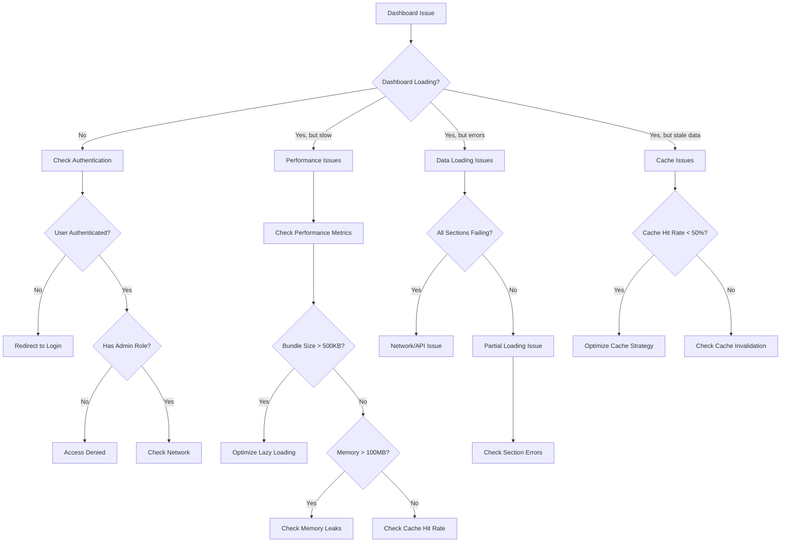
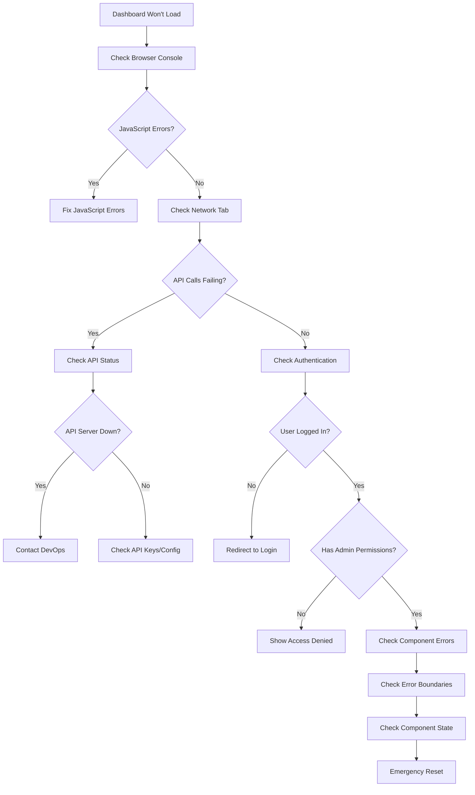
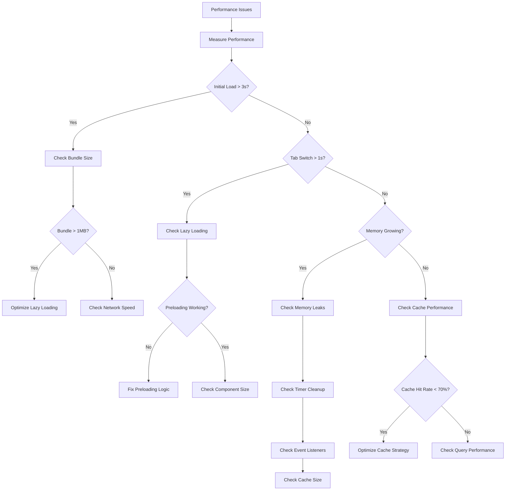
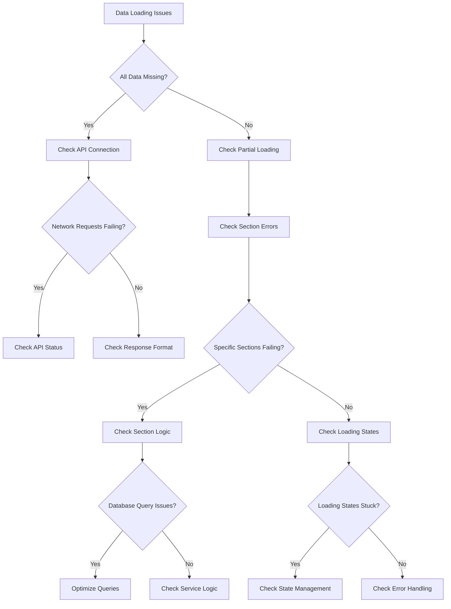
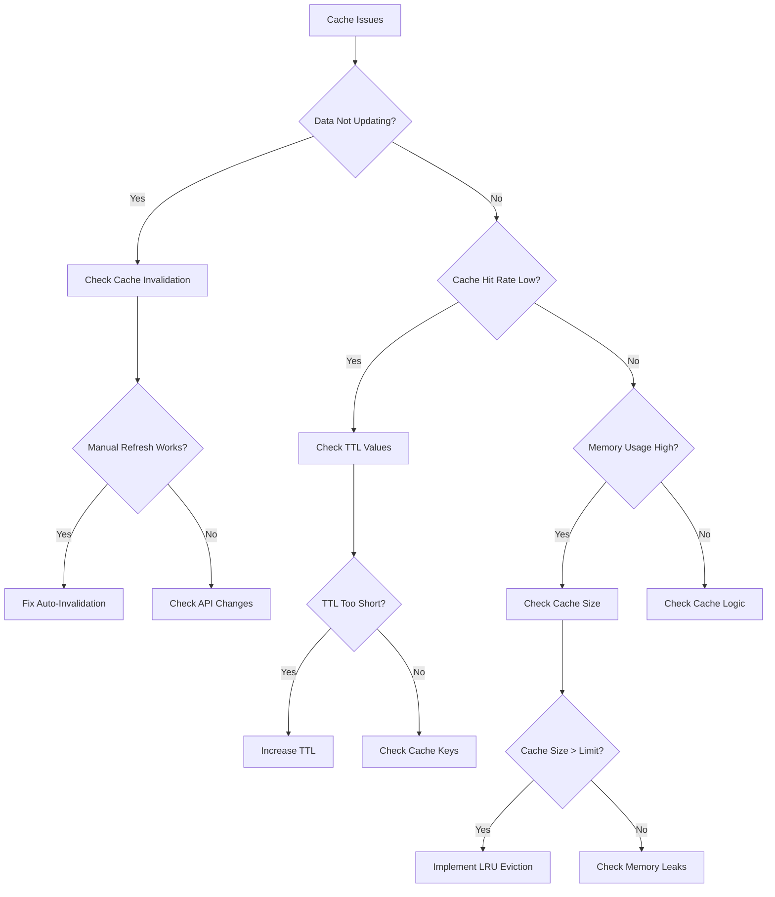

# Admin Dashboard Troubleshooting Flowchart

Visual troubleshooting guide for common admin dashboard issues.

## 🔄 Main Troubleshooting Flow



## 🚨 Emergency Troubleshooting

### Dashboard Won't Load At All



### Performance Issues



### Data Loading Issues



### Cache Issues



## 🔧 Diagnostic Commands

### Quick Health Check
```bash
# Run this in browser console
const healthCheck = () => {
  const health = {
    auth: !!user?.id,
    permissions: user?.role === 'admin' || user?.role === 'owner',
    cache: adminDashboardCache.getStats().hitRate > 50,
    memory: performance.memory ? 
      performance.memory.usedJSHeapSize < 100 * 1024 * 1024 : true,
    network: navigator.onLine,
    errors: Object.values(errors).filter(e => e).length === 0
  };
  
  console.log('Health Check:', health);
  return Object.values(health).every(Boolean);
};

healthCheck();
```

### Performance Diagnostic
```bash
const performanceDiagnostic = () => {
  const metrics = {
    bundleSize: getBundleInfo()?.totalJSSize || 0,
    cacheHitRate: adminDashboardCache.getStats().hitRate,
    memoryUsage: performance.memory?.usedJSHeapSize || 0,
    loadingTabs: Object.values(loadingStates).filter(Boolean).length,
    errorSections: Object.values(errors).filter(e => e).length,
    preloadedTabs: preloadedTabs?.size || 0
  };
  
  console.log('Performance Diagnostic:', metrics);
  
  // Performance score (0-100)
  const score = Math.min(100, 
    (metrics.cacheHitRate * 0.3) +
    ((1 - Math.min(1, metrics.bundleSize / (1024 * 1024))) * 30) +
    ((1 - Math.min(1, metrics.memoryUsage / (100 * 1024 * 1024))) * 20) +
    ((metrics.errorSections === 0 ? 1 : 0) * 20)
  );
  
  console.log('Performance Score:', score.toFixed(1) + '/100');
  return score;
};

performanceDiagnostic();
```

### Cache Diagnostic
```bash
const cacheDiagnostic = () => {
  const stats = adminDashboardCache.getStats();
  const keys = adminDashboardCache.getKeys();
  
  const diagnostic = {
    stats,
    keyCount: keys.length,
    oldestEntry: Math.min(...keys.map(key => {
      const entry = adminDashboardCache.get(key);
      return entry ? Date.now() - entry.timestamp : 0;
    })),
    newestEntry: Math.max(...keys.map(key => {
      const entry = adminDashboardCache.get(key);
      return entry ? Date.now() - entry.timestamp : 0;
    })),
    tagDistribution: keys.reduce((acc, key) => {
      const entry = adminDashboardCache.get(key);
      if (entry?.tags) {
        entry.tags.forEach(tag => {
          acc[tag] = (acc[tag] || 0) + 1;
        });
      }
      return acc;
    }, {})
  };
  
  console.log('Cache Diagnostic:', diagnostic);
  return diagnostic;
};

cacheDiagnostic();
```

## 🎯 Issue-Specific Solutions

### Issue: White Screen of Death
**Symptoms**: Dashboard shows blank white screen
**Diagnostic Flow**:
1. Check browser console for JavaScript errors
2. Check if React app is mounting
3. Check authentication status
4. Check error boundaries

**Solution Steps**:
```javascript
// 1. Check for JavaScript errors
console.log('Checking for errors...');

// 2. Check React mounting
console.log('React root:', document.getElementById('root'));

// 3. Emergency reset
localStorage.clear();
sessionStorage.clear();
window.location.reload();
```

### Issue: Infinite Loading
**Symptoms**: Loading spinner never disappears
**Diagnostic Flow**:
1. Check loading states
2. Check API responses
3. Check error handling
4. Check timeout logic

**Solution Steps**:
```javascript
// 1. Check loading states
console.log('Loading states:', loadingStates);

// 2. Force complete loading
Object.keys(loadingStates).forEach(section => {
  setLoadingState(section, false);
});

// 3. Check for stuck promises
console.log('Pending requests:', /* check network tab */);
```

### Issue: Memory Leak
**Symptoms**: Browser becomes slow, high memory usage
**Diagnostic Flow**:
1. Check memory usage trend
2. Check cache size
3. Check timer cleanup
4. Check event listener cleanup

**Solution Steps**:
```javascript
// 1. Check memory usage
if (performance.memory) {
  console.log('Memory usage:', {
    used: performance.memory.usedJSHeapSize / 1024 / 1024,
    total: performance.memory.totalJSHeapSize / 1024 / 1024
  });
}

// 2. Clear cache
adminDashboardCache.clear();

// 3. Force garbage collection (dev only)
if (window.gc) window.gc();
```

### Issue: Stale Data
**Symptoms**: Data doesn't update despite refresh
**Diagnostic Flow**:
1. Check cache invalidation
2. Check API responses
3. Check timestamp comparison
4. Check refresh logic

**Solution Steps**:
```javascript
// 1. Check cache ages
adminDashboardCache.getKeys().forEach(key => {
  const entry = adminDashboardCache.get(key);
  console.log(`${key}: ${Date.now() - entry.timestamp}ms old`);
});

// 2. Force invalidation
CacheInvalidation.smartInvalidate('all');

// 3. Force refresh
refresh(true);
```

## 📊 Monitoring Dashboard

### Create a Debug Panel
```javascript
const DebugPanel = () => {
  const [isOpen, setIsOpen] = useState(false);
  
  if (process.env.NODE_ENV !== 'development') return null;
  
  return (
    <div className="fixed bottom-4 left-4 z-50">
      <button 
        onClick={() => setIsOpen(!isOpen)}
        className="bg-red-500 text-white p-2 rounded"
      >
        Debug
      </button>
      
      {isOpen && (
        <div className="bg-white border p-4 rounded shadow-lg mt-2 text-xs">
          <div>Health: {healthCheck() ? '✅' : '❌'}</div>
          <div>Performance: {performanceDiagnostic().toFixed(1)}/100</div>
          <div>Cache Hit Rate: {adminDashboardCache.getStats().hitRate.toFixed(1)}%</div>
          <div>Memory: {(performance.memory?.usedJSHeapSize / 1024 / 1024).toFixed(1)}MB</div>
          <div>Loading: {Object.values(loadingStates).filter(Boolean).length}</div>
          <div>Errors: {Object.values(errors).filter(e => e).length}</div>
          
          <div className="mt-2 space-x-2">
            <button onClick={() => adminDashboardCache.clear()}>Clear Cache</button>
            <button onClick={() => refresh(true)}>Force Refresh</button>
            <button onClick={() => window.location.reload()}>Reload</button>
          </div>
        </div>
      )}
    </div>
  );
};
```

## 🚀 Performance Optimization Checklist

### Before Optimization
- [ ] Measure baseline performance
- [ ] Document current issues
- [ ] Set performance targets
- [ ] Plan optimization strategy

### During Optimization
- [ ] Implement lazy loading
- [ ] Optimize cache strategy
- [ ] Minimize bundle sizes
- [ ] Optimize database queries
- [ ] Add performance monitoring

### After Optimization
- [ ] Measure performance improvements
- [ ] Verify functionality still works
- [ ] Test edge cases
- [ ] Document changes
- [ ] Monitor production performance

## 📞 Escalation Path

### Level 1: Self-Service
1. Use this troubleshooting guide
2. Check debug cheat sheet
3. Try emergency reset procedures
4. Check browser developer tools

### Level 2: Team Support
1. Gather diagnostic information
2. Document steps to reproduce
3. Include performance metrics
4. Contact development team

### Level 3: System Issues
1. Check system status
2. Contact DevOps team
3. Check infrastructure logs
4. Escalate to system administrators

### Level 4: Critical Issues
1. Implement emergency procedures
2. Notify stakeholders
3. Activate incident response
4. Document for post-mortem

Remember: Always start with the simplest solutions first, and gather diagnostic information before escalating issues.