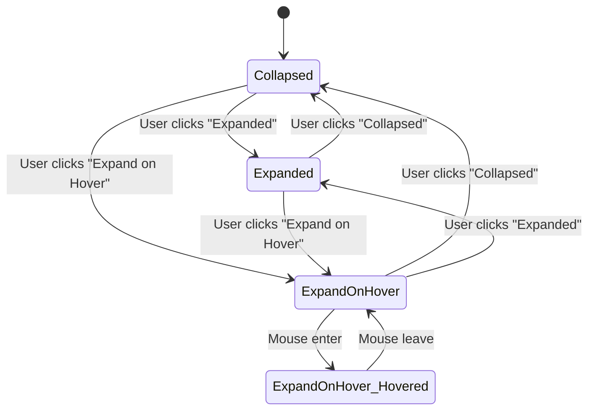

# Admin Layout and Sidebar System

## Overview

The admin layout and sidebar system provides a responsive, multi-state navigation interface for the admin panel with role-based access control and mobile support.

## Key Features

- **3-State Sidebar**: Expanded, Collapsed, and Expand-on-Hover modes
- **Responsive Design**: Mobile-first approach with touch support
- **State Persistence**: Sidebar preferences saved across sessions
- **Role-Based Access**: Navigation items filtered by user permissions
- **Section Layouts**: Dedicated layouts for each admin section
- **Smooth Transitions**: Fluid animations between states
- **Performance Optimized**: Efficient rendering and state management

## Architecture

### Core Components

#### AdminSidebar (`src/components/admin/AdminSidebar.tsx`)
Main sidebar component with three operational modes:

- **Expanded (256px)**: Full sidebar with text labels and icons
- **Collapsed (64px)**: Icon-only sidebar for space efficiency
- **Expand-on-Hover (64px + overlay)**: Collapsed by default, expands as overlay on hover

**Features:**
- Desktop and mobile versions
- Touch gesture support for mobile
- Dropdown menu for mode switching
- State persistence in localStorage
- Role-based navigation filtering

#### AdminLayout (`src/layouts/admin/AdminLayout.tsx`)
Main layout container that:

- Manages sidebar width communication
- Handles responsive behavior
- Provides authentication and access control
- Integrates with theme system
- Manages mobile/desktop layout switching

#### Section Layouts
Individual layouts for each admin section:

- **ManagementLayout**: User and client management
- **AnalyticsLayout**: Analytics and reporting
- **AuditLayout**: Audit logs and monitoring
- **SettingsLayout**: System and user settings

Each section layout includes:
- Section-specific navigation
- Responsive sub-sidebar
- Consistent layout structure
- Mobile-optimized navigation

### Navigation Configuration

#### Main Navigation (`src/config/adminNav.ts`)
```tsx
export const mainNavItems = [
  {
    id: 'dashboard',
    title: 'Dashboard',
    href: '/admin/dashboard',
    icon: LayoutDashboard,
    requiredAccess: ['system_admin']
  },
  {
    id: 'management',
    title: 'Management',
    href: '/admin/management',
    icon: Users,
    requiredAccess: ['system_admin', 'client_admin']
  }
  // ... more items
];
```

#### Section Navigation
Each section has its own navigation configuration:
- `managementNav.ts`: Management section sub-pages
- `analyticsNav.ts`: Analytics section sub-pages
- `auditNav.ts`: Audit section sub-pages
- `settingsNav.ts`: Settings section sub-pages

## Usage

### Basic Implementation

```tsx
// App routing setup
<Routes>
  <Route path="/admin" element={<AdminLayout />}>
    <Route path="management" element={<ManagementLayout />}>
      <Route path="users" element={<UserManagement />} />
      <Route path="clients" element={<ClientManagement />} />
    </Route>
    <Route path="analytics" element={<AnalyticsLayout />}>
      <Route path="overview" element={<AnalyticsOverview />} />
      <Route path="reports" element={<AnalyticsReports />} />
    </Route>
  </Route>
</Routes>
```

### Creating New Section Layout

```tsx
// src/layouts/admin/NewSectionLayout.tsx
import React from 'react';
import { Outlet, NavLink } from 'react-router-dom';
import { newSectionNavItems } from '@/config/newSectionNav';
import { cn } from '@/lib/utils';

const NewSectionLayout: React.FC = () => {
  return (
    <div className="space-y-6">
      <div>
        <h2 className="text-2xl font-bold tracking-tight text-foreground">
          New Section
        </h2>
        <p className="text-muted-foreground">
          Section description here.
        </p>
      </div>
      <div className="flex flex-col space-y-8 lg:flex-row lg:space-x-8 lg:space-y-0">
        <aside className="lg:w-56 lg:flex-shrink-0">
          <nav className="flex space-x-2 lg:flex-col lg:space-x-0 lg:space-y-1 overflow-x-auto lg:overflow-x-visible">
            {newSectionNavItems.map((item) => (
              <NavLink
                key={item.href}
                to={item.href}
                end
                className={({ isActive }) =>
                  cn(
                    'inline-flex items-center rounded-md text-sm font-medium transition-colors',
                    'hover:bg-accent hover:text-accent-foreground',
                    'px-4 py-2 whitespace-nowrap',
                    isActive
                      ? 'bg-muted hover:bg-muted text-foreground'
                      : 'text-muted-foreground hover:text-foreground',
                    'justify-start'
                  )
                }
              >
                <item.icon className="mr-2 h-4 w-4 flex-shrink-0" />
                <span className="truncate">{item.title}</span>
              </NavLink>
            ))}
          </nav>
        </aside>
        <div className="flex-1 min-w-0">
          <Outlet />
        </div>
      </div>
    </div>
  );
};

export default NewSectionLayout;
```

### Adding Navigation Items

```tsx
// src/config/newSectionNav.ts
import { Users, Settings, BarChart } from 'lucide-react';

export const newSectionNavItems = [
  {
    href: '/admin/new-section/overview',
    title: 'Overview',
    icon: BarChart
  },
  {
    href: '/admin/new-section/users',
    title: 'Users',
    icon: Users
  },
  {
    href: '/admin/new-section/settings',
    title: 'Settings',
    icon: Settings
  }
];
```

### Role-Based Access Control

```tsx
// Add to main navigation
{
  id: 'new-section',
  title: 'New Section',
  href: '/admin/new-section',
  icon: NewIcon,
  requiredAccess: ['system_admin'] // or ['system_admin', 'client_admin']
}

// Check access in components
import { hasRequiredAccess } from '@/config/adminNav';

const MyComponent = () => {
  const { user } = useAuth();
  const canAccess = hasRequiredAccess(user, ['system_admin']);
  
  if (!canAccess) {
    return <AccessDenied />;
  }
  
  return <ComponentContent />;
};
```

## Sidebar States

### State Management

The sidebar uses a centralized state management system:

```tsx
interface SidebarState {
  mode: 'expanded' | 'collapsed' | 'expand-on-hover';
  isHovered: boolean;
  width: number;
}
```

### State Transitions



### Width Communication

The sidebar communicates width changes to the layout:

```tsx
// Sidebar dispatches width changes
useEffect(() => {
  const layoutWidth = sidebarState.mode === 'expanded' ? 256 : 64;
  window.dispatchEvent(new CustomEvent('admin-sidebar-resize', { 
    detail: { width: layoutWidth } 
  }));
}, [sidebarState.mode]);

// Layout listens for changes
useEffect(() => {
  const handleSidebarResize = (event: CustomEvent) => {
    setMainSidebarWidth(event.detail.width);
  };
  
  window.addEventListener('admin-sidebar-resize', handleSidebarResize);
  return () => window.removeEventListener('admin-sidebar-resize', handleSidebarResize);
}, []);
```

## Mobile Support

### Touch Gestures

The mobile sidebar supports touch gestures:

- **Right swipe from left edge**: Open drawer
- **Left swipe on open drawer**: Close drawer
- **Tap outside drawer**: Close drawer

### Mobile Layout

```tsx
// Mobile-specific features
const MobileAdminNavigation = () => {
  const [isDrawerOpen, setIsDrawerOpen] = useState(false);
  
  return (
    <>
      {/* Trigger button */}
      <Button onClick={() => setIsDrawerOpen(true)}>
        <Menu className="h-5 w-5" />
      </Button>
      
      {/* Drawer overlay */}
      {isDrawerOpen && (
        <div className="fixed inset-0 bg-black/50 z-50">
          <div className="fixed left-0 top-0 h-full w-[85%] max-w-sm bg-card">
            {/* Navigation content */}
          </div>
        </div>
      )}
    </>
  );
};
```

## Responsive Design

### Breakpoints

The system uses Tailwind CSS breakpoints:

- **Mobile**: `< 768px` - Drawer navigation
- **Tablet**: `768px - 1024px` - Collapsed sidebar by default
- **Desktop**: `> 1024px` - Full sidebar functionality

### Layout Adaptation

```tsx
// Responsive layout calculation
const totalLeftMargin = isMobile ? 0 : mainSidebarWidth;

// Content area styling
<div 
  className="min-h-screen transition-all duration-300 ease-in-out"
  style={{ 
    marginLeft: isMobile ? 0 : `${totalLeftMargin}px`,
    width: isMobile ? '100%' : `calc(100vw - ${totalLeftMargin}px)`
  }}
>
```

### Section Layout Responsiveness

```tsx
// Section layouts adapt to screen size
<div className="flex flex-col space-y-8 lg:flex-row lg:space-x-8 lg:space-y-0">
  <aside className="lg:w-56 lg:flex-shrink-0">
    {/* Mobile: horizontal scroll, Desktop: vertical navigation */}
    <nav className="flex space-x-2 lg:flex-col lg:space-x-0 lg:space-y-1 overflow-x-auto lg:overflow-x-visible">
      {/* Navigation items */}
    </nav>
  </aside>
  <div className="flex-1 min-w-0">
    <Outlet />
  </div>
</div>
```

## Performance Considerations

### Optimization Strategies

1. **Memoization**: Components are memoized to prevent unnecessary re-renders
2. **Event Debouncing**: Mouse events are debounced for smooth interactions
3. **Lazy Loading**: Section layouts are lazy-loaded for better initial load times
4. **State Persistence**: Sidebar state is persisted to avoid recalculation

### Memory Management

```tsx
// Cleanup timeouts and event listeners
useEffect(() => {
  return () => {
    if (hoverTimeoutRef.current) {
      clearTimeout(hoverTimeoutRef.current);
    }
  };
}, []);

// Remove global event listeners
useEffect(() => {
  const handleResize = () => { /* ... */ };
  window.addEventListener('resize', handleResize);
  return () => window.removeEventListener('resize', handleResize);
}, []);
```

## Troubleshooting

### Common Issues

1. **Sidebar not expanding on hover**
   - Check if mode is set to 'expand-on-hover'
   - Verify mouse event handlers are attached
   - Ensure no CSS is blocking pointer events

2. **Layout not adjusting to sidebar changes**
   - Verify event listeners are properly set up
   - Check if width calculation is correct
   - Ensure initial width dispatch occurs on mount

3. **Dropdown menu closing immediately**
   - Check if dropdown state is properly managed
   - Verify timeout clearing logic
   - Ensure mouse leave events don't conflict

4. **Mobile drawer not working**
   - Check touch event handlers
   - Verify z-index values
   - Ensure body scroll is prevented when drawer is open

### Debug Tools

```javascript
// Browser console debugging
window.debugSidebar = {
  getState: () => JSON.parse(localStorage.getItem('admin-sidebar-state')),
  setState: (mode) => {
    localStorage.setItem('admin-sidebar-state', JSON.stringify({ mode }));
    window.location.reload();
  },
  testModes: () => {
    ['expanded', 'collapsed', 'expand-on-hover'].forEach((mode, i) => {
      setTimeout(() => window.debugSidebar.setState(mode), i * 2000);
    });
  }
};
```

## Testing

### Unit Tests

```tsx
// Sidebar state testing
describe('AdminSidebar', () => {
  it('initializes with correct default state', () => {
    render(<AdminSidebar />);
    const saved = localStorage.getItem('admin-sidebar-state');
    expect(JSON.parse(saved).mode).toBe('collapsed');
  });
  
  it('handles mode changes', async () => {
    render(<AdminSidebar />);
    // Test mode switching logic
  });
});
```

### Integration Tests

```tsx
// Layout integration testing
describe('Layout Integration', () => {
  it('adjusts layout when sidebar width changes', () => {
    render(<AdminLayout />);
    // Test width communication
  });
});
```

## Migration Guide

### From Legacy Sidebar

1. **Update imports**:
   ```tsx
   // Before
   import { OldSidebar } from './OldSidebar';
   
   // After
   import AdminSidebar from '@/components/admin/AdminSidebar';
   ```

2. **Update layout structure**:
   ```tsx
   // Before
   <div className="admin-layout">
     <OldSidebar />
     <div className="content">
       <Component />
     </div>
   </div>
   
   // After
   <AdminLayout>
     <SectionLayout>
       <Component />
     </SectionLayout>
   </AdminLayout>
   ```

3. **Update navigation configuration**:
   ```tsx
   // Before
   const navItems = [
     { name: 'Users', path: '/users' }
   ];
   
   // After
   const navItems = [
     {
       id: 'users',
       title: 'Users',
       href: '/admin/users',
       icon: Users,
       requiredAccess: ['system_admin']
     }
   ];
   ```

## Contributing

### Adding New Features

1. **New Sidebar Mode**: Extend the `SidebarMode` type and add handling logic
2. **New Section**: Create layout component and navigation configuration
3. **New Navigation Item**: Add to appropriate navigation configuration with access control

### Code Style

- Use TypeScript for all components
- Follow existing naming conventions
- Include proper accessibility attributes
- Add comprehensive tests for new features
- Update documentation for changes

### Testing Requirements

- Unit tests for component logic
- Integration tests for layout communication
- Accessibility tests for navigation
- Mobile responsiveness tests
- Performance tests for state changes

This system provides a robust, scalable foundation for admin panel navigation with excellent user experience across all device types.