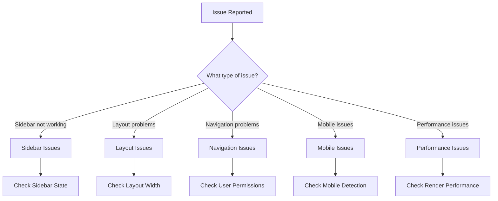
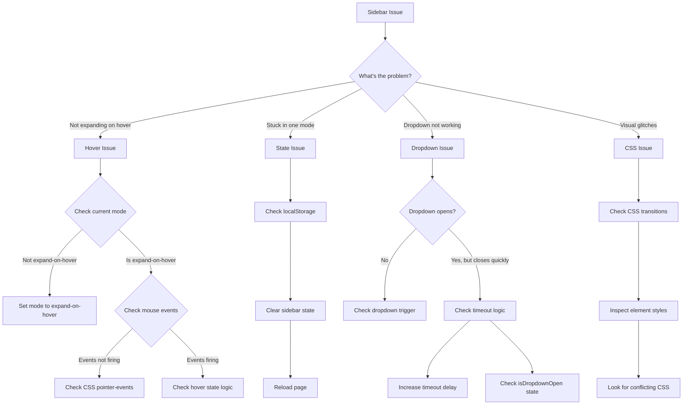
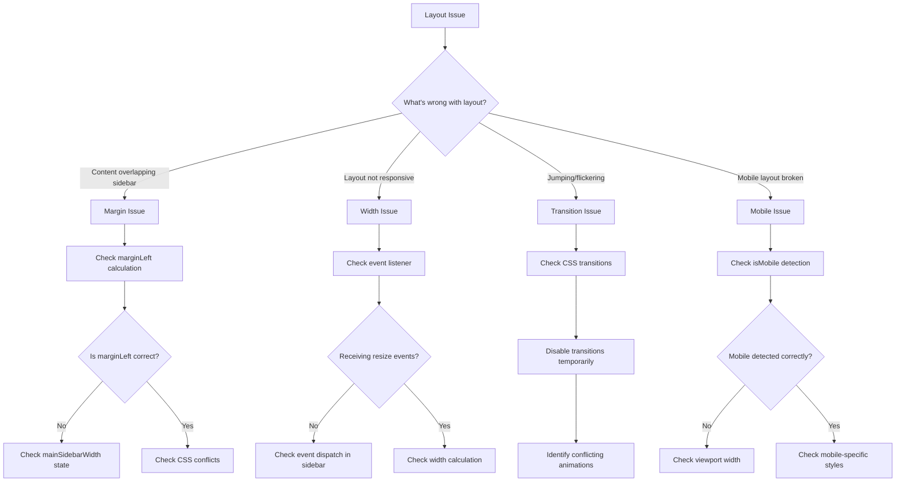
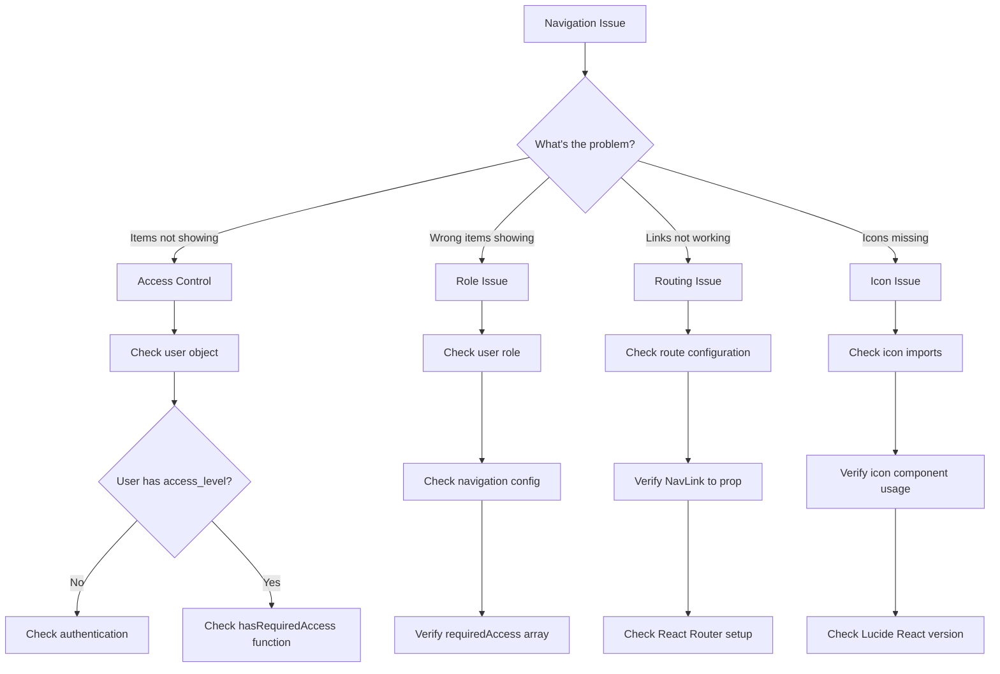
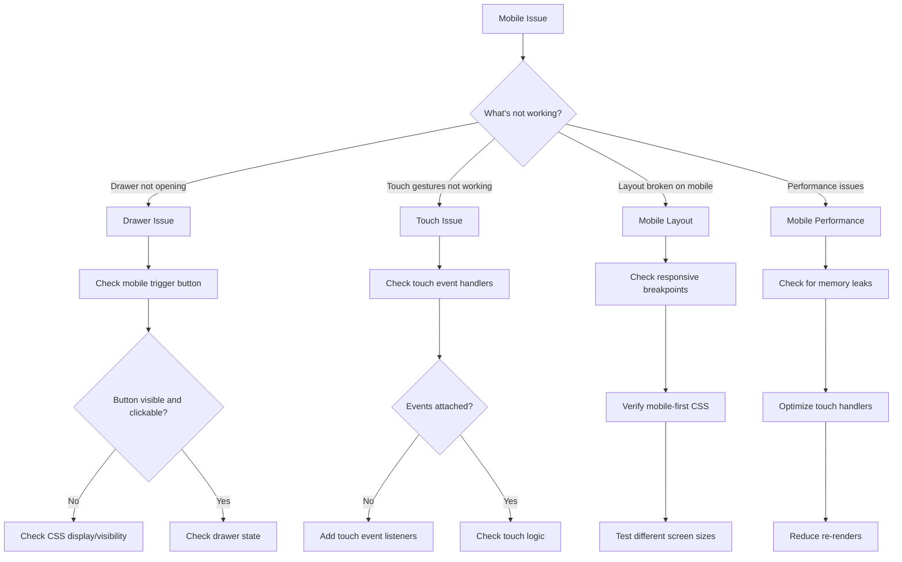

# Troubleshooting Flow: Admin Layout & Sidebar System

## Visual Problem-Solving Guide

### 🔍 Initial Diagnosis Flow



### 🔧 Sidebar Issues Troubleshooting



### 📐 Layout Issues Troubleshooting



### 🧭 Navigation Issues Troubleshooting



### 📱 Mobile Issues Troubleshooting



## Step-by-Step Diagnostic Procedures

### 🔍 Procedure 1: Sidebar State Diagnosis

**Step 1: Check Current State**
```javascript
// In browser console
const state = JSON.parse(localStorage.getItem('admin-sidebar-state'));
console.log('Current sidebar state:', state);
```

**Step 2: Verify State Logic**
```javascript
// Check if state matches UI
const sidebar = document.querySelector('[data-sidebar]');
const computedWidth = window.getComputedStyle(sidebar).width;
console.log('Expected width:', state?.mode === 'expanded' ? '256px' : '64px');
console.log('Actual width:', computedWidth);
```

**Step 3: Test State Changes**
```javascript
// Test each mode
['expanded', 'collapsed', 'expand-on-hover'].forEach((mode, i) => {
  setTimeout(() => {
    localStorage.setItem('admin-sidebar-state', JSON.stringify({ mode }));
    window.location.reload();
  }, i * 3000);
});
```

### 🔍 Procedure 2: Layout Communication Diagnosis

**Step 1: Check Event Dispatch**
```javascript
// Monitor sidebar width changes
window.addEventListener('admin-sidebar-resize', (e) => {
  console.log('Width change event:', e.detail.width);
});
```

**Step 2: Test Manual Dispatch**
```javascript
// Manually trigger width change
window.dispatchEvent(new CustomEvent('admin-sidebar-resize', { 
  detail: { width: 256 } 
}));
```

**Step 3: Verify Layout Response**
```javascript
// Check if layout adjusts
const main = document.querySelector('main');
console.log('Main margin-left:', window.getComputedStyle(main).marginLeft);
```

### 🔍 Procedure 3: Navigation Access Diagnosis

**Step 1: Check User Object**
```javascript
// In React DevTools or console
console.log('Current user:', user);
console.log('Access level:', user?.user_metadata?.access_level);
```

**Step 2: Test Access Function**
```javascript
// Test access control
import { hasRequiredAccess } from '@/config/adminNav';
console.log('System admin access:', hasRequiredAccess(user, ['system_admin']));
console.log('Client admin access:', hasRequiredAccess(user, ['client_admin']));
```

**Step 3: Check Navigation Filtering**
```javascript
// Check filtered navigation items
import { mainNavItems } from '@/config/adminNav';
const filtered = mainNavItems.filter(item => 
  hasRequiredAccess(user, item.requiredAccess)
);
console.log('Filtered navigation:', filtered);
```

## Decision Trees

### 🌳 Sidebar Mode Decision Tree

```
Is sidebar working at all?
├── No
│   ├── Check if component is rendered
│   ├── Check for JavaScript errors
│   └── Verify imports and dependencies
└── Yes
    └── Is specific mode not working?
        ├── Expanded mode
        │   ├── Check if width is 256px
        │   ├── Check if text is visible
        │   └── Verify localStorage state
        ├── Collapsed mode
        │   ├── Check if width is 64px
        │   ├── Check if only icons visible
        │   └── Verify localStorage state
        └── Expand-on-hover mode
            ├── Check if base width is 64px
            ├── Test hover functionality
            ├── Check overlay rendering
            └── Verify timeout logic
```

### 🌳 Layout Responsiveness Decision Tree

```
Is layout responsive?
├── No
│   └── What's not responsive?
│       ├── Sidebar width changes
│       │   ├── Check event listeners
│       │   ├── Check event dispatch
│       │   └── Check width calculation
│       ├── Mobile layout
│       │   ├── Check breakpoint detection
│       │   ├── Check mobile-specific styles
│       │   └── Check viewport meta tag
│       └── Content area
│           ├── Check margin calculation
│           ├── Check width calculation
│           └── Check CSS conflicts
└── Yes
    └── Performance issues?
        ├── Check for unnecessary re-renders
        ├── Check for memory leaks
        └── Optimize event handlers
```

## Quick Fix Matrix

| Issue | Symptom | Quick Fix | Permanent Solution |
|-------|---------|-----------|-------------------|
| Sidebar stuck | Won't change modes | `localStorage.clear(); reload()` | Fix state management logic |
| Layout overlap | Content under sidebar | `window.forceLayoutWidth = 64` | Fix width communication |
| Dropdown closes | Can't select options | Increase timeout to 500ms | Fix dropdown state logic |
| Mobile drawer broken | Won't open on mobile | `window.bypassSidebar = true` | Fix mobile detection |
| Navigation missing | No nav items visible | `window.bypassAccessControl = true` | Fix access control |
| Performance slow | Laggy interactions | Disable transitions temporarily | Optimize re-renders |

## Emergency Recovery Procedures

### 🚨 Level 1: Quick Reset
```javascript
// Clear all sidebar state
localStorage.removeItem('admin-sidebar-state');
window.location.reload();
```

### 🚨 Level 2: Force Safe Mode
```javascript
// Force expanded mode (most stable)
localStorage.setItem('admin-sidebar-state', JSON.stringify({ mode: 'expanded' }));
window.location.reload();
```

### 🚨 Level 3: Bypass System
```javascript
// Completely bypass sidebar (emergency only)
window.emergencyMode = true;
// Then modify AdminLayout to check this flag and render without sidebar
```

### 🚨 Level 4: Nuclear Reset
```javascript
// Clear everything and force reload
localStorage.clear();
sessionStorage.clear();
if ('serviceWorker' in navigator) {
  navigator.serviceWorker.getRegistrations().then(registrations => {
    registrations.forEach(registration => registration.unregister());
  });
}
window.location.href = window.location.origin + window.location.pathname + '?clean=true';
```

## Prevention Checklist

### ✅ Before Deployment
- [ ] Test all three sidebar modes
- [ ] Test mobile drawer functionality
- [ ] Test touch gestures on mobile device
- [ ] Verify layout responsiveness at all breakpoints
- [ ] Test with different user roles
- [ ] Check performance with React DevTools Profiler
- [ ] Verify accessibility with screen reader
- [ ] Test keyboard navigation
- [ ] Check for console errors
- [ ] Validate localStorage persistence

### ✅ Code Review Checklist
- [ ] State management follows established patterns
- [ ] Event listeners are properly cleaned up
- [ ] CSS transitions are smooth and performant
- [ ] Mobile-first responsive design
- [ ] Proper TypeScript types
- [ ] Accessibility attributes included
- [ ] Error boundaries in place
- [ ] Performance optimizations applied
- [ ] Tests cover critical functionality
- [ ] Documentation updated

This troubleshooting flow provides systematic approaches to diagnose and resolve issues with the admin layout and sidebar system. Use the appropriate flow based on the type of issue you're encountering.