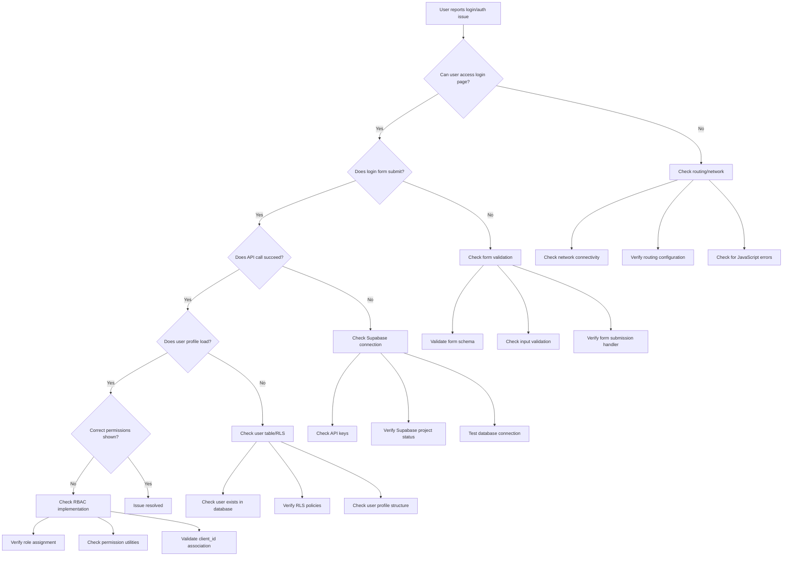
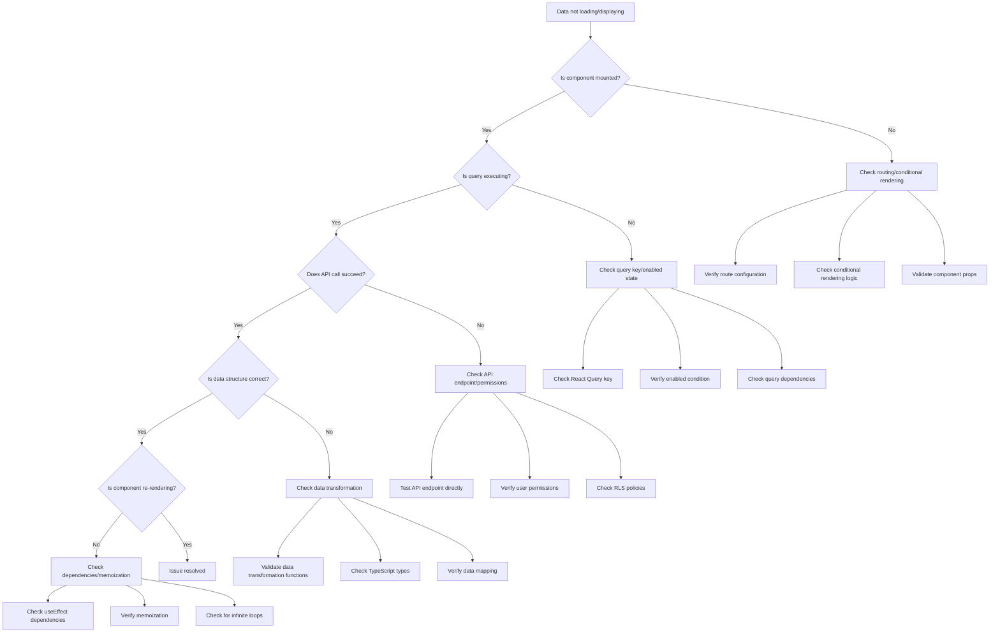
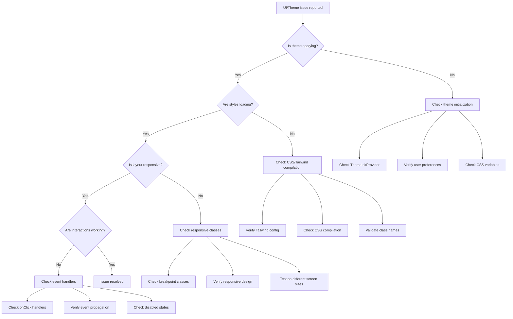
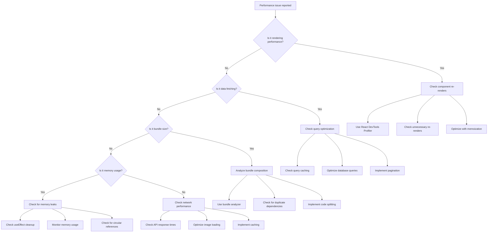
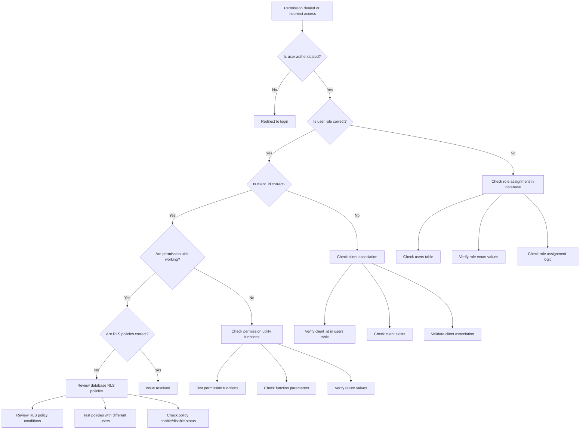

# Troubleshooting Flow: Visual Problem-Solving Guide
## Dealermate Application

### 🎯 Purpose

This document provides systematic, visual troubleshooting flows for common issues in the Dealermate application. Follow these decision trees to quickly identify and resolve problems.

---

## 🔐 Authentication Issues Flow



### Authentication Debug Steps

#### 1. Login Page Issues
- **Check**: Network tab for failed resource loads
- **Verify**: React Router configuration
- **Test**: Direct URL navigation to `/login`

#### 2. Form Submission Issues
- **Check**: Browser console for validation errors
- **Verify**: Form schema with Zod validation
- **Test**: Manual form submission with valid data

#### 3. API Connection Issues
- **Check**: Supabase project status and API keys
- **Verify**: Environment variables are loaded
- **Test**: Direct API call in browser console

#### 4. User Profile Issues
- **Check**: User exists in `users` table
- **Verify**: RLS policies allow user access
- **Test**: Direct database query for user data

---

## 📊 Data Loading Issues Flow



### Data Loading Debug Steps

#### 1. Component Mounting Issues
```typescript
// Add debug logging
useEffect(() => {
  console.log('Component mounted:', componentName);
  return () => console.log('Component unmounted:', componentName);
}, []);
```

#### 2. Query Execution Issues
```typescript
// Debug React Query state
const { data, isLoading, error, isError, failureCount } = useQuery({
  queryKey: ['data', id],
  queryFn: fetchData,
  enabled: !!id, // Check this condition
});

console.log('Query debug:', { 
  data, isLoading, error, isError, failureCount,
  queryKey: ['data', id],
  enabled: !!id 
});
```

#### 3. API Call Issues
```typescript
// Test API call directly
const testApiCall = async () => {
  try {
    const result = await fetch('/api/endpoint');
    console.log('API test result:', result);
  } catch (error) {
    console.error('API test failed:', error);
  }
};
```

---

## 🎨 UI/Theme Issues Flow



### UI/Theme Debug Steps

#### 1. Theme Not Applying
```typescript
// Check theme state
console.log('Theme debug:', {
  documentTheme: document.documentElement.getAttribute('data-theme'),
  userTheme: user?.preferences?.displaySettings?.theme,
  systemTheme: window.matchMedia('(prefers-color-scheme: dark)').matches ? 'dark' : 'light'
});

// Force theme application
document.documentElement.setAttribute('data-theme', 'light');
```

#### 2. Styles Not Loading
```bash
# Check Tailwind compilation
npm run build
# Look for CSS errors in output

# Verify class names exist
# Search in compiled CSS for specific classes
```

#### 3. Responsive Issues
```css
/* Add debug borders */
* {
  outline: 1px solid red !important;
}

/* Check specific breakpoints */
@media (max-width: 768px) {
  .debug-mobile {
    background: yellow !important;
  }
}
```

---

## ⚡ Performance Issues Flow



### Performance Debug Steps

#### 1. Rendering Performance
```typescript
// Add render counting
const useRenderCount = (componentName) => {
  const renderCount = useRef(0);
  renderCount.current++;
  console.log(`${componentName} rendered ${renderCount.current} times`);
};

// Use React DevTools Profiler
// Record interaction and analyze flame graph
```

#### 2. Data Fetching Performance
```typescript
// Add timing to queries
const useTimedQuery = (key, fn) => {
  return useQuery({
    queryKey: key,
    queryFn: async () => {
      console.time(`Query: ${key}`);
      const result = await fn();
      console.timeEnd(`Query: ${key}`);
      return result;
    }
  });
};
```

#### 3. Bundle Size Analysis
```bash
# Analyze bundle
npm run build
npx vite-bundle-analyzer dist

# Check for large dependencies
npm ls --depth=0 | grep -E '\d+\.\d+MB'
```

---

## 🔒 Permission/RBAC Issues Flow



### Permission Debug Steps

#### 1. User Authentication Check
```typescript
// Debug auth state
console.log('Auth debug:', {
  user: user,
  isAuthenticated: isAuthenticated,
  session: session,
  loading: isLoading
});
```

#### 2. Role Assignment Check
```typescript
// Check user role in database
const checkUserRole = async (userId) => {
  const { data, error } = await supabase
    .from('users')
    .select('id, role, client_id')
    .eq('id', userId)
    .single();
    
  console.log('User role check:', { data, error });
};
```

#### 3. Permission Utility Check
```typescript
// Test permission functions
const debugPermissions = (user) => {
  console.log('Permission debug:', {
    hasSystemAccess: hasSystemWideAccess(user),
    canViewSensitive: canViewSensitiveInfo(user),
    shouldFilter: shouldFilterByClient(user),
    clientFilter: getClientIdFilter(user)
  });
};
```

---

## 🚨 Emergency Troubleshooting

### Critical System Failure
1. **Check browser console** for JavaScript errors
2. **Clear all storage** and refresh
3. **Test in incognito mode** to rule out extensions
4. **Check Supabase status** and API connectivity
5. **Revert to last known working commit**

### Database Connection Issues
1. **Test connection** with simple query
2. **Check API keys** and environment variables
3. **Verify Supabase project** status
4. **Review RLS policies** for access issues

### Authentication System Failure
1. **Clear auth tokens** from storage
2. **Test login flow** step by step
3. **Check user table** for data integrity
4. **Verify auth callbacks** and redirects

---

## 📊 Monitoring & Prevention

### Regular Health Checks
- **Weekly**: Review error logs and performance metrics
- **Monthly**: Analyze user feedback and support tickets
- **Quarterly**: Comprehensive security and performance audit

### Automated Monitoring
- Set up error tracking (e.g., Sentry)
- Monitor API response times
- Track user session metrics
- Alert on critical failures

---

*Use this troubleshooting flow as a systematic approach to problem-solving. For specific technical details, refer to the [Debug Cheatsheet](./debug-cheatsheet.md) and [Developer Guide](./developer-guide.md).*