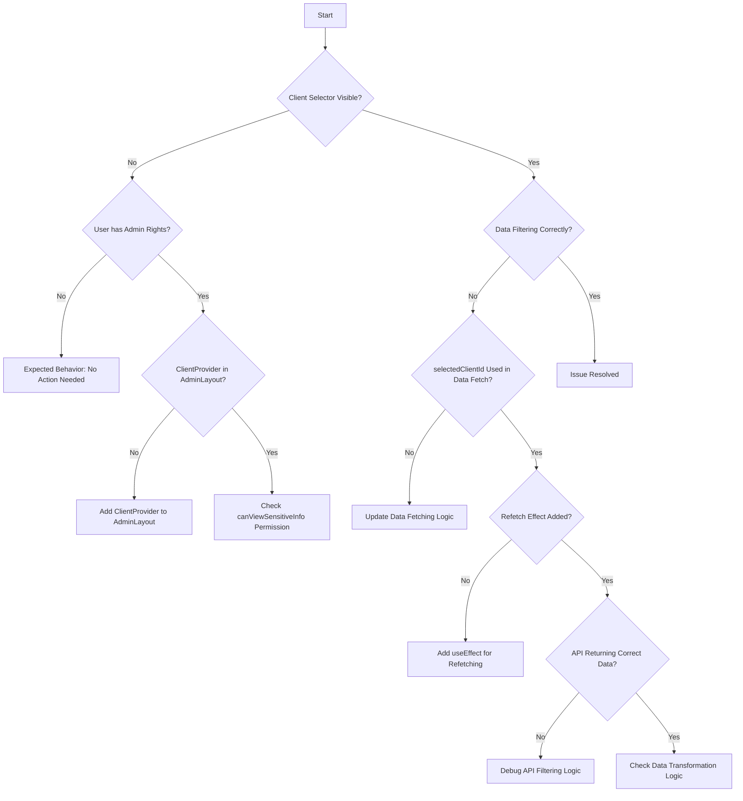

# Global Client Selector - Troubleshooting Flow

## Visual Problem-Solving Guide

This document provides a systematic approach to diagnosing and resolving issues with the global client selector implementation.



## Decision Tree for Client Selector Issues

### 1. Client Selector Not Visible

#### Check User Permissions
- **Question**: Does the user have admin rights?
- **If No**: This is expected behavior. Regular users should not see the selector.
- **If Yes**: Continue to next step.

#### Check ClientProvider
- **Question**: Is ClientProvider properly imported and used in AdminLayout?
- **If No**: Add ClientProvider to AdminLayout.tsx
- **If Yes**: Check if canViewSensitiveInfo returns true for this user

#### Check GlobalClientSelector in TopBar
- **Question**: Is GlobalClientSelector included in TopBar.tsx?
- **If No**: Add GlobalClientSelector to TopBar
- **If Yes**: Check if it's conditionally hidden (CSS or logic)

### 2. Client Selector Visible But Not Working

#### Check Context Connection
- **Question**: Is the ClientContext connected to GlobalClientSelector?
- **If No**: Debug useClient hook implementation
- **If Yes**: Check if clients list is loading properly

#### Check Client List
- **Question**: Is the clients array populated?
- **If No**: Debug client data fetching in ClientContext
- **If Yes**: Check if dropdown is rendering correctly

### 3. Data Not Filtering By Selected Client

#### Check Data Fetching Logic
- **Question**: Is selectedClientId used in data fetching parameters?
- **If No**: Update data fetching to include selectedClientId
- **If Yes**: Continue to next step

#### Check Refetch Effect
- **Question**: Is there a useEffect to refetch when selectedClientId changes?
- **If No**: Add refetch effect with selectedClientId dependency
- **If Yes**: Continue to next step

#### Check API Response
- **Question**: Is the API returning client-filtered data?
- **If No**: Debug API filtering logic
- **If Yes**: Check data transformation after fetching

## Component-Specific Checks

### ClientContext.tsx
- [ ] Provider exports and initializes correctly
- [ ] Client list fetching works
- [ ] selectedClientId state updates properly
- [ ] useClient hook returns expected values

### GlobalClientSelector.tsx
- [ ] Component imports useClient correctly
- [ ] Permission check works as expected
- [ ] Renders ClientSelector with correct props
- [ ] Handles loading and error states

### AdminLayout.tsx
- [ ] Imports ClientProvider
- [ ] Wraps content with ClientProvider
- [ ] Provider is above components that use useClient

### Pages Using Client Filtering
- [ ] Import useClient hook
- [ ] Use selectedClientId in data fetching
- [ ] Add refetch effect for client changes
- [ ] Handle loading and empty states

## Common Solutions

### Fix Missing ClientProvider
```tsx
// In AdminLayout.tsx
import { ClientProvider } from '@/context/ClientContext';

// Wrap content
<ThemeProvider>
  <ClientProvider>
    {/* Rest of your application */}
  </ClientProvider>
</ThemeProvider>
```

### Fix Data Fetching With Client ID
```tsx
// Before
const { data } = useQuery(['data'], fetchData);

// After
const { selectedClientId } = useClient();
const { data } = useQuery(
  ['data', selectedClientId],
  () => fetchData(selectedClientId),
  {
    enabled: !!selectedClientId || selectedClientId === 'all'
  }
);
```

### Fix Missing Refetch
```tsx
// Add this to component
const { selectedClientId } = useClient();
const { data, refetch } = useQuery(...);

useEffect(() => {
  if (refetch) {
    refetch();
  }
}, [selectedClientId, refetch]);
```

## System Health Monitoring

### Client Selector Performance
- Monitor render time of GlobalClientSelector
- Check for excessive re-renders
- Verify client list fetching performance

### Data Refetching Impact
- Monitor network requests when changing clients
- Check for redundant API calls
- Measure time between client change and data update

## Root Cause Analysis Template

When troubleshooting persistent issues:

1. **Symptom**: Describe what's not working
2. **Impact**: How it affects users
3. **Investigation Steps**:
   - Check component rendering
   - Verify context connections
   - Inspect network requests
   - Review permission logic
4. **Root Cause**: Identify the underlying issue
5. **Solution**: How to fix it
6. **Prevention**: How to prevent similar issues

## Emergency Procedures

If the client selector causes critical application issues:

1. **Immediate Action**: Comment out GlobalClientSelector in TopBar
2. **Temporary Fallback**: Hardcode clientId = 'all' in affected pages
3. **Diagnosis**: Use React DevTools to inspect ClientContext
4. **Resolution**: Fix identified issues
5. **Verification**: Test with multiple user types before re-enabling
