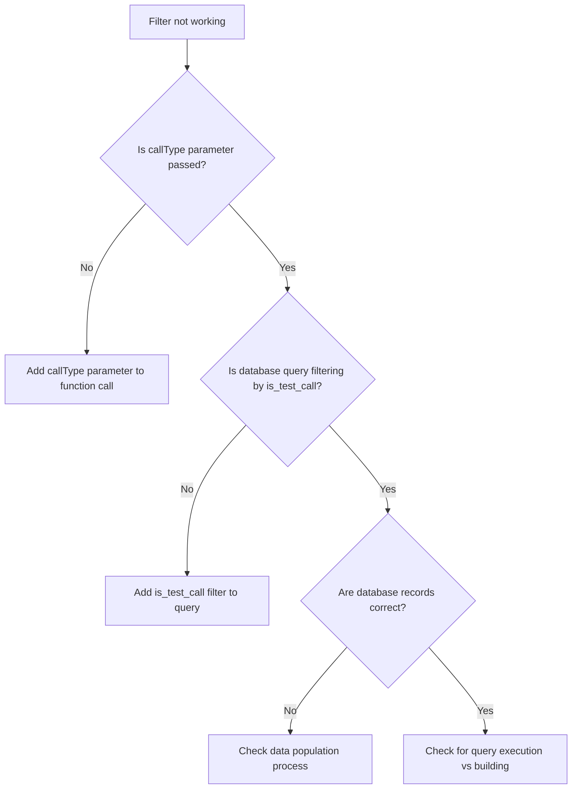
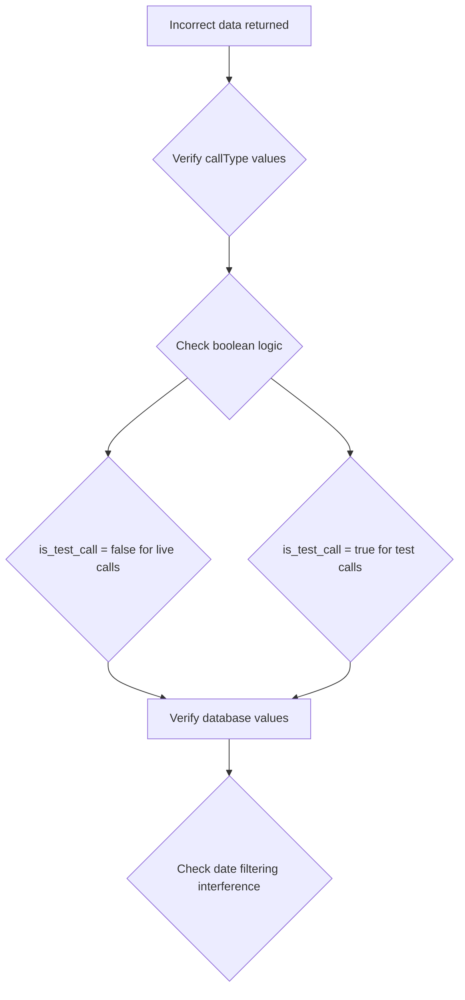
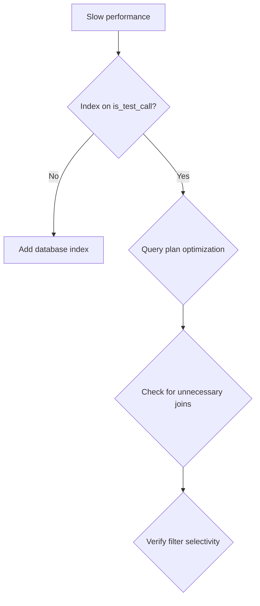

# Call Mode Filter Troubleshooting Flow

## Issue: Filter Not Working



## Issue: Incorrect Data



## Issue: Performance Problems



## Step-by-Step Debugging Process

### 1. Verify Parameter Flow

1. Check component state:
   ```typescript
   console.log('Current callType:', callType);
   ```

2. Check service function parameter:
   ```typescript
   export async function getData(callType: 'all' | 'live' | 'test') {
     console.log('Service received callType:', callType);
   }
   ```

3. Check database query:
   ```typescript
   if (callType === 'live') {
     console.log('Adding live call filter');
     query = query.eq('is_test_call', false);
   }
   ```

### 2. Database Verification

1. Check table structure:
   ```sql
   \d calls
   ```

2. Check sample data:
   ```sql
   SELECT id, is_test_call FROM calls LIMIT 10;
   ```

3. Manual query test:
   ```sql
   SELECT COUNT(*) FROM calls WHERE is_test_call = false; -- Live calls
   SELECT COUNT(*) FROM calls WHERE is_test_call = true;  -- Test calls
   ```

### 3. Service Testing

1. Test each mode individually:
   ```typescript
   const testData = await service.getData('test');
   const liveData = await service.getData('live');
   const allData = await service.getData('all');
   
   console.log('Test:', testData.count);
   console.log('Live:', liveData.count);
   console.log('All:', allData.count);
   ```

2. Verify mathematical relationship:
   ```typescript
   if (allData.count !== testData.count + liveData.count) {
     console.warn('Count mismatch detected');
   }
   ```

## Common Fix Patterns

### Missing Parameter

**Before**:
```typescript
const data = await getAnalyticsData(startDate, endDate, clientId);
```

**After**:
```typescript
const data = await getAnalyticsData(startDate, endDate, clientId, callType);
```

### Missing Query Filter

**Before**:
```typescript
let query = supabase.from('calls').select('*');
```

**After**:
```typescript
let query = supabase.from('calls').select('*');

if (callType === 'live') {
  query = query.eq('is_test_call', false);
} else if (callType === 'test') {
  query = query.eq('is_test_call', true);
}
```

### Incorrect Boolean Logic

**Wrong**:
```typescript
if (callType === 'live') {
  query = query.eq('is_test_call', true); // Wrong!
}
```

**Correct**:
```typescript
if (callType === 'live') {
  query = query.eq('is_test_call', false); // Correct
}
```

## Validation Script

Run this script to validate implementation:

```typescript
async function validateCallModeFilter() {
  console.log('Validating call mode filter implementation...');
  
  const startDate = '2023-01-01';
  const endDate = '2023-12-31';
  
  try {
    // Test all modes
    const allData = await getAnalyticsData(startDate, endDate, undefined, 'all');
    const liveData = await getAnalyticsData(startDate, endDate, undefined, 'live');
    const testData = await getAnalyticsData(startDate, endDate, undefined, 'test');
    
    console.log('Results:');
    console.log('All calls:', allData.total);
    console.log('Live calls:', liveData.total);
    console.log('Test calls:', testData.total);
    
    // Validate relationship
    if (allData.total === liveData.total + testData.total) {
      console.log('✅ Count validation passed');
    } else {
      console.warn('❌ Count validation failed');
      console.warn('Expected:', liveData.total + testData.total);
      console.warn('Actual:', allData.total);
    }
    
    console.log('Validation complete');
  } catch (error) {
    console.error('Validation failed:', error);
  }
}

// Run validation
validateCallModeFilter();
```
