# Troubleshooting Flow: Error Boundaries & Loading States

## Visual Problem-Solving Guide

### 🚨 Error Boundary Issues

```mermaid
flowchart TD
    A[Error Occurred] --> B{Error Boundary Catches?}
    B -->|Yes| C[Error UI Displayed]
    B -->|No| D[App Crashes]
    
    C --> E{Recovery Options Work?}
    E -->|Yes| F[✅ Issue Resolved]
    E -->|No| G[Manual Recovery Needed]
    
    D --> H[Check Error Boundary Placement]
    H --> I{Boundary Around Component?}
    I -->|No| J[Add SectionErrorBoundary]
    I -->|Yes| K[Check Error Type]
    
    K --> L{Event Handler Error?}
    L -->|Yes| M[Use useErrorRecovery Hook]
    L -->|No| N[Check Console for Details]
    
    G --> O[Try Recovery Strategies]
    O --> P{Strategy Successful?}
    P -->|Yes| F
    P -->|No| Q[Escalate to Manual Fix]
    
    J --> R[Wrap Component]
    R --> S[Test Error Handling]
    S --> F
    
    M --> T[Add Error Reporting]
    T --> U[Test Event Handler]
    U --> F
```



### ⏳ Loading State Issues

```mermaid
flowchart TD
    A[Component Loading] --> B{Loading State Shows?}
    B -->|Yes| C[✅ Working Correctly]
    B -->|No| D[Investigate Issue]
    
    D --> E{Component Lazy Loaded?}
    E -->|No| F[Add lazy() wrapper]
    E -->|Yes| G{Suspense Boundary Exists?}
    
    G -->|No| H[Add Suspense with fallback]
    G -->|Yes| I{Loading Too Fast?}
    
    I -->|Yes| J[Add artificial delay for testing]
    I -->|No| K[Check Fallback Component]
    
    F --> L[const Component = lazy(() => import('./Component'))]
    L --> M[Test Lazy Loading]
    M --> C
    
    H --> N[<Suspense fallback={<LoadingFallback />}>]
    N --> O[Test Suspense Boundary]
    O --> C
    
    J --> P[Add setTimeout in import for dev]
    P --> Q[Verify Loading Shows]
    Q --> C
    
    K --> R{Fallback Renders?}
    R -->|No| S[Check Fallback Component Import]
    R -->|Yes| T[Check Fallback Props]
    
    S --> U[Fix Import Path]
    U --> C
    
    T --> V[Verify sectionName prop]
    V --> C
```

### 🔄 Recovery Strategy Flow

```mermaid
flowchart TD
    A[Error Detected] --> B[Classify Error Type]
    B --> C{Network Error?}
    B --> D{Database Error?}
    B --> E{Permission Error?}
    B --> F{Generic Error?}
    
    C -->|Yes| G[Network Recovery Strategies]
    D -->|Yes| H[Database Recovery Strategies]
    E -->|Yes| I[Permission Recovery Strategies]
    F -->|Yes| J[Generic Recovery Strategies]
    
    G --> G1[Retry Request]
    G --> G2[Check Connection]
    G --> G3[Switch to Offline Mode]
    
    H --> H1[Refresh Auth Session]
    H --> H2[Clear Local Cache]
    H --> H3[Retry with Backoff]
    
    I --> I1[Refresh Permissions]
    I --> I2[Redirect to Login]
    I --> I3[Show Access Request]
    
    J --> J1[Reload Component]
    J --> J2[Navigate Back]
    J --> J3[Reload Page]
    
    G1 --> K{Strategy Successful?}
    G2 --> K
    G3 --> K
    H1 --> K
    H2 --> K
    H3 --> K
    I1 --> K
    I2 --> K
    I3 --> K
    J1 --> K
    J2 --> K
    J3 --> K
    
    K -->|Yes| L[✅ Recovery Successful]
    K -->|No| M[Try Next Strategy]
    M --> N{More Strategies?}
    N -->|Yes| O[Execute Next Strategy]
    N -->|No| P[❌ Manual Intervention Required]
    
    O --> K
```



## Step-by-Step Troubleshooting

### 🔍 Issue: Error Boundary Not Working

**Step 1: Verify Error Boundary Placement**
```tsx
// ❌ Problem: No error boundary
<MyComponent />

// ✅ Solution: Add error boundary
<SectionErrorBoundary sectionName="MySection">
  <MyComponent />
</SectionErrorBoundary>
```

**Step 2: Check Error Type**
```tsx
// ❌ Problem: Event handler error not caught
const handleClick = () => {
  throw new Error('This won\'t be caught by error boundary');
};

// ✅ Solution: Use error recovery hook
const { reportError } = useErrorRecovery({
  section: 'MySection',
  component: 'MyComponent'
});

const handleClick = () => {
  try {
    riskyOperation();
  } catch (error) {
    reportError(error); // This will be handled properly
  }
};
```

**Step 3: Test Error Boundary**
```tsx
// Add temporary test button
{process.env.NODE_ENV === 'development' && (
  <button onClick={() => { throw new Error('Test error'); }}>
    Test Error Boundary
  </button>
)}
```

### ⏳ Issue: Loading States Not Appearing

**Step 1: Verify Lazy Loading**
```tsx
// ❌ Problem: Component not lazy loaded
import MyComponent from './MyComponent';

// ✅ Solution: Make component lazy
const MyComponent = lazy(() => import('./MyComponent'));
```

**Step 2: Add Suspense Boundary**
```tsx
// ❌ Problem: No suspense boundary
<MyComponent />

// ✅ Solution: Add suspense with fallback
<Suspense fallback={<SectionLoadingFallback sectionName="MySection" />}>
  <MyComponent />
</Suspense>
```

**Step 3: Test Loading State**
```tsx
// Add artificial delay for testing (development only)
const MyComponent = lazy(() => 
  process.env.NODE_ENV === 'development' 
    ? new Promise(resolve => 
        setTimeout(() => resolve(import('./MyComponent')), 2000)
      )
    : import('./MyComponent')
);
```

### 🔄 Issue: Recovery Not Working

**Step 1: Enable Auto-Recovery**
```tsx
const { reportError, attemptRecovery } = useErrorRecovery({
  section: 'MySection',
  component: 'MyComponent',
  autoRecover: true // Make sure this is enabled
});
```

**Step 2: Check Recovery Strategies**
```tsx
// Debug recovery strategies
const strategies = getRecoveryStrategies(error);
console.log('Available recovery strategies:', strategies);

// Test manual recovery
const testRecovery = async () => {
  const success = await attemptRecovery(error);
  console.log('Recovery result:', success);
};
```

**Step 3: Implement Custom Recovery**
```tsx
const { reportError, attemptRecovery } = useErrorRecovery({
  section: 'MySection',
  component: 'MyComponent',
  onRecovery: (success, strategy) => {
    if (success) {
      console.log('Recovery successful with strategy:', strategy?.name);
      // Show success message to user
    } else {
      console.log('Recovery failed, manual intervention needed');
      // Show error message to user
    }
  }
});
```

## Common Error Patterns & Solutions

### Pattern 1: Infinite Error Loop

**Symptoms:**
- Same error keeps occurring
- Error boundary resets repeatedly
- Browser becomes unresponsive

**Solution:**
```tsx
// Add circuit breaker pattern
const CircuitBreakerErrorBoundary = ({ children, maxErrors = 3 }) => {
  const [errorCount, setErrorCount] = useState(0);
  const [lastReset, setLastReset] = useState(Date.now());
  
  // Reset counter after 5 minutes
  useEffect(() => {
    const timer = setTimeout(() => {
      setErrorCount(0);
      setLastReset(Date.now());
    }, 5 * 60 * 1000);
    
    return () => clearTimeout(timer);
  }, [lastReset]);
  
  if (errorCount >= maxErrors) {
    return (
      <div className="p-6 text-center">
        <h3>Too Many Errors</h3>
        <p>This section has encountered repeated errors.</p>
        <button onClick={() => window.location.reload()}>
          Refresh Page
        </button>
      </div>
    );
  }
  
  return (
    <SectionErrorBoundary 
      sectionName="Protected"
      onError={() => setErrorCount(prev => prev + 1)}
    >
      {children}
    </SectionErrorBoundary>
  );
};
```

### Pattern 2: Memory Leaks from Error Handling

**Symptoms:**
- Increasing memory usage over time
- Slow performance after errors
- Browser tab becomes unresponsive

**Solution:**
```tsx
// Implement proper cleanup
const useErrorCleanup = () => {
  const errorTimeouts = useRef(new Set());
  
  useEffect(() => {
    return () => {
      // Clear all error-related timeouts
      errorTimeouts.current.forEach(clearTimeout);
      errorTimeouts.current.clear();
    };
  }, []);
  
  const scheduleCleanup = useCallback((callback, delay) => {
    const timeout = setTimeout(() => {
      callback();
      errorTimeouts.current.delete(timeout);
    }, delay);
    
    errorTimeouts.current.add(timeout);
  }, []);
  
  return { scheduleCleanup };
};
```

### Pattern 3: Performance Issues from Error Boundaries

**Symptoms:**
- Slow rendering after errors
- High CPU usage
- Delayed user interactions

**Solution:**
```tsx
// Optimize error boundary performance
const OptimizedErrorBoundary = memo(({ children, sectionName }) => {
  const [error, setError] = useState(null);
  const errorRef = useRef(null);
  
  // Debounce error state updates
  const debouncedSetError = useMemo(
    () => debounce(setError, 100),
    []
  );
  
  // Use callback to prevent unnecessary re-renders
  const handleError = useCallback((error, errorInfo) => {
    if (errorRef.current !== error) {
      errorRef.current = error;
      debouncedSetError(error);
    }
  }, [debouncedSetError]);
  
  if (error) {
    return <ErrorFallback error={error} sectionName={sectionName} />;
  }
  
  return (
    <SectionErrorBoundary sectionName={sectionName} onError={handleError}>
      {children}
    </SectionErrorBoundary>
  );
});
```

## Debug Decision Tree

### When Error Boundary Doesn't Catch Error

```
Is the error thrown during render?
├─ Yes → Check if error boundary wraps the component
│  ├─ Yes → Check error boundary implementation
│  └─ No → Add SectionErrorBoundary wrapper
└─ No → Error is in event handler or async operation
   └─ Use useErrorRecovery hook to report error manually
```

### When Loading State Doesn't Show

```
Is the component lazy-loaded?
├─ Yes → Is there a Suspense boundary?
│  ├─ Yes → Is the loading too fast to see?
│  │  ├─ Yes → Add artificial delay for testing
│  │  └─ No → Check fallback component implementation
│  └─ No → Add Suspense with fallback
└─ No → Convert to lazy-loaded component
```

### When Recovery Fails

```
Is auto-recovery enabled?
├─ Yes → Are there available recovery strategies?
│  ├─ Yes → Do strategies match the error type?
│  │  ├─ Yes → Check strategy implementation
│  │  └─ No → Add custom recovery strategy
│  └─ No → Error type not recognized
│     └─ Add custom error classification
└─ No → Enable autoRecover: true in useErrorRecovery
```

## Emergency Procedures

### 🚨 Critical System Failure

**Immediate Actions:**
1. Open browser console
2. Run emergency reset script:
```javascript
// Emergency reset
errorRecoveryService.clearErrorHistory();
localStorage.clear();
sessionStorage.clear();
window.location.reload();
```

### 🔧 Debug Mode Activation

**For Development:**
```javascript
// Activate comprehensive debug mode
window.debugMode = true;
window.showErrorDetails = true;
window.bypassErrorBoundary = false; // Set to true to bypass for debugging
console.log('🔧 Debug mode activated');
```

### 📊 Health Check

**System Health Verification:**
```javascript
// Run health check
const healthCheck = () => {
  const stats = errorRecoveryService.getErrorStatistics();
  console.log('📊 System Health:', {
    totalErrors: stats.totalErrors,
    criticalErrors: stats.errorsBySeverity.critical || 0,
    recentErrors: stats.recentErrors.length,
    status: stats.totalErrors < 10 ? '✅ Healthy' : '⚠️ Needs Attention'
  });
};

healthCheck();
```

## Prevention Checklist

### ✅ Before Deploying New Components

- [ ] Component wrapped with appropriate error boundary
- [ ] Lazy loading implemented for non-critical components
- [ ] Suspense boundaries added with meaningful fallbacks
- [ ] Error recovery hook integrated for event handlers
- [ ] Error scenarios tested in development
- [ ] Performance impact assessed
- [ ] Recovery strategies verified

### ✅ Before Releasing Features

- [ ] All error boundaries tested with various error types
- [ ] Loading states verified on slow connections
- [ ] Recovery mechanisms tested with network issues
- [ ] Error reporting integrated with monitoring service
- [ ] User experience validated for error scenarios
- [ ] Documentation updated with new error patterns

This troubleshooting guide provides visual flows and step-by-step procedures to quickly identify and resolve error boundary and loading state issues.