```mermaid
flowchart TD
    A[Provider Error] --> B{Component wrapped in provider?}
    B -->|No| C[Add provider wrapper]
    B -->|Yes| D{Provider has correct props?}
    D -->|No| E[Fix provider props]
    D -->|Yes| F{Multiple providers needed?}
    F -->|Yes| G[Wrap in all required providers]
    F -->|No| H{Provider mock needed?}
    H -->|Yes| I[Mock provider context]
    H -->|No| J[Check provider implementation]
    
    C --> K[✅ Fixed]
    E --> K
    G --> K
    I --> K
    J --> K
```

# Test Troubleshooting Flow

Visual problem-solving guide for common testing issues in the call dashboard application.

## 🔍 Test Failure Decision Tree

```
Test Failed?
├── Yes → Continue to Problem Identification
└── No → Test Passed ✅

Problem Identification
├── Import/Module Error → Go to [Module Issues](#module-issues)
├── Element Not Found → Go to [Element Issues](#element-issues)
├── Async/Timing Error → Go to [Async Issues](#async-issues)
├── Mock Not Working → Go to [Mock Issues](#mock-issues)
├── Provider/Context Error → Go to [Provider Issues](#provider-issues)
├── Performance/Timeout → Go to [Performance Issues](#performance-issues)
└── Other → Go to [General Debugging](#general-debugging)
```

## Module Issues

### 🚨 Symptoms
- `Cannot find module '@/components/...'`
- `Module not found: Can't resolve '...'`
- `TypeError: ... is not a function`

### 🔧 Troubleshooting Flow


### 🛠️ Quick Fixes

#### 1. Check File Existence
```bash
# Verify file exists
ls src/components/LoginPage.tsx
ls src/pages/Login.tsx
```

#### 2. Fix Import Paths
```typescript
// ❌ Wrong path
import LoginPage from '@/components/LoginPage';

// ✅ Correct path
import Login from '@/pages/Login';
```

#### 3. Check TypeScript Configuration
```json
// tsconfig.json
{
  "compilerOptions": {
    "paths": {
      "@/*": ["./src/*"]
    }
  }
}
```

#### 4. Fix Mock Definition
```typescript
// ❌ Mock after import
import { apiService } from '@/services/apiService';
vi.mock('@/services/apiService');

// ✅ Mock before import
vi.mock('@/services/apiService', () => ({
  apiService: { getData: vi.fn() }
}));
```

## Element Issues

### 🚨 Symptoms
- `TestingLibraryElementError: Unable to find element`
- `Element not found by role/text/label`
- `Multiple elements found`

### 🔧 Troubleshooting Flow

```mermaid
flowchart TD
    A[Element Not Found] --> B[Add screen.debug()]
    B --> C{Element visible in output?}
    C -->|No| D{Component rendered?}
    D -->|No| E[Check component props/providers]
    D -->|Yes| F[Check element selector]
    C -->|Yes| G{Correct query type?}
    G -->|No| H[Use appropriate query]
    G -->|Yes| I{Async operation?}
    I -->|Yes| J[Add waitFor or findBy]
    I -->|No| K[Check element attributes]
    
    E --> L[✅ Fixed]
    F --> L
    H --> L
    J --> L
    K --> L
```

### 🛠️ Quick Fixes

#### 1. Debug Rendered Output
```typescript
it('debug element issue', () => {
  render(<MyComponent />);
  
  // See what's actually rendered
  screen.debug();
  
  // Check specific container
  const { container } = render(<MyComponent />);
  console.log(container.innerHTML);
});
```

#### 2. Use Correct Query
```typescript
// ❌ Wrong query type
screen.getByText('Submit'); // Multiple buttons with "Submit"

// ✅ More specific query
screen.getByRole('button', { name: 'Submit Form' });
screen.getByLabelText('Email Address');
screen.getByTestId('login-button');
```

#### 3. Handle Async Elements
```typescript
// ❌ Element not loaded yet
expect(screen.getByText('Data loaded')).toBeInTheDocument();

// ✅ Wait for element
await waitFor(() => {
  expect(screen.getByText('Data loaded')).toBeInTheDocument();
});

// ✅ Or use findBy (built-in waiting)
expect(await screen.findByText('Data loaded')).toBeInTheDocument();
```

#### 4. Check Element Visibility
```typescript
// Element might be hidden
const element = screen.getByTestId('hidden-element');
console.log('Element styles:', getComputedStyle(element));

// Use queryBy for elements that might not exist
expect(screen.queryByText('Optional text')).not.toBeInTheDocument();
```

## Async Issues

### 🚨 Symptoms
- `Timeout exceeded`
- `Promise rejection not handled`
- `Act warning`
- `State update after unmount`

### 🔧 Troubleshooting Flow

```mermaid
flowchart TD
    A[Async Issue] --> B{Timeout error?}
    B -->|Yes| C[Increase timeout or add waitFor]
    B -->|No| D{Act warning?}
    D -->|Yes| E[Wrap in act() or use proper async patterns]
    D -->|No| F{Promise rejection?}
    F -->|Yes| G[Add proper error handling]
    F -->|No| H{State update after unmount?}
    H -->|Yes| I[Add cleanup in useEffect]
    H -->|No| J[Check async operation timing]
    
    C --> K[✅ Fixed]
    E --> K
    G --> K
    I --> K
    J --> K
```

### 🛠️ Quick Fixes

#### 1. Handle Async Operations
```typescript
// ❌ Not waiting for async
it('should show data', () => {
  render(<AsyncComponent />);
  expect(screen.getByText('Data')).toBeInTheDocument();
});

// ✅ Wait for async operations
it('should show data', async () => {
  render(<AsyncComponent />);
  
  await waitFor(() => {
    expect(screen.getByText('Data')).toBeInTheDocument();
  });
});
```

#### 2. Increase Timeouts
```typescript
// For slow operations
await waitFor(() => {
  expect(screen.getByText('Slow data')).toBeInTheDocument();
}, { timeout: 5000 });

// Global timeout
vi.setTimeout(10000);
```

#### 3. Mock Async Functions
```typescript
// Mock API calls
const mockApiCall = vi.fn(() => Promise.resolve({ data: 'test' }));

// Mock with delay
const mockSlowApi = vi.fn(() => 
  new Promise(resolve => setTimeout(() => resolve({ data: 'test' }), 100))
);
```

#### 4. Handle Cleanup
```typescript
// Component with cleanup
const AsyncComponent = () => {
  const [data, setData] = useState(null);
  
  useEffect(() => {
    let cancelled = false;
    
    fetchData().then(result => {
      if (!cancelled) {
        setData(result);
      }
    });
    
    return () => {
      cancelled = true;
    };
  }, []);
  
  return <div>{data}</div>;
};
```

## Mock Issues

### 🚨 Symptoms
- `mockFunction is not a function`
- `Mock not called`
- `Mock implementation not working`
- `Cannot spy on property`

### 🔧 Troubleshooting Flow


### 🛠️ Quick Fixes

#### 1. Proper Mock Definition
```typescript
// ❌ Mock after import
import { apiService } from '@/services/apiService';
vi.mock('@/services/apiService');

// ✅ Mock before import
vi.mock('@/services/apiService', () => ({
  apiService: {
    getData: vi.fn(() => Promise.resolve([])),
    postData: vi.fn(() => Promise.resolve({ success: true })),
  },
}));
```

#### 2. Mock Implementation
```typescript
// Simple mock
const mockFn = vi.fn();
mockFn.mockReturnValue('test value');

// Async mock
const mockAsyncFn = vi.fn(() => Promise.resolve('async result'));

// Mock with different return values
mockFn
  .mockReturnValueOnce('first call')
  .mockReturnValueOnce('second call')
  .mockReturnValue('default');
```

#### 3. Clear Mocks Between Tests
```typescript
beforeEach(() => {
  vi.clearAllMocks(); // Clear call history
  vi.resetAllMocks(); // Reset implementations
});
```

#### 4. Debug Mock Calls
```typescript
// Check if mock was called
console.log('Mock called:', mockFn.mock.calls.length, 'times');
console.log('Call arguments:', mockFn.mock.calls);
console.log('Return values:', mockFn.mock.results);

// Verify specific calls
expect(mockFn).toHaveBeenCalledWith('expected', 'args');
expect(mockFn).toHaveBeenCalledTimes(2);
```

## Provider Issues

### 🚨 Symptoms
- `useAuth must be used within AuthProvider`
- `useContext must be used within Provider`
- `Cannot read property of undefined`

### 🔧 Troubleshooting Flow



### 🛠️ Quick Fixes

#### 1. Wrap with Providers
```typescript
// ❌ Missing provider
render(<ComponentUsingAuth />);

// ✅ With provider
render(
  <AuthProvider>
    <ComponentUsingAuth />
  </AuthProvider>
);

// ✅ Multiple providers
render(
  <BrowserRouter>
    <AuthProvider>
      <ThemeProvider>
        <ComponentUsingAuth />
      </ThemeProvider>
    </AuthProvider>
  </BrowserRouter>
);
```

#### 2. Create Test Utilities
```typescript
// Custom render with providers
const renderWithProviders = (ui, options = {}) => {
  const AllProviders = ({ children }) => (
    <BrowserRouter>
      <AuthProvider>
        <ThemeProvider>
          {children}
        </ThemeProvider>
      </AuthProvider>
    </BrowserRouter>
  );

  return render(ui, { wrapper: AllProviders, ...options });
};
```

#### 3. Mock Context Values
```typescript
// Mock auth context
vi.mock('@/context/AuthContext', () => ({
  useAuth: () => ({
    user: { id: '1', name: 'Test User' },
    isAuthenticated: true,
    login: vi.fn(),
    logout: vi.fn(),
  }),
}));
```

## Performance Issues

### 🚨 Symptoms
- `Test timeout exceeded`
- `Tests running slowly`
- `Memory leaks`
- `Too many re-renders`

### 🔧 Troubleshooting Flow


### 🛠️ Quick Fixes

#### 1. Optimize Test Data
```typescript
// ❌ Large test data
const hugeMockData = Array.from({ length: 10000 }, (_, i) => ({
  id: i,
  name: `Item ${i}`,
  description: `Long description for item ${i}...`,
}));

// ✅ Minimal test data
const mockData = [
  { id: 1, name: 'Item 1' },
  { id: 2, name: 'Item 2' },
];
```

#### 2. Use Fake Timers
```typescript
// ❌ Real timers slow down tests
setTimeout(() => setData('loaded'), 1000);

// ✅ Fake timers
beforeEach(() => {
  vi.useFakeTimers();
});

afterEach(() => {
  vi.useRealTimers();
});

// In test
vi.advanceTimersByTime(1000);
```

#### 3. Add Cleanup
```typescript
// Component cleanup
useEffect(() => {
  const interval = setInterval(() => {}, 1000);
  
  return () => {
    clearInterval(interval);
  };
}, []);

// Test cleanup
afterEach(() => {
  vi.clearAllTimers();
  vi.clearAllMocks();
});
```

## General Debugging

### 🔧 Step-by-Step Debugging Process

```mermaid
flowchart TD
    A[Test Failed] --> B[Read error message carefully]
    B --> C[Add screen.debug()]
    C --> D[Check what's rendered]
    D --> E[Verify component props]
    E --> F[Check mock implementations]
    F --> G[Add console.log for debugging]
    G --> H[Run test in isolation]
    H --> I[Compare with working test]
    I --> J[Make minimal fix]
    J --> K[Verify fix works]
    K --> L[Clean up debug code]
    L --> M[✅ Test Fixed]
```

### 🛠️ Universal Debugging Tools

#### 1. Visual Debugging
```typescript
// See rendered output
screen.debug();

// See specific element
const button = screen.getByRole('button');
screen.debug(button);

// Get testing playground URL
screen.logTestingPlaygroundURL();
```

#### 2. State Debugging
```typescript
// Log component state
const TestComponent = () => {
  const [state, setState] = useState('initial');
  console.log('Component state:', state);
  return <div>{state}</div>;
};
```

#### 3. Mock Debugging
```typescript
// Log mock calls
console.log('Mock calls:', mockFn.mock.calls);
console.log('Mock results:', mockFn.mock.results);

// Add implementation logging
mockFn.mockImplementation((...args) => {
  console.log('Mock called with:', args);
  return 'result';
});
```

## Emergency Procedures

### 🚨 When All Tests Fail

```bash
# 1. Check basic setup
npm install
npm run build

# 2. Clear caches
rm -rf node_modules/.cache
npm test -- --no-cache

# 3. Check for global issues
npm test -- --reporter=verbose | head -20

# 4. Run single test
npm test -- --grep "simple test"
```

### 🚨 When Tests Are Flaky

```bash
# Run test multiple times
for i in {1..10}; do npm test -- LoginPage.test.tsx; done

# Add timing logs
console.log('Test start:', Date.now());

# Increase timeouts
vi.setTimeout(30000);
```

### 🚨 When CI/CD Fails

```bash
# Check environment differences
CI=true npm test

# Check Node/npm versions
node --version
npm --version

# Run with same conditions as CI
NODE_ENV=test npm test
```

## Quick Reference

### 🔍 Debugging Commands
| Command | Purpose |
|---------|---------|
| `screen.debug()` | Show rendered HTML |
| `screen.logTestingPlaygroundURL()` | Get query suggestions |
| `console.log(mockFn.mock.calls)` | Check mock calls |
| `vi.clearAllMocks()` | Reset mocks |
| `waitFor(() => {})` | Wait for async |

### 🎯 Common Queries
| Query | Use Case |
|-------|---------|
| `getByRole('button')` | Interactive elements |
| `getByLabelText('Email')` | Form inputs |
| `getByText('Submit')` | Text content |
| `getByTestId('custom')` | Custom test IDs |
| `queryBy*` | Optional elements |
| `findBy*` | Async elements |

### ⚡ Quick Fixes
| Issue | Fix |
|-------|-----|
| Element not found | Add `screen.debug()` |
| Async failure | Use `waitFor()` or `findBy*` |
| Mock not working | Move mock before import |
| Provider error | Wrap in provider |
| Timeout | Increase timeout or use fake timers |

This troubleshooting flow should help you systematically identify and resolve testing issues. Follow the decision trees and use the quick fixes to get your tests back to green! 🟢