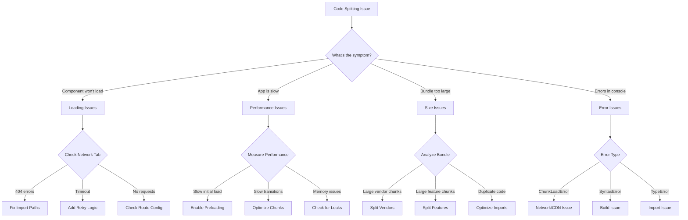
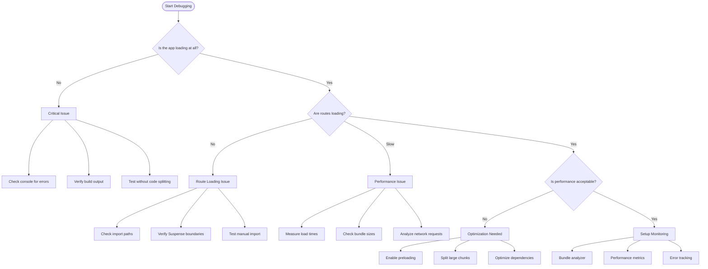
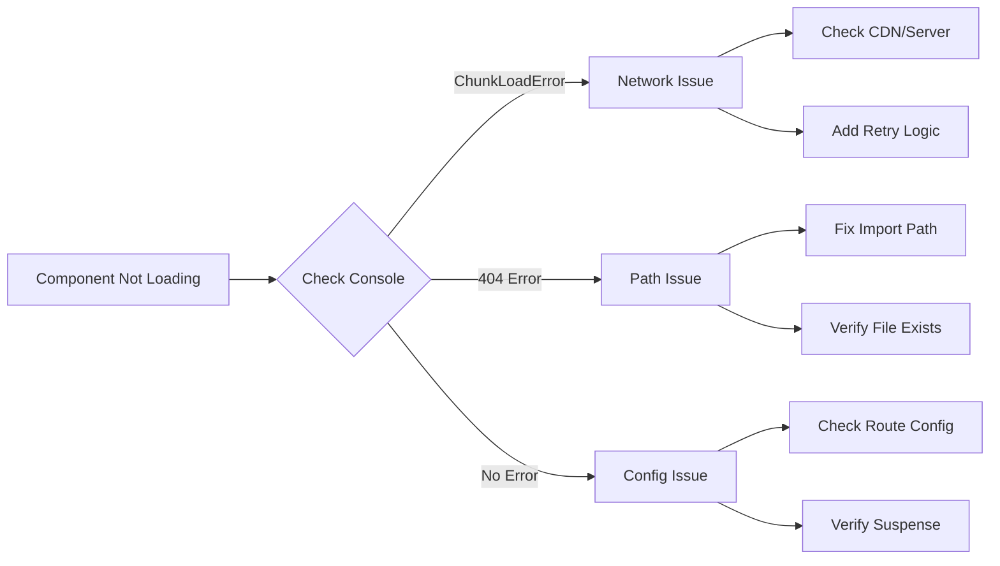
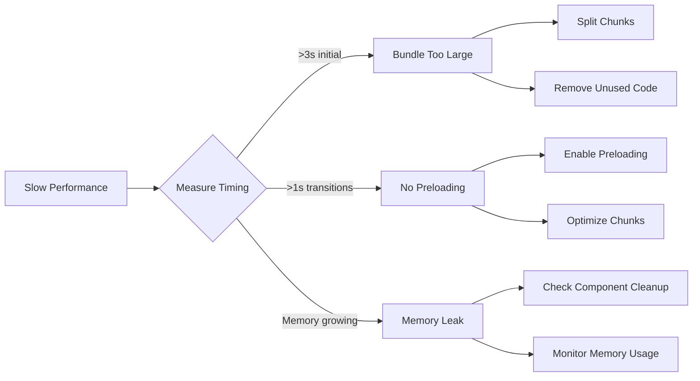
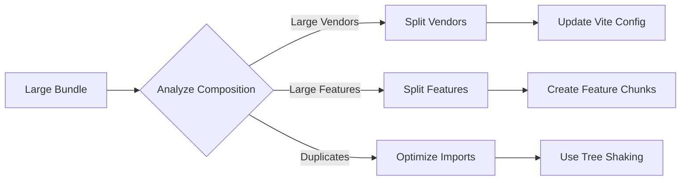
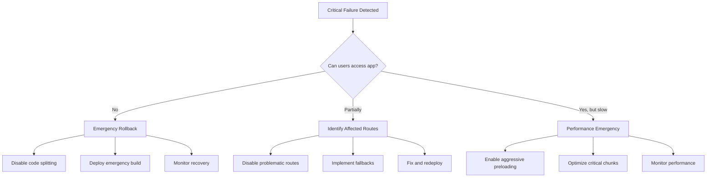

# Code Splitting Troubleshooting Flow

## Visual Problem-Solving Guide

### 🚨 Issue Identification Flow



### 🔧 Diagnostic Decision Tree



## Step-by-Step Troubleshooting

### 🎯 Phase 1: Initial Assessment

**Step 1: Quick Health Check**
```bash
# Run these commands first
npm run build
ls -la dist/assets/ | grep -E '\.(js|css)$'
npm run preview
```

**Step 2: Browser DevTools Check**
```javascript
// Open console and run:
console.log('Bundle analyzer metrics:', bundleAnalyzer.getMetrics());
console.log('Route groups loaded:', Object.keys(window.__ROUTE_GROUPS__ || {}));
```

**Step 3: Network Analysis**
- Open Network tab
- Reload page
- Look for: Failed requests (red), large files (>500KB), slow requests (>2s)

### 🔍 Phase 2: Specific Issue Diagnosis

#### Loading Issues



**Diagnostic Commands:**
```javascript
// Test specific route import
import('../pages/Dashboard')
  .then(module => console.log('✅ Import successful:', module))
  .catch(error => console.error('❌ Import failed:', error));

// Check route configuration
console.log('Current route config:', RouteGroups);
```

#### Performance Issues



**Performance Measurement:**
```javascript
// Measure route transition time
const measureRouteTransition = (routeName) => {
  const start = performance.now();
  return import(`../pages/${routeName}`)
    .then(() => {
      const time = performance.now() - start;
      console.log(`${routeName} load time: ${time.toFixed(2)}ms`);
      return time;
    });
};

// Test all main routes
['Dashboard', 'Analytics', 'Logs', 'Leads'].forEach(measureRouteTransition);
```

#### Bundle Size Issues



**Bundle Analysis:**
```bash
# Quick size check
npm run build
find dist/assets -name "*.js" -exec ls -lh {} \; | sort -k5 -hr

# Detailed analysis
npx vite-bundle-analyzer dist
```

### 🛠️ Phase 3: Solution Implementation

#### Quick Fixes

```typescript
// 1. Emergency: Disable code splitting for critical route
// Before:
const Dashboard = lazy(() => import('./pages/Dashboard'));
// After:
import Dashboard from './pages/Dashboard';

// 2. Add error boundary
<ErrorBoundary fallback={<div>Loading failed. Please refresh.</div>}>
  <Suspense fallback={<LoadingSpinner />}>
    <Component />
  </Suspense>
</ErrorBoundary>

// 3. Add retry logic
const createRetryLazyRoute = (importFn, retries = 3) => {
  return lazy(() => {
    return new Promise((resolve, reject) => {
      const attemptImport = (attempt) => {
        importFn()
          .then(resolve)
          .catch((error) => {
            if (attempt < retries) {
              setTimeout(() => attemptImport(attempt + 1), 1000 * attempt);
            } else {
              reject(error);
            }
          });
      };
      attemptImport(1);
    });
  });
};
```

#### Systematic Fixes

**1. Bundle Optimization**
```typescript
// vite.config.ts
export default defineConfig({
  build: {
    rollupOptions: {
      output: {
        manualChunks: {
          // Split by usage frequency
          'critical': ['./src/pages/Dashboard', './src/pages/Login'],
          'frequent': ['./src/pages/Analytics', './src/pages/Logs'],
          'occasional': ['./src/pages/Settings', './src/pages/Agents'],
          
          // Split by size
          'heavy-vendor': ['recharts', 'date-fns', 'xlsx'],
          'light-vendor': ['lucide-react', 'clsx'],
        },
      },
    },
  },
});
```

**2. Preloading Strategy**
```typescript
// Intelligent preloading based on user behavior
const preloadingStrategy = {
  '/dashboard': ['Analytics', 'Logs'], // Users often go here next
  '/analytics': ['Logs', 'Leads'],     // Related features
  '/logs': ['Leads', 'Analytics'],     // Common workflow
};

const useIntelligentPreloading = () => {
  const location = useLocation();
  
  useEffect(() => {
    const routesToPreload = preloadingStrategy[location.pathname];
    if (routesToPreload) {
      routesToPreload.forEach(route => {
        setTimeout(() => {
          import(`../pages/${route}`).catch(() => {});
        }, 2000); // Preload after 2 seconds
      });
    }
  }, [location.pathname]);
};
```

### 📊 Phase 4: Monitoring & Validation

#### Automated Monitoring

```javascript
// Set up continuous monitoring
const setupMonitoring = () => {
  // Performance monitoring
  setInterval(() => {
    const metrics = bundleAnalyzer.getMetrics();
    
    // Alert on performance degradation
    if (metrics.cacheHitRate < 0.7) {
      console.warn('⚠️ Low cache hit rate:', metrics.cacheHitRate);
    }
    
    // Alert on large chunks
    Object.entries(metrics.chunkSizes).forEach(([chunk, size]) => {
      if (size > 500 * 1024) {
        console.warn(`⚠️ Large chunk: ${chunk} (${(size/1024).toFixed(2)}KB)`);
      }
    });
  }, 60000); // Check every minute
  
  // Error monitoring
  window.addEventListener('error', (event) => {
    if (event.message.includes('Loading chunk')) {
      console.error('🚨 Chunk loading failed:', event.error);
      // Implement fallback or retry logic
    }
  });
};
```

#### Validation Checklist

```markdown
## Post-Implementation Checklist

### ✅ Functionality
- [ ] All routes load correctly
- [ ] Loading states display properly
- [ ] Error boundaries work
- [ ] Retry logic functions

### ✅ Performance
- [ ] Initial load < 3 seconds
- [ ] Route transitions < 1 second
- [ ] Bundle size < 2MB total
- [ ] Cache hit rate > 80%

### ✅ User Experience
- [ ] Loading indicators are informative
- [ ] No blank screens during loading
- [ ] Graceful error handling
- [ ] Smooth transitions

### ✅ Monitoring
- [ ] Bundle analyzer running
- [ ] Performance metrics tracked
- [ ] Error logging active
- [ ] Alerts configured
```

## Emergency Procedures

### 🚨 Critical Failure Response



### 🔧 Emergency Commands

```bash
# Emergency build without code splitting
VITE_DISABLE_CODE_SPLITTING=true npm run build

# Quick performance check
curl -w "@curl-format.txt" -o /dev/null -s "http://localhost:8080"

# Emergency bundle analysis
npx vite-bundle-analyzer dist --no-open --json > bundle-analysis.json
```

### 📞 Escalation Path

1. **Level 1**: Developer fixes (< 30 minutes)
2. **Level 2**: Team lead involvement (< 1 hour)
3. **Level 3**: Architecture review (< 2 hours)
4. **Level 4**: Emergency rollback (immediate)

This troubleshooting flow provides a systematic approach to identifying and resolving code splitting issues quickly and effectively.